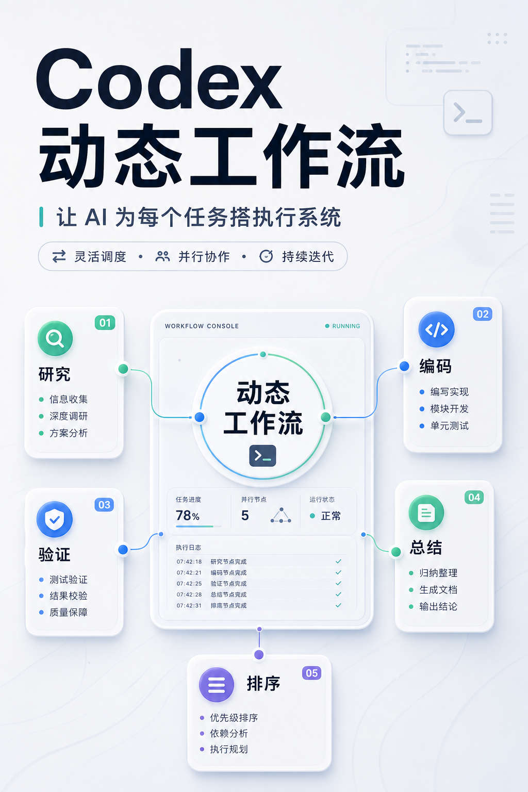

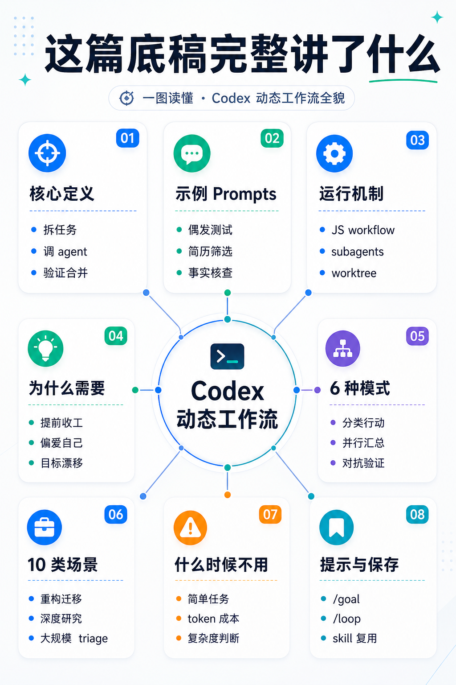

# Codex 动态工作流：让 AI 为每个任务临时搭一套执行系统

很多人使用 Codex 时，第一反应是把它当成“会写代码的 AI 助手”。

但动态工作流真正改变的地方，不只是让 Codex 写更多代码，而是让 Codex 可以根据任务本身，临时搭建一套专用的执行系统。

你可以把它理解成：以前我们把一个复杂任务丢给一个 agent，让它在同一个上下文里规划、执行、检查和总结；现在 Codex 可以先为这个任务写一个专门的工作流，再用这个工作流去拆任务、派发子 agent、做交叉验证、合并结果，甚至决定哪些步骤需要更强模型、哪些步骤要放进独立工作区里运行。

默认的 Codex 执行框架本来是为编码任务设计的，但很多非编码任务其实也很像编码任务：都有输入、拆解、执行、验证、修正和交付。研究、代码安全分析、agent 团队协作、代码审查、文档核查、批量分类、候选方案评估，本质上都可以被看成一类“复杂任务执行问题”。

动态工作流的价值就在这里：它允许你为当前任务动态创建一个更合适的执行框架，让 Codex 更自然地处理这些复杂任务，而且这些工作流还可以保存、分享和复用。

不过要注意，动态工作流并不是所有任务都应该默认使用。它通常会消耗更多 token，也会让任务执行结构更复杂。所以更合理的方式是：当任务本身足够复杂、需要并行、需要验证、需要长期循环、需要多角度判断时，再考虑让 Codex 创建 workflow。

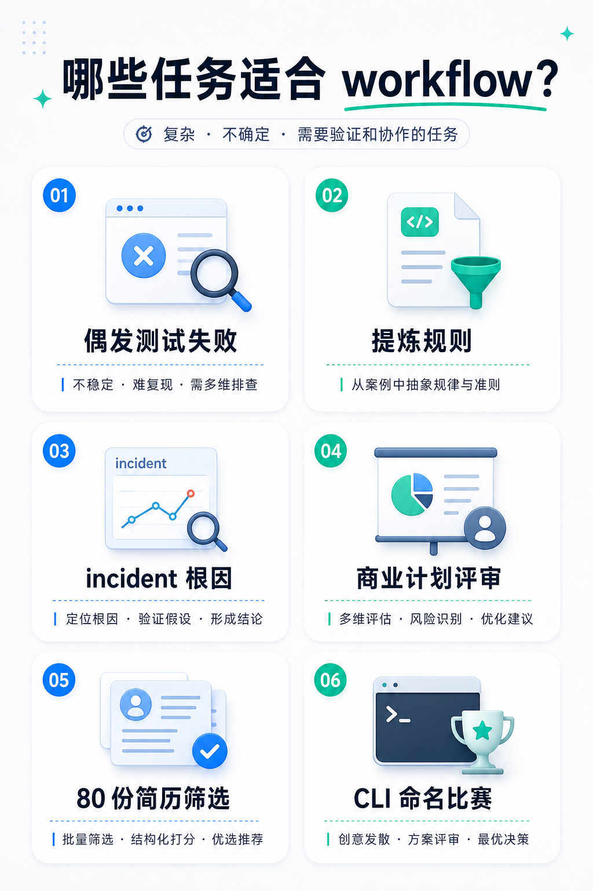

## 先看几个典型用法

在理解技术细节之前，可以先看一些适合动态工作流的提示词场景。

比如，一个测试偶尔失败，可能 50 次才失败 1 次。普通方式可能是让 Codex 猜原因、改代码、跑测试。但动态工作流可以这样设计：让 Codex 建一个 workflow，反复复现问题，提出多个假设，把每个假设放到独立工作区里测试，并且设置一个明确目标：不要在找到有效理论前停止。

再比如，你发现自己在最近几十次 Codex 会话里不断纠正同样的问题。你可以让 workflow 回看最近 50 个会话，挖掘你反复做出的修正，把高频问题整理成 AGENTS.md 规则。这样不是凭感觉写规则，而是从真实使用数据里提炼规则。

团队内部的 incident 复盘也很适合。你可以让 workflow 去分析过去六个月 Slack 里的事故讨论，找出反复出现但没有人提 ticket 的根因。这个任务需要搜索、聚类、判断、去重和输出建议，比单次问答更适合工作流。

如果你有一份商业计划，也可以让不同 agent 分别从投资人、客户、竞争对手的角度拆解它。每个视角独立提出问题，再汇总成一份更完整的评审。

如果你有 80 份简历，可以让 workflow 先采访你，确定后端岗位筛选标准，再让多个 agent 分批排序，最后对前 10 名做复核。

如果你要给一个 CLI 工具命名，可以让多个 agent 生成候选名字，再用 tournament 的方式两两比较，选出前三名。

如果你要把代码库里的 User 模型统一重命名成 Account，也可以让 workflow 拆成调用点、测试、模块、文档等多个修复点并行推进。

如果你写了一篇技术博客，担心里面有不准确的技术断言，可以让 workflow 逐条核对文章中的事实，并对照代码库验证。这里的重点不是“润色文章”，而是用 workflow 做事实防错。

这些例子背后的共同点是：任务不是简单问答，而是需要拆分、并行、检查、汇总和停止条件。

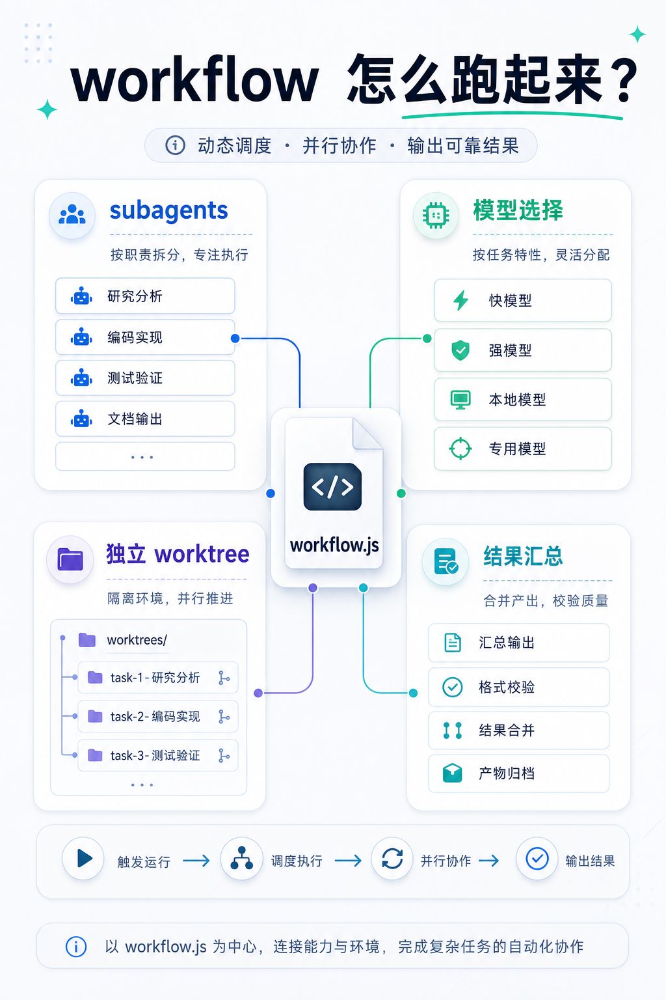

## 动态工作流到底怎么运行

动态工作流本质上会执行一个 JavaScript 文件。这个文件里可以使用一些特殊函数，用来创建和协调子 agent。

这意味着 workflow 不是单个 prompt，也不是普通的“多问几轮”。它更像一个任务调度脚本：负责决定要创建哪些 agent，每个 agent 做什么，结果怎么收集，哪些结果要验证，什么时候继续，什么时候停止。

除了这些特殊函数，workflow 也可以使用标准 JavaScript 能力，比如 JSON、Math、Array 等，用来处理结构化数据、排序、聚合、统计和判断。

更关键的是，动态工作流可以决定每个 agent 使用什么模型，也可以决定某些子 agent 是否运行在自己的 worktree 里。

这很重要。因为不同步骤对智能水平、隔离性和执行成本的要求不一样。简单分类不一定需要最强模型；复杂推理、最终判断、对抗式验证可能需要更强模型。代码修改类任务如果互相干扰，就应该放到独立工作区里跑。

如果 workflow 被中断，例如用户手动停止，或者终端退出，恢复会话后也可以从中断处继续。这让它更适合长任务，而不是只能做一次性短回答。

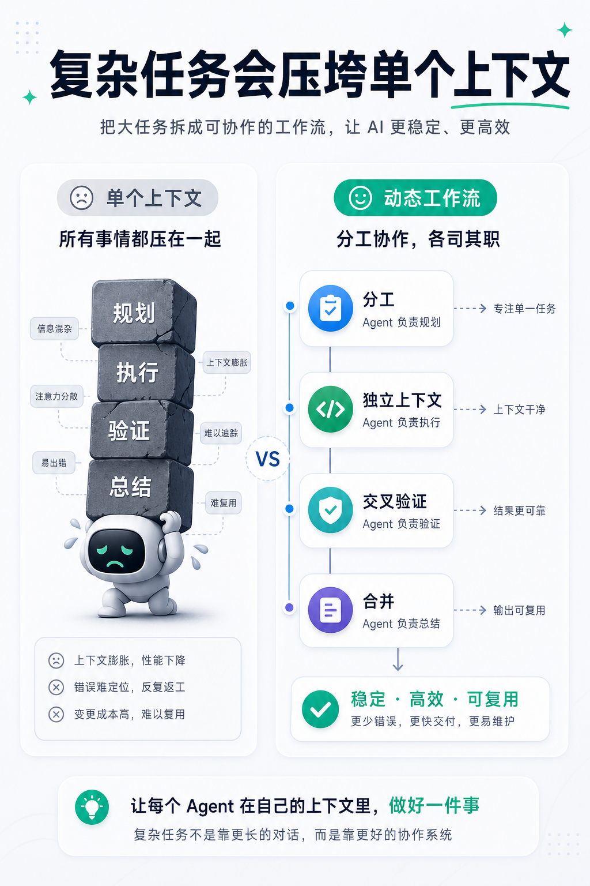

## 为什么需要动态工作流

默认 Codex 执行任务时，通常要在同一个上下文窗口里完成规划和执行。

对很多普通编码任务来说，这已经很有效。比如修一个明确 bug、加一个小功能、解释一段代码，单个上下文足够承载信息、计划和操作。

但当任务变成长期运行、大规模并行、或者高度结构化的对抗任务时，单个上下文会开始出现问题。

原因很直接：任务越复杂，Codex 在同一个上下文里工作越久，就越容易受到几类失败模式影响。

第一类是 agentic laziness，可以理解成“代理式偷懒”。

它指的是 Codex 在特别复杂、多步骤任务里，可能还没真正完成就宣布任务结束。比如一次安全审查有 50 个问题要处理，它只处理了 20 个，就把局部进展包装成完成结果。

第二类是 self-preferential bias，可以理解成“偏爱自己的答案”。

当 Codex 被要求验证或评判自己的结果时，它容易倾向于相信自己已经做对了。尤其是需要按照 rubric 评分、审查、比较时，单个 agent 既当选手又当裁判，可靠性会下降。

第三类是 goal drift，可以理解成“目标漂移”。

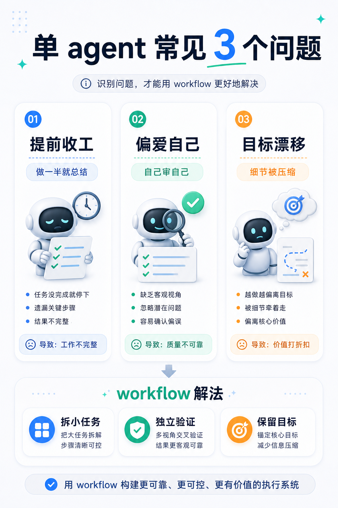


长任务经过很多轮上下文压缩后，原始目标会慢慢失真。每次总结都会丢一点信息，尤其是边界条件、反例、不要做什么、必须保留什么，这些细节很容易被压缩掉。

动态工作流可以缓解这些问题。它不是让一个 Codex 在同一个上下文里坚持到底，而是把任务拆给多个有独立上下文、目标清晰的 Codex。每个子 agent 只负责一个更小、更明确的目标，再由 workflow 负责调度、等待、验证和合并。

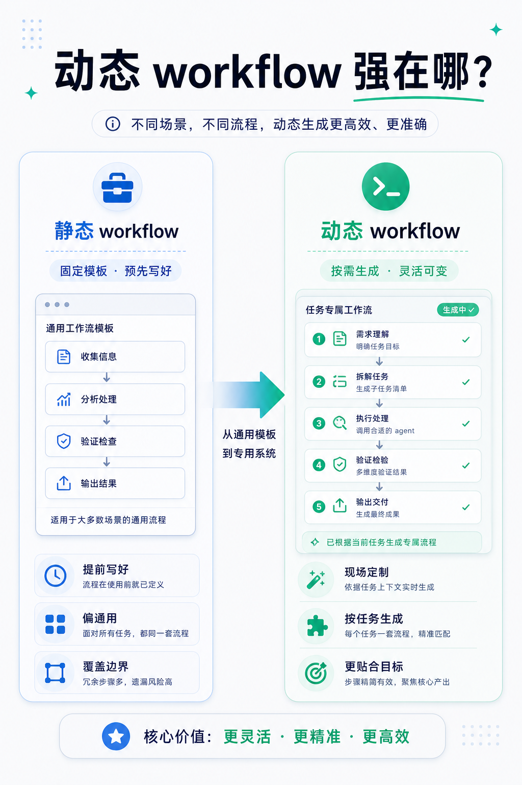

## 动态工作流和静态工作流有什么不同

以前也可以用脚本化方式创建静态 workflow，协调多个 Codex 会话或子任务一起工作。

静态 workflow 的问题是：它要提前写好，而且要尽量覆盖各种边界情况，所以往往更通用、更笨重。

动态 workflow 的思路不一样。它不是先做一个万能模板，而是让 Codex 根据当前任务临时写一个定制 harness。

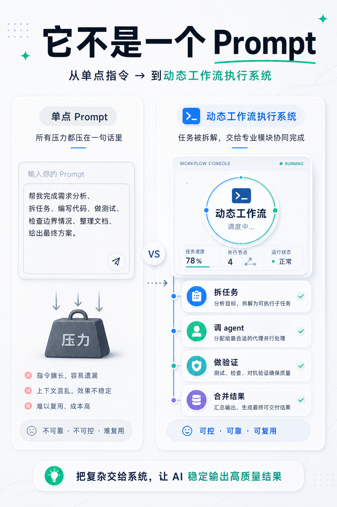


也就是说，任务不同，workflow 也可以不同。

处理 flaky test，需要复现、假设、对抗测试和停止条件；处理 80 份简历，需要 rubric、分批评估、去重和复核；处理技术博客核查，需要抽取事实断言、查代码、验证来源、标注风险。这些任务都叫“复杂任务”，但它们需要的执行系统并不一样。

动态 workflow 的优势就在于：它可以为当前任务现场生成一套最合适的执行结构。

## 使用动态工作流时常见的几种模式

你可以直接让 Codex 创建一个 workflow，也可以明确要求它使用“多 agent 分工、验证、合并”的工作流思路。

但真正用好动态工作流，需要建立几个基本模式的心智模型。这样你在提示 Codex 时，知道自己想要的是分类、并行、验证、筛选、竞赛，还是循环。

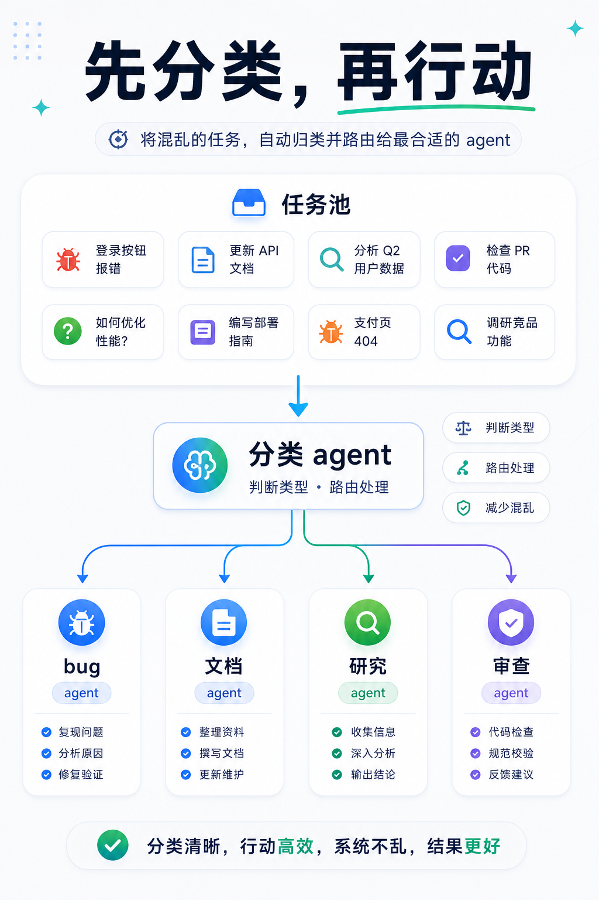

### 模式一：Classify-and-act

先用一个分类 agent 判断任务属于哪一类，再根据分类结果路由到不同 agent 或不同行为。

比如一批 support tickets，有些是 bug，有些是 feature request，有些是账号问题，有些是文档问题。先分类，再分发，会比让一个 agent 从头到尾处理所有内容更清晰。

这个模式也可以用在最后一步：先生成多个结果，再用分类器判断输出类型、优先级或风险等级。

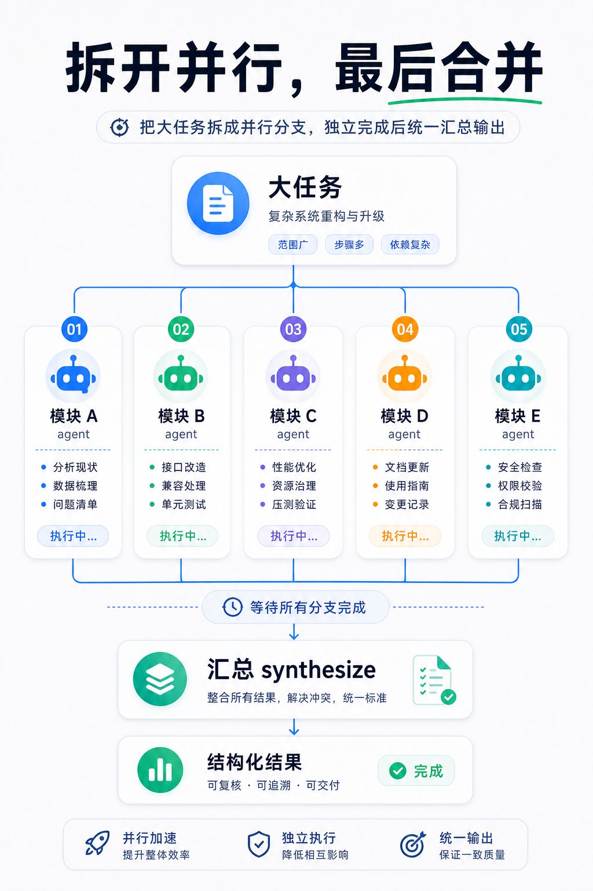

### 模式二：Fan-out-and-synthesize

把一个大任务拆成很多小步骤，每个步骤交给一个 agent 并行处理，最后再综合结果。

这种模式特别适合两类场景。

第一类是步骤很多，比如代码库里大量调用点需要迁移。

第二类是每个步骤都需要一个干净上下文，避免不同子任务互相污染。比如多个研究方向、多个候选方案、多个模块审查。

这里的 synthesize 是一个屏障：它会等待所有 fan-out agent 完成，再把结构化输出合并成一个结果。

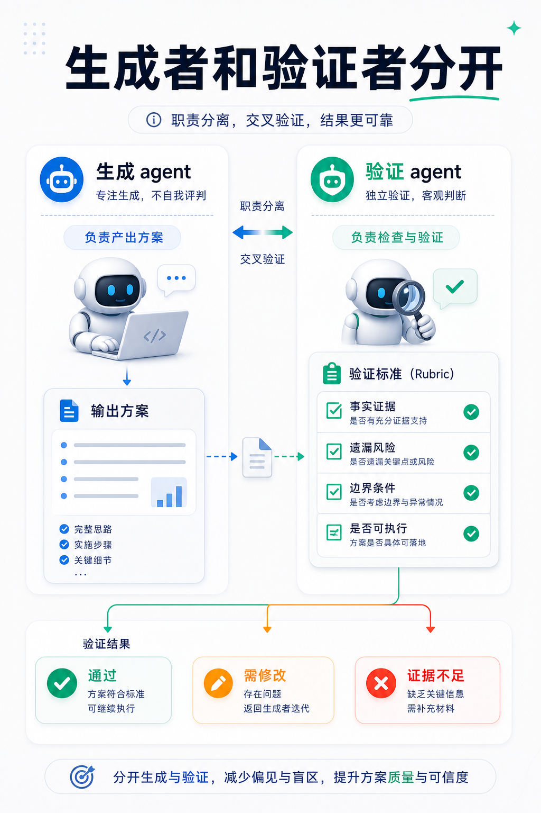

### 模式三：Adversarial verification

每个 agent 产出结果后，再派另一个独立 agent 按 rubric 或标准反向检查。

这适合事实核查、代码审查、安全审查、研究报告验证、候选方案评分。

它的核心是分离“生成者”和“验证者”。生成 agent 负责产出，验证 agent 负责挑错。这样可以减少 self-preferential bias。

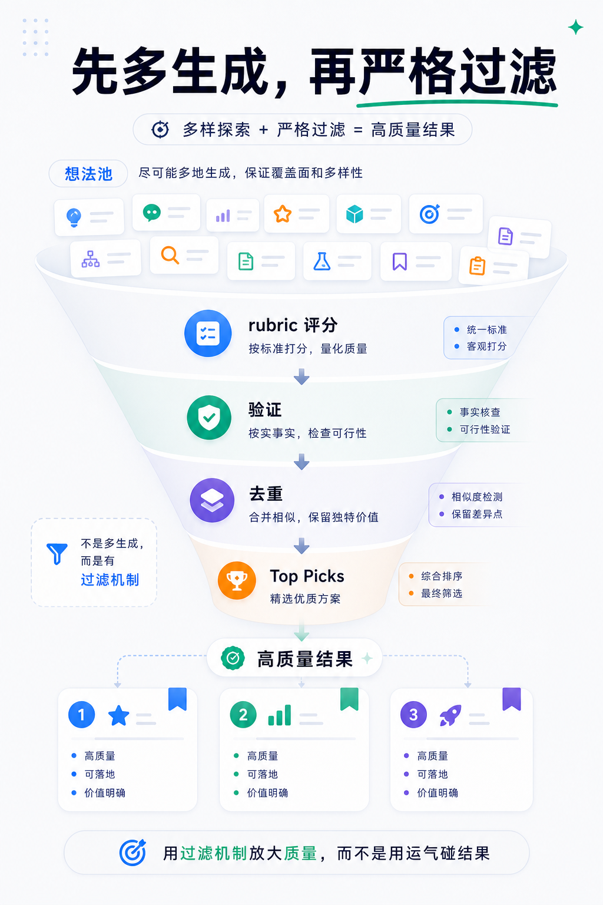

### 模式四：Generate-and-filter

先围绕某个主题生成大量想法，再按照 rubric、验证结果或质量标准筛选，去重后只保留最高质量、经过测试的结果。

这适合命名、设计方案、产品点子、实验计划、文章标题、prompt 方案等任务。

关键不是“多生成几个”，而是要有过滤机制。否则只是堆候选项，并不会提升最终质量。

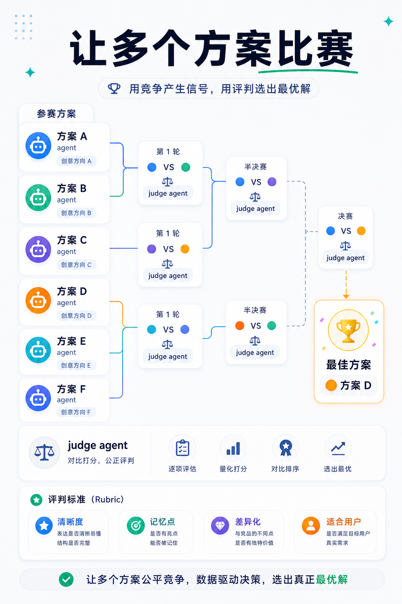

### 模式五：Tournament

让多个 agent 不是分工，而是竞争。

比如 N 个 agent 各自用不同方法完成同一个任务，再由 judge agent 两两比较，像淘汰赛一样筛到最后。

这种模式适合主观判断强、需要品味和取舍的任务，比如命名、设计、策略、方案选择。相对绝对打分，两两比较通常更稳定。

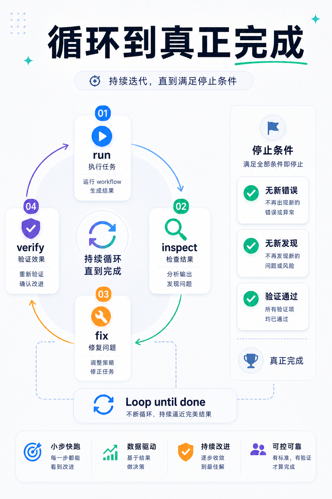

### 模式六：Loop until done

对于工作量未知的任务，不要预设固定轮数，而是让 workflow 循环创建 agent，直到满足停止条件。

停止条件可以是：没有新的发现、日志里不再出现错误、测试不再失败、候选结果已经稳定、验证 agent 不再提出高风险问题。

这种模式适合调试、triage、长期监控、持续研究和持续验证。

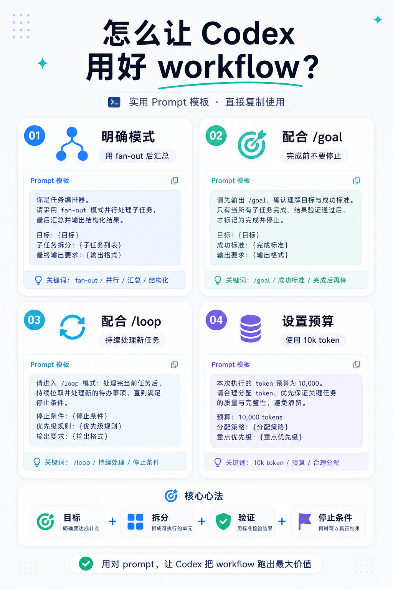

## 具体怎么用：6 个可以直接照抄的案例

上面讲的是模式。真正落地时，用户最容易卡住的地方是：到底该怎么把一个真实任务说给 Codex 听？

一个好用的提示词通常要包含四件事：任务目标、拆分方式、验证标准、停止条件。

下面这些案例可以直接改成自己的任务使用。

### 案例一：复现一个偶发失败的测试

适合场景：测试不是每次都失败，而是偶尔失败，比如 30 次、50 次才失败 1 次。

普通问法通常是：“这个测试偶尔失败，帮我看看原因。”

更适合 workflow 的问法是：

```text
为这个偶发失败测试创建一个 workflow。
目标是复现失败、提出多个独立假设，并逐个验证。
请把每个假设放到独立 worktree 或独立分支里测试。
不要在只找到一个可能原因时停止，直到至少有一个假设能稳定解释失败，并通过反向验证。
最后输出：复现步骤、根因、证据、修复方案、还没有排除的风险。
```

Codex 拿到这个任务后，不应该只猜一个原因，而应该拆成几个角色：

- 复现 agent：反复运行测试，记录失败条件、日志和随机性。
- 假设 agent：根据日志、最近改动、测试依赖提出多个解释。
- 验证 agent：逐个验证假设，不允许只凭直觉判断。
- 修复 agent：只在证据足够时修改代码。
- review agent：检查修复是否只是掩盖问题。

这个案例的关键是“停止条件”。不要让 Codex 看到一个可疑点就结束，而是要求它证明这个可疑点能解释现象。

### 案例二：把一套反复犯错的问题写进 AGENTS.md

适合场景：你经常纠正 Codex 同一类问题，比如命名风格、测试习惯、提交范围、UI 细节、文件输出位置。

可以这样提示：

```text
请创建一个 workflow，分析我最近的会话、代码审查意见和手动修改痕迹。
目标是找出我反复纠正 Codex 的问题。
请先聚类这些问题，再判断哪些问题值得写入 AGENTS.md。
每条候选规则都要经过反向验证：它是否真的能避免一个真实错误？是否会制造过多误报？
最后输出：新增规则草案、对应真实案例、为什么值得保留、哪些候选规则被排除。
```

这里最重要的不是“生成一些规则”，而是避免把所有偏好都塞进 AGENTS.md。

Codex 应该先做数据挖掘，再做规则筛选：

- 收集最近会话中的用户纠正。
- 找出重复出现的模式。
- 合并语义相近的问题。
- 让 skeptic agent 检查规则是否过宽。
- 只把高频、明确、可执行的规则写入。

这样得到的 AGENTS.md 会更像“从真实协作中沉淀出来的工作规范”，而不是一堆空泛口号。

### 案例三：给一篇技术文章做事实核查

适合场景：你准备发布技术文章、产品分析、行业报告，担心里面有事实错误、过时说法或代码理解偏差。

可以这样提示：

```text
请为这篇文章创建一个事实核查 workflow。
第一步：抽取所有可以被验证的事实断言。
第二步：按类型分类，包括代码行为、产品功能、发布时间、性能结论、外部资料引用。
第三步：为每条断言分配一个核查 agent，分别查代码库、文档或可信来源。
第四步：再让验证 agent 检查每条核查结果的证据质量。
最后输出：通过的断言、需要修改的断言、证据不足的断言、建议改写。
```

这类任务不能只让 Codex “通读一遍看看有没有问题”。

更稳的方法是先把文章拆成 claim list。比如：

- “这个模块会在用户登录后自动刷新 token。”
- “这个 API 在 v2 版本后改变了返回结构。”
- “这个工具适合处理大规模并行任务。”
- “这个功能可以通过配置文件开启。”

每一条都应该有验证路径。能查代码就查代码，能查文档就查文档，不能确认就标记“证据不足”，不要猜。

### 案例四：批量处理 1000 条用户反馈

适合场景：support tickets、bug reports、用户评论、问卷反馈、销售线索、内容选题池。

可以这样提示：

```text
请为这批用户反馈创建 triage workflow。
先定义分类体系：bug、功能请求、体验问题、文档问题、重复反馈、无法判断。
然后分批处理，每批由独立 agent 分类和摘要。
再做去重，把相同问题合并成一个 issue 候选。
对高优先级问题进行二次验证，避免误判。
最后输出：优先级排序、去重后的问题列表、建议负责人、需要人工确认的条目。
```

这里不要把 1000 条一次性塞给一个 agent 让它打分。

更好的执行结构是：

- 分片 agent：每个 agent 处理一小批，输出结构化 JSON。
- 去重 agent：按语义合并相似反馈。
- 优先级 agent：根据影响范围、严重程度、频率排序。
- quarantine agent：只读取外部用户输入，不执行高权限操作。
- action agent：只根据已验证结果创建任务或输出建议。

如果用户反馈来自公开渠道，还要特别注意 quarantine：读不可信内容的 agent 不应该拥有创建 issue、修改代码、发送消息这类权限。

### 案例五：给产品或文章标题做 tournament

适合场景：命名、标题、Slogan、产品方案、设计方向、封面风格。

可以这样提示：

```text
请创建一个 tournament workflow，为这个产品生成名字。
先让 8 个 agent 分别从不同方向生成候选：简洁、技术感、商业感、开发者友好、中文传播、国际化、记忆点、可搜索性。
然后让 judge agent 按 rubric 两两比较。
rubric 包括：清晰度、记忆点、差异化、是否容易误解、是否适合目标用户。
最后输出前三名，并解释每个名字为什么胜出，以及被淘汰名字的主要问题。
```

这个任务如果只问“帮我想 20 个名字”，结果通常会很散。

tournament 的优势是把主观选择变成一套比较流程。它不要求 judge agent 一次性给所有候选绝对打分，而是让它在两个候选之间做相对判断。

相对判断通常更稳定，也更接近真实决策。

### 案例六：做一次复杂代码重构

适合场景：大规模重命名、框架迁移、目录结构调整、API 升级、设计系统替换。

可以这样提示：

```text
请为这次重构创建 workflow。
目标：把 User 模型重命名为 Account，并保持行为不变。
先扫描所有调用点，按模块分组。
每个模块由独立 agent 在独立 worktree 中修改。
每个修改完成后必须运行相关测试。
再由 review agent 检查是否遗漏：类型定义、数据库字段、文档、测试、前端展示、API 返回。
最后合并前输出迁移清单、风险点、测试结果和需要人工确认的位置。
```

这个案例里，最容易出问题的是遗漏边角：

- 类型名改了，但数据库字段没改。
- 后端改了，但前端文案没改。
- 测试快照没更新。
- 文档还在使用旧名字。
- API response 里还有旧字段。

workflow 的作用是把这些遗漏点变成显式检查项，而不是期待一个 agent 在长上下文里全都记住。

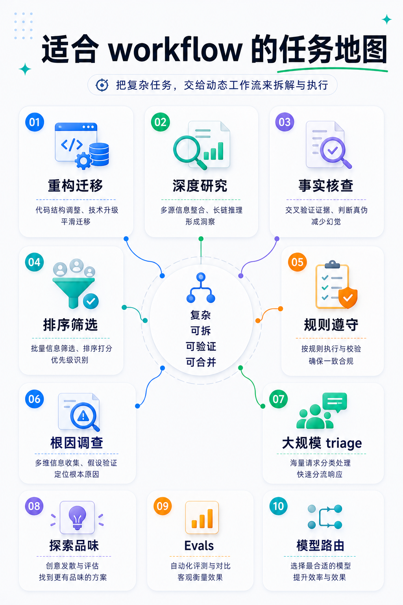

## 动态工作流适合哪些场景

动态工作流不只是技术任务工具。很多非技术任务只要具备“复杂、可拆、可验证、可合并”的特点，也很适合。

### 迁移和重构

大型迁移和重构很适合 workflow。

比如 Bun 曾经用 workflows 完成从 Zig 到 Rust 的重写。关键不是让一个 agent 一口气改完全部代码，而是把任务拆成调用点、失败测试、模块、接口、文档等多个需要处理的步骤。

每个修复可以由子 agent 在独立 worktree 中完成，然后再由另一个 agent 对抗式 review，最后合并。

这里有一个实用提醒：如果要最大化并行，最好告诉 agent 不要使用资源消耗特别大的命令，否则本机资源会成为瓶颈。

### 深度研究

Codex 里的 deep research skill 就使用了动态 workflow。

它会 fan-out 多个网页搜索，抓取来源，验证 claims，再综合成带引用的报告。

但深度研究不一定只针对网页。你也可以让 Codex 从 Slack 语境里整理状态报告，或者让它深入探索代码库，研究某个功能到底如何运作。

### 深度验证

如果你有一份报告，需要逐条检查里面的事实断言，可以生成一个 workflow。

一个 agent 先识别所有事实 claim，再为每条 claim 派出子 agent 详细核查。还可以再派验证 agent 检查来源质量，避免引用低质量资料。

这类任务如果交给单个 agent，很容易漏掉断言，或者对来源质量判断不够严格。

### 排序

有些任务需要按“质量、严重性、相关性、优先级”排序，比如把 support tickets 按 bug 严重程度排序。

如果一次性把 1000 行数据塞进一个 prompt，质量会下降，也可能放不进上下文。

更好的方法是：用 tournament、成对比较 pipeline，或者先并行分桶排序，再合并。

这里的关键是 comparative judgment。相对比较通常比绝对评分更可靠。每次比较由独立 agent 完成，确定性的循环结构负责保存 bracket 和运行顺序。

### 记忆和规则遵守

如果你有一组规则，Codex 即使放进 AGENTS.md 也经常漏掉，可以创建一个 workflow，让每条规则都有一个 verifier agent 检查。

也可以创建一个 skeptic persona agent，专门审查这些规则是否合理，避免规则过多导致误报。

反过来也可以：从最近的会话和代码审查评论里挖掘你反复做出的纠正，聚类成候选规则，再对抗式验证每条规则是否真的能避免实际错误，最后把通过验证的规则写回 AGENTS.md。

### 根因调查

调试最有效的方式，往往是提出多个独立假设并逐个验证。

但如果只使用一个上下文窗口，Codex 很容易偏爱自己最早提出的解释。

workflow 可以从结构上避免这个问题：让不同 agent 从不重叠的证据里生成假设，比如日志 agent、文件 agent、数据 agent。每个假设再交给 verifier 和 refuter 检查。

这不只适用于代码。销售下滑、数据管道失败、事故复盘、运营异常，都可以使用类似模式。

### 大规模 triage

每个团队都有 support queue、bug reports 或其他 backlog，人类不可能完全处理。

triage workflow 可以分类每个条目、和已有记录去重，然后采取行动。行动可以是尝试修复，也可以是升级给人工用户。

这里有一个重要模式叫 quarantine。

读取不可信公开内容的 agent 不应该拥有高权限动作。真正执行高权限动作的 agent 应该和读取外部内容的 agent 分离。这样可以降低 prompt injection 或不可信输入带来的风险。

如果配合 `/loop`，triage workflow 还可以持续运行。

### 探索和品味判断

当你在探索不同解法，尤其是设计、命名、产品方向这类带品味判断的任务时，workflow 很有用。

你可以让 Codex 探索一批方案，再给 review agent 一个 rubric，定义什么才是好方案。任务可以在 review agent 判断达到标准时结束。

方案也可以通过 tournament 排序或筛选。

### Evals

你可以用 workflow 做轻量 eval。

做法是：在独立 worktree 里启动多个 agent 执行特定任务，再让 comparison agents 按 rubric 比较和评分输出。

比如，你创建了一个 skill，可以用 workflow 对它在某些标准下的表现做评估，然后再反向优化 skill。

### 模型和智能路由

你可以创建一个 classifier agent，专门判断某个任务应该使用哪个模型。

这在任务会涉及大量工具调用，且执行前需要先研究复杂度时很有用。

比如“解释 auth 模块如何工作”这个任务，到底该用更快的模型还是更强的模型，取决于 auth 模块有多少文件、代码结构多复杂、依赖链多深。classifier agent 可以先做研究，再根据复杂度路由到合适模型。

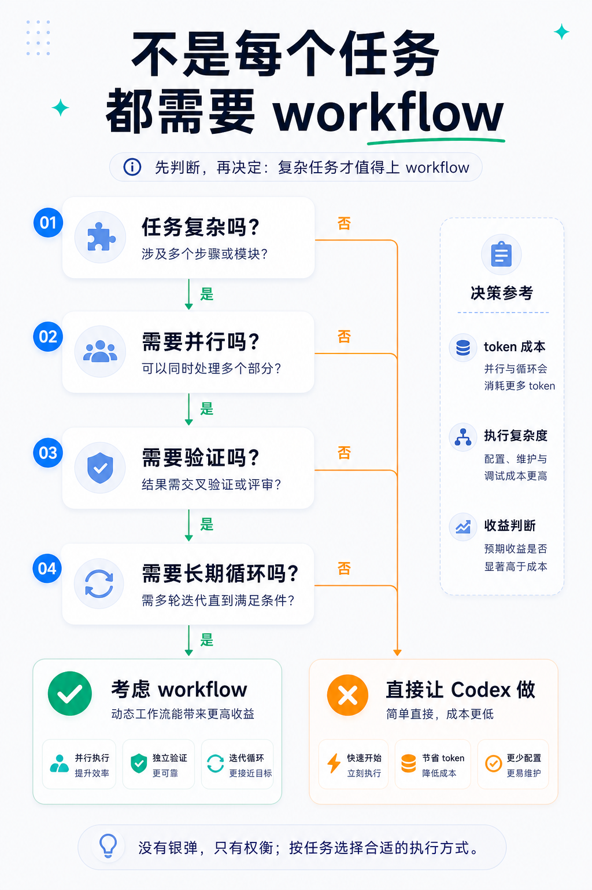

## 什么时候不要使用动态工作流

workflow 是一个强工具，但不是每个任务都需要。

它仍然比较新，在很多场景里能带来明显收益，但也会消耗更多 token。

所以使用前最好问自己：这个任务真的需要更多计算和更复杂的执行结构吗？

大多数传统编码任务并不需要 5 个 reviewer 组成评审团。一个明确 bug、一个小功能、一个局部解释，通常直接让 Codex 做就够了。

更适合 workflow 的，是那些普通单 agent 容易出现遗漏、偏差、上下文漂移、并行效率低或验证不足的任务。

## 构建动态工作流的提示技巧

### 提示要具体

动态 workflow 的效果很依赖提示质量。

如果你只是说“帮我处理这个复杂任务”，Codex 可能会给出一个比较泛的执行方案。

更好的提示方式是明确你希望它使用哪种模式：复现并验证、fan-out 后综合、对抗式审查、按 rubric 排序、循环直到没有新错误、用 tournament 选出前三名。

workflow 不只适合大型任务。你也可以要求一个 quick workflow，比如快速对某个假设做一次对抗式审查。

### 和 /goal、/loop 结合

对于可以重复运行的 workflow，比如 triage、研究、验证，适合和 `/loop` 结合，让它按周期运行。

对于有硬性完成要求的任务，适合和 `/goal` 结合，明确什么才算完成，不要在部分进展时提前结束。

### 设置 token budget

动态 workflow 可以设置明确 token 预算，限制任务消耗。

你可以在 prompt 里写“使用 10k token 预算”之类的要求，让它在预算内规划执行。

这对 workflow 很重要，因为 workflow 一旦创建多个 agent，很容易比普通任务消耗更多。

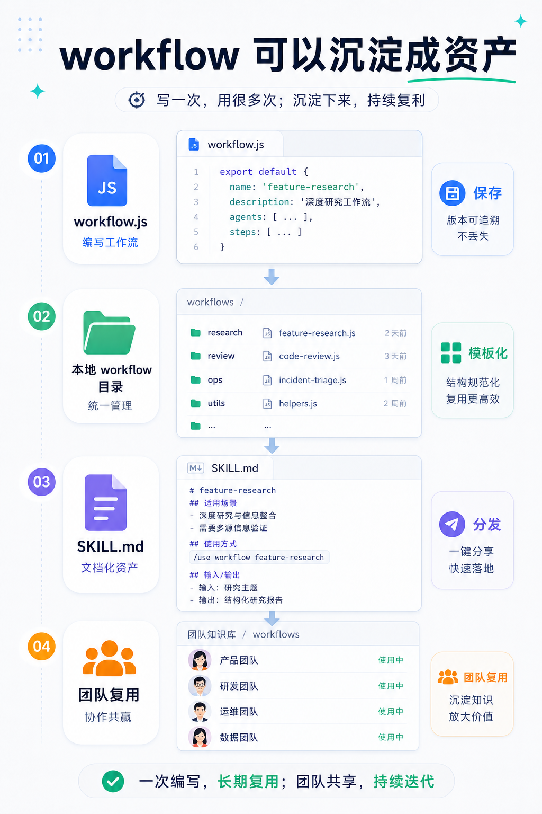

### 保存和分享 workflow

你可以在 workflow 菜单里按 `s` 保存 workflow。

保存后可以把它们放进本地 workflow 目录，也可以通过 skill 分发。

如果通过 skill 分享，可以把 JavaScript workflow 文件放进 skill 文件夹，并在 `SKILL.md` 里引用。

为了保留灵活性，可以提示 Codex 把 skill 里的 workflow 当成模板，而不是必须原样执行的固定脚本。

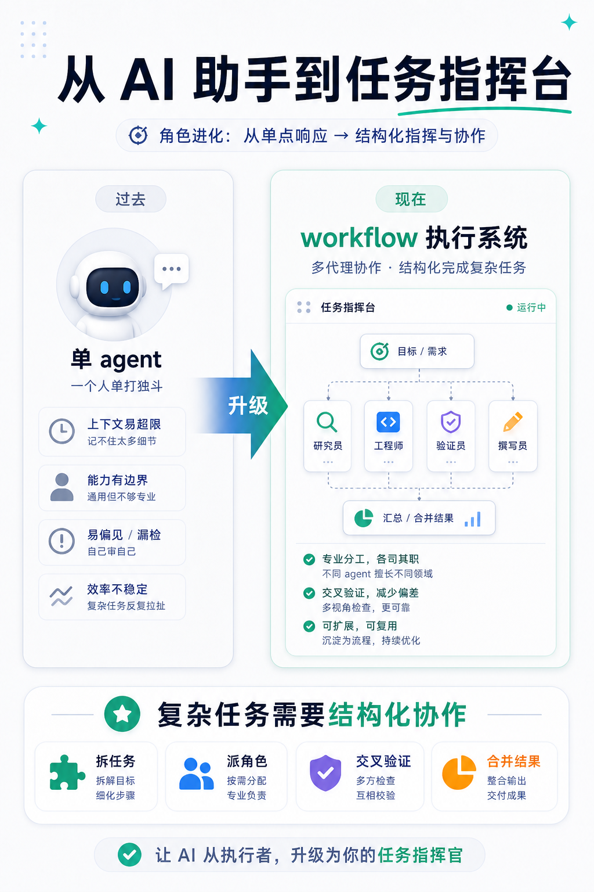

## 最后总结

动态 workflow 是扩展 Codex 的一种新方式。

它真正有意思的地方，不是“多开几个 agent”，而是让 Codex 能根据任务临时搭建执行系统。

普通 agent 更像一个人接任务、做任务、交结果。

动态 workflow 更像一个任务指挥系统：它会拆任务、派角色、隔离上下文、交叉验证、循环执行、控制预算、合并结果。

当任务足够复杂时，这种结构能明显提升完成度和可靠性。

但它也不是银弹。简单任务直接做，复杂任务才值得创建 workflow。真正的关键，是判断什么时候该让 AI 回答问题，什么时候该让 AI 组织一套工作系统。

如果你现在用 Codex，你最想把哪类任务改成 workflow？

<!--
source: 02_小红书发布正文.md
images: assets/*.png
generated_by: scripts/build_wechat_md.py
-->
