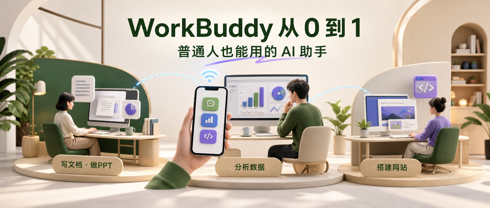

# WorkBuddy 从 0 到 1：普通人也能用的 AI 助手完整指南

汇报要写，数据要理，PPT 要出，代码要改。很多人不是不知道 AI 有用，而是卡在注册、支付、安装、网络和复杂配置上。

WorkBuddy 把微信登录、模型、Skills、连接器、知识库、自动化和远程控制放进一个桌面端。对于不准备折腾开发环境、主要想处理日常办公的人，它更像一位能真正接活的数字同事。

## 先装上：微信扫码就能进入

WorkBuddy 提供 macOS 和 Windows 客户端，下载安装后可以直接微信扫码登录。进入主界面不要急着发任务，先理解工作模式、权限与工作空间，能避免白白消耗积分或把文件放乱。

## 三个场景，一套工作台

平台把任务分成代码开发、日常办公和设计创意。切换场景后，快捷入口会同步变化：文档、数据分析、研究、幻灯片、网站、Agent、PPT、原型等都能找到对应入口和模板。

最重要的是分清三种模式：

- Craft：收到需求便直接执行。
- Ask：普通问答，不跑完整任务。
- Plan：先给计划，确认后再执行。

默认是 Craft。只想问问题时先切 Ask；需求还不清楚时先用 Plan；材料和验收标准都明确后再用 Craft。

模型可选腾讯混元、DeepSeek、GLM、Kimi 等，版本和计费以客户端实时展示为准。也能接入兼容 OpenAI 协议的接口，但 API Key 应只在可信客户端中配置。

权限方面，新手更适合默认权限。完全访问虽然省弹窗，也会放大误删、误传和执行意外命令的风险。工作空间则相当于项目文件夹，最好按项目提前分类。

## 专家、Skills 与连接器有什么区别

专家是预先配置好角色、工具和知识的垂直 Agent；专家团让多个角色协作，但积分消耗可能是单专家的数倍。

Skills 是可复用的做事方法。连接器即 MCP，用来打通 QQ 邮箱、腾讯会议、腾讯文档等外部服务。它们越强，权限边界越重要：社区 Skill 要检查来源；不用的连接器及时撤销；邮件发送、文件外传和对外发布保留人工确认。

## 开工前调好四项设置

技能自动更新适合持续获得改进；锁屏远程适合长任务，但要考虑设备和隐私；对话记忆能学习偏好，却不该存放密码、财务和客户机密；自定义指令应写清“先理解、精准修改、目标可验证、完成后验证”。

## 办公任务的稳妥流程

1. 切到日常办公。
2. 选择工作空间或上传材料。
3. 选择模型。
4. 输入需求并优化提示词。
5. 检查目标、输入范围、输出格式和截止条件。
6. 用 Plan 看计划，确认后执行。
7. 跟踪 Todo，最后检查预览与本地文件。

Agent 能交付，不等于交付天然正确。文档、数据、PPT 和图表仍要核对事实、格式与完整性。

## 开发任务：小项目可用，复杂工程要谨慎

做一个主题网页，可以先说明目标、风格、模块和交互，用 Plan 看方案，再让它执行。第一版完成后可用前端 Skill 优化，配置服务器 Skill 后还能继续部署。

但复杂工程对架构、调试、上下文和代码质量要求更高。无论使用哪种编码 Agent，都应保留代码审查、测试、版本控制和人工验收。

## 微信远程控制：方便，也要设边界

手机端可以让任务在云端沙箱运行，也能连接本地电脑读取工作文件。人在外面临时找文件、整理材料会很方便。

风险也集中在这里：手机指令、云端服务、本地文件和邮件发送被串在一起。建议只开放专门工作区，不要放开整个硬盘；外传文件保留最终确认；遗失手机后立即撤销授权。

## 写在最后

普通人真正需要的，不是更会聊天的 AI，而是能把整理数据、制作 PPT、生成文档和开发小工具变成可交付流程的数字同事。

正确的协作方式是：说清目标，让 Agent 先规划；限定目录和权限；执行中看 Todo；交付后检查事实、文件和费用。做到这些，AI 才能真正让工作变轻。

