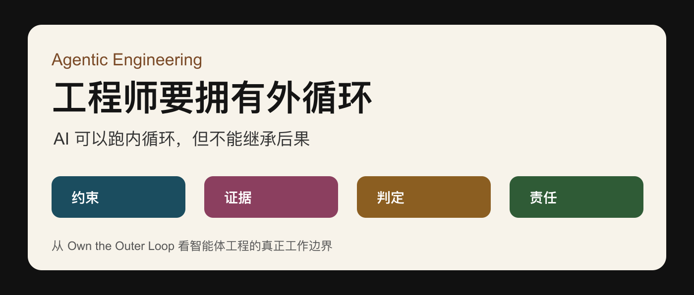
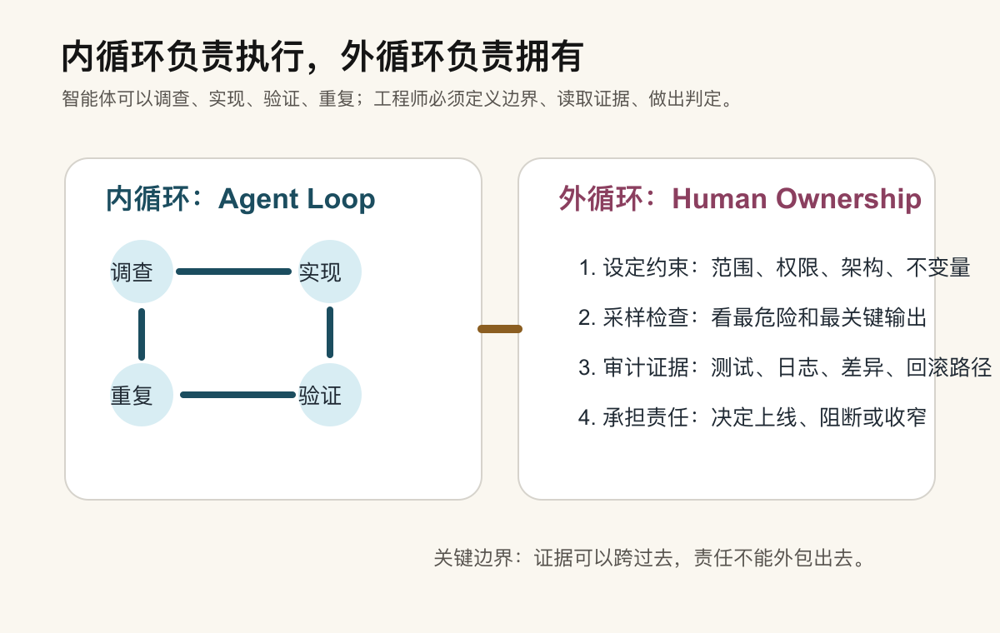
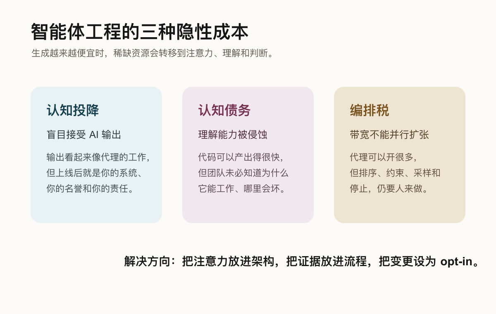
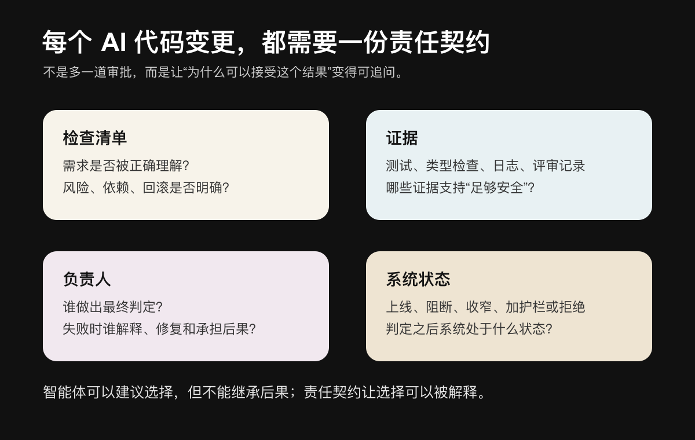

过去一年，关于 AI 编程的讨论已经变了。

最早大家关心的是模型能不能写代码、补测试、解释报错、改一个函数。现在更关键的问题是：当智能体可以自己读文件、调用工具、使用记忆、跑测试、修复失败、继续迭代，甚至在几个小时的任务周期里持续推进工作时，工程师到底还应该站在哪里？

答案不是重新盯住每一行代码。

真正需要被工程师拥有的，是外循环。

内循环是智能体执行任务的地方：调查、实现、验证、重复。外循环是人类和组织承担责任的地方：定义约束、读取证据、做出判定、解释后果、决定是否进入生产系统。

这件事听起来像流程问题，其实是 AI 时代的软件工程基本盘。

因为智能体越强，组织越不能只问“它能不能做”。真正的问题会变成：

- 它改了什么？
- 为什么这个改动足够安全？
- 哪些证据支持这个判断？
- 谁决定它可以进入下游系统？
- 如果判断错了，谁解释、谁修复、谁承担后果？

如果这些问题没人能回答，那么 AI 的产能越高，组织积累的不确定性也越高。

## 问题变了：生成越来越便宜，控制越来越稀缺

软件开发的成本结构正在改变。

过去最贵的部分，经常是“把东西做出来”：拆需求、写代码、补测试、改文档、排评审、修回归。AI 编程工具出现之后，生成能力被大幅放大。一个人可以更快地产出补丁，一个团队可以并行启动更多实验，一个智能体可以在短时间内探索更多实现路径。

一些开发者调查已经显示，AI 生成或显著辅助的代码提交正在成为不可忽视的比例。很多团队也预期，这个比例不会停在当前水平，而会继续增长。

这意味着，真正稀缺的东西正在从“生成”转向另一组能力：

- review；
- validation；
- understanding；
- maintenance；
- accountability。

生成变便宜以后，审查、验证、理解和维护反而更贵。

这里有一个危险的缺口：生成速度已经上去了，但控制速度没有同步上去。很多团队嘴上说“不完全信任 AI 代码”，但流程上并没有把这种不信任转化成更强的验证机制。

这就是 trust-verification gap。

更麻烦的是，治理动作常常发生在代码生成之后。也就是说，团队先接受了风险，再试图补上责任边界。等代码已经进入下游系统，问题就不再是“这个补丁看起来是否合理”，而是“谁要为这个生产行为负责”。

所以 AI 编程不是单纯的工具升级。它会逼迫团队重新设计工程系统。

## 智能体不是模型本身，而是模型加上一套 harness

要理解外循环，先要理解智能体到底是什么。

一个真正能干活的智能体，不只是模型。模型只是引擎。真正让它能进入工程工作的，是围绕模型搭起来的一整套 harness：

- 文件访问；
- 工具调用；
- 项目记忆；
- 组织技能；
- 沙箱；
- 权限；
- 测试；
- 日志；
- 观测；
- 失败恢复；
- 人工确认点。

没有 harness，模型只是一个会说话、会生成文本的引擎。它可以建议，但很难安全地进入真实工作流。有了 harness，它才像一辆车：有方向盘、有刹车、有仪表盘、有安全带，也有不能越过的道路边界。

而 harness 之上，是 loop。

一个典型的智能体工程循环是：

1. 调查任务；
2. 实现方案；
3. 验证结果；
4. 根据证据重复调整。

一次好的运行还不够。真正有工程价值的是：这个循环可以被重复运行，可以被不同任务复用，可以用独立检查判断是否完成，而不是只听模型自己说“我完成了”。

当许多这样的循环同时运行时，就会形成软件工厂。

软件工厂不是把人踢出去，而是把人的位置上移。智能体在工厂内部运行循环，人类在工厂边界上决定哪些证据足够、哪些输出可以进入生产、哪些任务应该被阻断或收窄。

## 软件工厂的核心，是系统内外的边界

智能体在系统内部做的是 capability。

它可以调查、实现、测试、报告。它可以读代码、跑命令、打开工具、调用知识库、整理证据。这是模型能力加工程 harness 产生的工作能力。

但系统外部还有另一件事：agency。

Agency 是决定、验证、批准、拥有。它不是“能不能做”，而是“该不该做”“做到什么程度”“凭什么放行”“谁承担后果”。

这条边界很重要。

系统内部，智能体可以接收产品团队的意图、历史发布知识、事故记录、用户反馈和当前任务目标。它调查问题，提出计划，修改实现，运行测试，收集证据。

然后，证据跨过边界。

拥有下游系统的人必须看到证据，并做出生产判定。这个判定可能是：

- ship：放行；
- block：阻断；
- redirect：改变方向；
- narrow：缩小范围；
- add a guardrail：加护栏；
- reject：拒绝。

这就是外循环。

过去，智能体只是执行循环里的一个小助手。现在，它开始能运行完整的内部执行循环。于是工程师的工作也要相应变化：不再把注意力耗在每一步具体操作上，而是拥有边界、证据和判定。

AI 可以跑得比你看得快。

所以人类判断力必须被放在最关键的边界上。

## 三个关键词：质量、判定、可答责

外循环可以拆成三个词：Quality、Verdict、Answerability。

Quality 不是口号。

质量不是“我们要写高质量代码”这种愿望，而是系统里真实存在的反压机制。它限制智能体的自治范围，让系统不会因为“能做”就无限做下去。

普通工程系统里本来就有很多质量信号：

- 类型检查；
- 单元测试；
- 集成测试；
- pre-commit hook；
- sandbox 限制；
- 权限审批；
- 审计日志；
- 监控告警；
- 回滚方案；
- code review；
- 变更说明；
- 事故复盘。

这些机制的本质是 back pressure。它们让变化慢一点，让证据多一点，让不可见风险被迫露出来。

智能体工程不是把这些东西绕过去。恰恰相反，智能体必须能产生同类信号，并且把信号结构化地留下来。

Verdict 是生产判定。

模型可以写那一行代码，但是否接受这行代码，不能由模型继承。因为代码进入生产后，它就不再是“模型输出”。它会成为你的产品行为、线上风险、用户体验、维护负担和团队声誉。

Answerability 是可答责。

可观测性告诉你发生了什么。可答责要求你能解释：为什么当时这个决定可以接受？你看到了哪些证据？你知道哪些风险？如果错了，你准备怎么处理？

长周期智能体尤其需要可答责。

当一个智能体在小时级任务里连续做出很多局部选择时，并不是每个微小决策都能回溯到某个输入 token。它可能读了几十个文件，试了几条路径，放弃了几个方向，修了几轮测试失败，最后给出一个完整结果。

如果系统没有在关键节点留下证据链，事后重建“为什么会这样”会非常昂贵。

所以可答责不是官僚主义。它是智能体工程规模化之后的基本工程卫生。

## 人不需要一直待在内循环里，但必须拥有四类外部循环

信任工程系统，不等于不要人在回路里。

真正的变化是：人不一定要待在最细的内循环里。

如果智能体每改一个文件都要人确认，效率不会真正提升。如果人完全不看证据，让智能体一路跑进生产，风险会被规模化放大。

合理的位置，是让人进入四类外部循环。

第一类是 constraints loop。

人要定义输入、架构、权限、不可违反的不变量。比如哪些目录不能改，哪些 API 不能破坏，哪些兼容性必须保留，哪些安全边界必须优先。

第二类是 sampling loop。

人要决定抽样检查什么。不是所有输出都要逐字审查，但高风险部分必须被抽中：安全相关、数据迁移、权限变更、账务逻辑、用户可见行为、遗留系统核心路径。

第三类是 audit loop。

人要决定保留什么证据。测试结果、失败记录、差异摘要、日志、基准测试、回滚路径、关键判断，都应该能被追踪。

第四类是 ownership loop。

人要决定哪个生产边界由谁拥有。不是“AI 做的”，而是某个人、某个团队、某个角色接受了这个结果，并愿意为后果负责。

人类不需要把所有动作都亲手做掉，但必须拥有关键判断。

## 三种隐藏成本：认知投降、认知债务、编排税

智能体越强，隐藏成本越容易被低估。

第一种成本是认知投降。

当你把任务交给 AI，输出看起来像 AI 的工作。但只要你接受它，它就变成了你的答案。你的代码库承受缺陷，你的团队维护行为，你的名字背书结果。

这很危险，因为 AI 错的时候，人也可能更自信。一些研究已经观察到，当 AI 给出错误答案时，很多人仍然会接受，而且自信度可能高于没有 AI 辅助时。

错误加自信，是工程系统里很糟糕的组合。

第二种成本是认知债务。

AI 可以在大型代码库里快速产出你短时间内写不出的代码。但这也会扩大“代码存在”和“团队理解”之间的距离。

当智能体规划周期越长，生成代码和人类理解之间的差距越大。这个差距会复利。短期看，任务完成了；长期看，团队失去了理解系统的肌肉。

有编码理解实验显示，依赖 AI 完成编码任务的人，在后续理解测验上明显落后于自己完成任务的人。这个结果提醒我们：产出不等于理解，完成不等于掌握。

第三种成本是编排税。

现在启动多个智能体很容易，但人的注意力不会因此并行扩张。

你仍然要决定：

- 哪个任务值得跑；
- 哪个输出值得看；
- 哪个风险最先验证；
- 哪个假设危险到不能放任；
- 什么时候应该停止；
- 哪些结果需要进入审计。

所有这些工作都不能被完全自动化。

没有人类判断的智能体编排，只会把噪音和风险并行化。

## 棕地系统最危险，因为真实行为不只在代码里

全新系统里，智能体循环相对容易设计。

你可以从一开始定义接口、权限、测试、监控、回滚和证据标准。规则相对干净，边界相对清楚。

真正困难的是 brownfield，也就是已有多年历史的生产系统。

老系统的真实行为不只写在代码里。它还藏在：

- 客户已经依赖的边界行为；
- 多次迁移留下的兼容层；
- 过去事故形成的隐性规则；
- 发布周期和预算周期；
- 数据里的异常值；
- runbook 里的人工流程；
- 老员工脑子里的经验；
- 团队早已习惯但从未写下来的假设；
- 长期没有人愿意整理的历史包袱。

这些东西是系统的疤痕。

它们未必优雅，但它们是生产行为的一部分。如果智能体只读代码，不读疤痕，它很容易做出看似干净、实际危险的改变。

所以棕地系统里的智能体工程，关键不是让 AI 更大胆，而是把隐性知识转成显性约束：

- 把历史事故转成检查清单；
- 把经验转成测试过程；
- 把 runbook 转成可执行验证；
- 把客户依赖转成兼容性约束；
- 把老员工脑子里的判断转成团队可引用的证据。

要照看棕地系统，需要一种 durable engineering。

它不是一次性修补，而是长期把隐性知识变成显性约束，跨团队、跨年代保持一致，并把每次失败继续转化成学习。

如果系统没有得到它一直依赖的照看，智能体带来的速度反而可能让它更快崩掉。

## 修复方向：把注意力、范围和证据放进架构

面对这些风险，修复方向不是“少用 AI”。

真正应该做的是，把注意力作为架构决策的一部分。

第一，用 worktree、scope 和 evidence 降低耦合。

智能体任务应该尽可能有独立工作区、明确范围和可检查证据。不要让一个模糊目标变成大范围自由修改。

第二，对不可执行、不可验证的步骤设定时间盒。

如果某个方向跑了很久仍然没有证据，就应该停止，而不是让智能体继续消耗注意力。

第三，把软件变更设为 opt-in permission。

默认不进入生产边界。只有当证据足够、判定明确、责任人接受时，变更才被允许进入下游系统。

第四，把最稀缺的人类判断放在高价值节点。

不要把人类注意力浪费在机械监督上，也不要把高价值裁决伪装成交给模型。人应该判断约束、证据、范围、风险和后果。

## Alpha、decay、taste：当人人都能做，选择做什么更重要

智能体降低了“做出来”的成本，也改变了职业和团队竞争的形态。

可以用三个词理解这件事：alpha、decay、taste。

Alpha 是领先动作，是你在当前竞争里最有价值的一步。Decay 是大家通过重复、模仿和惯性学会的模式，也可以理解为平台期。Taste 是在明确证据出现之前，你对变化方向的判断力。

当工具让更多人都能更快做出东西，真正稀缺的就不是“会不会做”，而是：

- 选择做什么；
- 为什么现在做；
- 做到什么程度；
- 什么时候停止；
- 哪些东西不值得做；
- 哪些东西虽然没有客观指标，但值得投入。

Paul Graham 讲过 taste 的重要性，Mitchell Hashimoto 也把 taste 定义成一种在没有客观指标时做高质量定性判断的能力。放到智能体工程里，这意味着：团队不能只训练“如何调用 AI”，还要训练“如何判断 AI 产出的方向是否值得”。

Taste 需要被 operationalize。

也就是给它命名，把它从直觉变成可讨论的东西；在 critique 和 examples 里练习它；把判断理由显性化。

未来真正有竞争力的人，不只是会把任务交给 AI，而是能不断把自己的边界往上推：从做任务，到教任务；从执行，到系统化；从生成，到决定什么时候应该生成；从完成，到拥有结果。

## 高 agency 不是全自动，而是知道什么时候委托、检查、停止和拥有

高 agency 很容易被误解成“让智能体做更多事”。

但在典型的智能体工作流里，高 agency 是一种判断艺术：知道什么时候委托，什么时候检查，什么时候停止，什么时候拥有结果。

可以把 agency 看成一条阶梯：

1. 标记潜在问题；
2. 调查问题；
3. 执行任务；
4. 诊断原因；
5. 提出方案；
6. 推荐修复；
7. 解决问题。

但更高阶的 agency，还包括一种很容易被忽视的判断：找到了，但不值得修，继续前进。

这对工程团队非常现实。

AI 会让更多问题变得“看起来可修”。但不是所有可修的问题都值得修，不是所有局部优化都应该进入系统，不是所有自动生成的方案都应该被接纳。

成熟工程师的价值，正在从“我能不能做”转向“我是否应该让这件事存在”。

## 每个人都可能成为 developer，但不是每个人都是 engineer

AI 工具会让越来越多人具备开发能力。

某种意义上，everyone is a developer。

但 not everyone is an engineer。

Engineering 不是“能写代码”。Engineering 是一种更严格的工作纪律：

- 推理要充分；
- 逻辑要站得住；
- 约束和权衡要被考虑；
- 风险暴露面要被识别；
- 结果要能被维护；
- 后果要有人承担。

智能体时代，这个区别会变得更明显。

因为写出代码会越来越便宜，能否为代码进入系统负责会越来越稀缺。

未来团队里的工作也会被重新拆开。有人专门做 prototype，有人专门 build，有人专门 sweep 技术债，有人专门 grow，有人专门 maintain。它们不一定都像传统工程岗位，但都服务于同一个目标：让工作可理解、可验证、可继承。

这些新工作不是边角料。

当自动化接管更多行政性工程劳动，真正的工程要求反而会上升。

## 责任会扩展软件工厂，否则高 agency 只会带来混乱

规模化智能体工程必须靠 accountability。

没有 accountability，就没有规则，没有权衡，没有风险边界，没有安全网。没人拥有后果时，高 agency 只能带来混乱。

这也是为什么“签名”很重要。

一个领先优势的半衰期可能只有一个版本。今天某个技巧很强，下一次模型更新、工具升级、团队学习之后，它就变成常识。

但签名的半衰期可能是一整个职业周期。

签名不是字面上的署名，而是你愿意站在这个工作背后，说：这是我接受的结果，我理解它为什么存在，我知道它为什么足够安全，我也知道如果错了应该怎么办。

技能带来杠杆。

责任把杠杆变成信任。

只有人能选择，也只有人会继承选择的后果。智能体可以在策略内选择、路由、合并和升级，但它不能继承后果。

这条边界不能模糊。

## 每个 AI 代码变更，都需要一份责任契约

每个代码库都应该有一种 accountability contract。

它不一定是一份复杂文档，但至少要让关键变更可追问：

- 接受变更时，我们理解了哪些检查项？
- 做决定时，我们看到了哪些证据？
- 谁对这个变更负责？
- 变更被接受、阻断或收窄后，系统处于什么状态？
- 如果判断错了，谁解释、谁修复、谁承担后果？

把它翻成团队可执行模板，可以是这样：

每次 AI 参与的关键变更，至少回答五个问题：

1. 这个变更解决什么问题，不解决什么问题？
2. 智能体使用了哪些权限、上下文、工具和约束？
3. 哪些证据支持它足够安全：测试、类型检查、日志、评审、灰度、回滚？
4. 谁做出最终判定：上线、阻断、收窄、加护栏还是拒绝？
5. 如果判断错了，谁解释、谁修复、谁承担后果？

这份契约不是为了制造流程负担，而是为了防止责任在自动化中消失。

## 支撑软件工厂的十二根柱子，最难立在棕地上

如果软件工厂要扩展，棕地就是前线。

在新系统里，设计反压机制相对容易。你有完整控制权，可以从第一天开始规划架构、测试、权限、监控和回滚。

但在遗留系统里，事情完全不同。

遗留系统包含的不只是代码。它包含生产行为、客户未来预期、迁移历史、发布周期、预算周期、未说出口的假设、边缘案例、异常数据、runbook 流程，以及多年积累下来的疤痕。

要成为棕地系统的 steward，需要 durable engineering。

这意味着：

- 把隐性知识转成显性约束；
- 让这些约束跨团队、跨时间保持一致；
- 把知识形式化成测试过程和功能规格；
- 把经验绑定到客观证据；
- 把每次失败继续转化成学习。

智能体不会自动理解这些历史。它可以读代码，但未必能读懂组织长期照看系统时留下的痕迹。

所以越是棕地，越不能只问“AI 能不能改”。要先问：我们有没有足够的反压机制，让它的改动被系统理解、验证和约束？

## 新工作是真工作

当内循环越来越自动化，外循环不会消失。它会变成更真实、更重要的工作。

团队会开始设计新的 loop，把已有软件工厂的知识接入新系统；会为新系统设计新的证据形式，让它们能达到验证标准；会照看越来越复杂、需要专门注意力的棕地系统；会设计和管理新的反压机制；会设计新的智能体；会构建组织层面的 agency。

这些都是真工作。

自动化会创造新的瓶颈。

过去的问题是：我们能不能构建这个东西？

未来的问题会越来越像：这个东西是否应该存在？我们能不能为它负责？

这就是智能体工程的实际操作模型：

- 内循环负责做事；
- 循环之间尽量独立；
- 质量保证和验证尽可能放进循环内部；
- 当循环本身被设计和验证后，再通过反压机制控制它的运行频率和作用范围；
- 人类站在正确的决策点上；
- 不把理解当成交接或发布闸门，而是把理解设计成做决定前的状态；
- 每个反馈到生产、团队和后续工程师手里的产物，都留下更好的证据和解释。

构建工厂，保持系统运转，让工作可读、可验证、有人拥有。

这就是现在的工程工作。

## 结语：AI 可以写，但上线前必须有人能解释

智能体可以写代码。

但在代码到达用户之前，必须有人能解释：

- 为什么它应该存在；
- 为什么它足够安全；
- 如果它错了，我们准备怎么处理；
- 谁拥有这个后果。

内循环可以自动化。

外循环必须被拥有。

生成速度越快，责任越不能模糊。软件工厂越大，签名越重要。技能带来杠杆，责任把杠杆变成信任。

这就是 AI 编程时代，工程师真正不能让出的工作。
