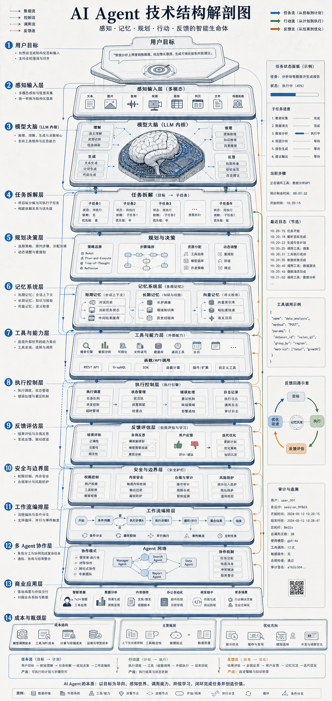

# AI Agent不是更会聊天的机器人

很多人把 AI Agent 理解成“更聪明的聊天机器人”。

这个理解太浅了。

聊天机器人主要负责回答问题，而 Agent 的目标是完成任务。它不仅要理解你说什么，还要拆解目标、制定计划、调用工具、检查结果，并在失败时重新调整路径。

所以，AI Agent 的关键不在“更会说”，而在“能不能把目标变成动作，并把动作闭环完成”。

如果说大模型是大脑，Agent 更像一个接入了记忆、工具、执行控制和安全边界的任务系统。

## 01 聊天机器人负责回答，Agent 负责完成任务

聊天机器人最核心的能力，是理解输入并生成回答。

但 Agent 要做的事情更进一步。

它面对的不是一个单轮问答，而是一个需要完成的目标，例如：

- 查找资料并输出结论
- 打开网页并执行一串操作
- 读代码、修改代码并验证结果
- 查询数据库后生成报告
- 处理客服请求并推进工单流转

这意味着 Agent 不能只停留在语言层。

它需要从“理解问题”进入“执行任务”。

这是 Agent 和普通聊天机器人的根本区别。

## 02 Agent 的第一层，是模型大脑

Agent 系统的中心仍然是模型。

这个模型负责：

- 理解自然语言目标
- 提取约束条件
- 识别成功标准
- 推理当前状态
- 生成下一步计划

没有模型，Agent 不会理解任务；但只有模型，也无法完成任务。

因为真实任务通常需要外部世界的信息和动作能力，而不是仅靠参数内部知识。

所以模型大脑只是 Agent 的中心，不是 Agent 的全部。

## 03 规划层：从目标到步骤

Agent 真正开始像“系统”而不是“对话接口”，往往发生在规划层。

当用户输入一个目标时，Agent 需要把它拆成若干可执行步骤。

例如：

1. 理解目标和限制条件
2. 判断需要哪些外部信息
3. 选择合适工具
4. 生成调用参数
5. 执行动作
6. 检查结果是否达标
7. 如果失败，重新规划

这个过程里，Agent 不只是“回答接下来做什么”，而是要决定“真正去做哪一步”。

所以规划层的价值，不在写出一个漂亮计划，而在把复杂目标拆成可落地动作。

## 04 记忆系统：为什么 Agent 不能只有上下文窗口

Agent 还需要记忆系统。

因为任务往往不是一次性完成的。

一个成熟的 Agent 通常要保存多类状态：

- 当前任务上下文
- 历史对话
- 执行中间结果
- 用户偏好
- 长期知识
- 工具返回记录

这部分可能来自短期上下文，也可能来自长期记忆、向量记忆或外部数据库。

如果没有记忆，Agent 很快就会出现几个问题：

- 忘记之前做过什么
- 重复执行相同步骤
- 丢失任务状态
- 无法持续跟进多轮任务

所以记忆不是锦上添花，而是执行闭环的一部分。

## 05 工具调用层：Agent 为什么开始有“行动力”

Agent 和模型最大的差异之一，是工具调用。

模型本身擅长生成文本，但工具让 Agent 获得了外部行动能力。

常见工具包括：

- 搜索
- 浏览器
- 代码执行
- 文件读写
- 数据库查询
- 企业系统接口
- 外部 API
- 插件

当 Agent 可以调用这些工具时，它就不再只是“解释世界”，而是开始“操作世界”。

例如：

- 为了回答问题，它先搜索资料
- 为了完成开发任务，它先读代码、改文件、跑测试
- 为了完成业务流程，它调用内部系统推进状态

这就是 Agent 的行动力来源。

## 06 执行控制层：最难的地方不是计划，而是执行闭环

很多人低估了执行控制层的难度。

Agent 不能只是“想一想”，它必须把计划转成动作：

- 选择哪个工具
- 生成什么参数
- 在什么权限范围内执行
- 如何读取返回结果
- 如何判断动作是否成功
- 出错后如何回退或重试

真正的复杂性在这里暴露出来。

模型可能规划错误，工具可能返回异常，权限可能越界，上下文可能丢失，任务链路越长，错误越容易累积。

这也是为什么 AI Agent 真正难的地方，不在生成一个看起来聪明的回答，而在完成一个稳定、可复现、可纠错的执行闭环。

## 07 反馈评估层：Agent 需要知道自己做得对不对

一个只会执行、不会检查结果的系统，不足以叫 Agent。

成熟的 Agent 必须具备反馈机制。

这通常包括：

- 结果检查
- 事实校验
- 单元测试
- 人类反馈
- 自我修正
- 重新规划

当一个动作执行完成后，系统要判断：

- 任务是否真的完成
- 输出是否符合要求
- 是否存在事实错误
- 是否需要补充步骤
- 是否应该回滚或改写

这部分决定了 Agent 是否能从“会行动”走向“会闭环”。

## 08 安全边界：为什么企业场景不能只靠模型自觉

Agent 一旦接入工具和系统，安全问题就会迅速放大。

因为它不再只是说错一句话，而可能真的执行错误动作。

成熟 Agent 系统必须加入安全边界，例如：

- 权限控制
- 沙箱
- 审计日志
- 敏感操作确认
- 越权防护
- 人工接管机制

例如删库、发邮件、调用生产系统、修改财务数据，这些都不能只靠模型判断“看起来合理”。

企业场景真正关心的，不是 Agent 能不能演示成功一次，而是它能不能在长期运行中保持边界清晰、责任可追踪、异常可接管。

## 09 单 Agent 和多 Agent，本质上都是工作流系统

再往上走，Agent 会进入工作流编排层。

这时它不再只是一个助手，而是一个能够被系统调度的执行单元。

常见能力包括：

- 多 Agent 协作
- 任务队列
- 状态机
- 事件触发
- 人工接管
- 流程编排

单 Agent 像一个多面手，适合简单到中等复杂度任务。

多 Agent 更像一个协作系统，不同 Agent 分别负责规划、检索、执行、验证和汇总。

两者背后的本质并不是“谁更智能”，而是谁更适合把任务组织成稳定工作流。

## 10 它的商业价值，不在陪聊，在流程自动化

AI Agent 真正有价值的地方，不在陪聊，而在任务自动化。

落地场景通常包括：

- 客服
- 办公自动化
- 代码助手
- 数据分析
- 运营助手
- 企业流程自动化

这些场景的共同点是：目标明确、步骤可拆、工具可接、结果可验证。

也正因为如此，Agent 的商业价值来自执行链路，而不是语言风格。

## 结语

AI Agent 的本质，不是“模型变成人”，而是“模型被接入工具、记忆和工作流之后，开始具备执行任务的能力”。

它真正重要的不是能聊多久，而是能否在目标、规划、工具、执行、反馈和安全之间形成闭环。

所以，大模型到 Agent，中间差的不是一点提示词技巧，而是一整套任务执行系统。

下次再看到 AI Agent，可以先问一个更关键的问题：

它到底是在“回答问题”，还是已经在“完成任务”？

<!--
Guocc WeChat source files:
- 小红书文案.txt
- 提示词.txt

Candidate images:
- 图片.png
-->
