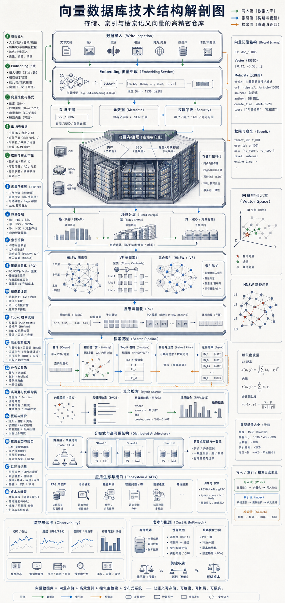

# 向量数据库到底存的是什么？

普通数据库擅长回答“完全匹配”的问题。

订单号是多少、用户 ID 是谁、价格是否大于某个数，这些都是结构化数据查询最熟悉的场景。

但 AI 应用经常要回答另一类问题：这段话和哪份文档语义最接近？这张图和哪些商品相似？这个用户可能喜欢什么内容？

这就是向量数据库存在的原因。

向量数据库解决的不是简单的“存数据”，而是让机器按语义、相似度和上下文关系找数据。

如果说大模型负责生成答案，向量数据库更像 AI 应用的记忆与检索系统。

## 01 普通数据库按字段查，向量数据库按相似度查

传统数据库更擅长确定性查询。

例如：

- `user_id = 123`
- `price > 100`
- `status = paid`
- `created_at between A and B`

这些查询的前提是，问题和数据字段之间有明确规则。

但很多 AI 场景不是这样。

用户可能问：“有没有和这段描述差不多的资料？”“这张图片和哪些商品相似？”“这份合同里有没有类似风险条款？”

这些问题并不是完全匹配，而是相似度匹配。

向量数据库的核心价值，就是把文本、图片、音频、商品、用户行为和企业知识，变成可以被机器计算相似度的向量。

## 02 第一步：把非结构化数据变成向量

向量数据库的第一步通常发生在数据库之外：Embedding。

Embedding 模型会把文本、图片、音频、视频、商品、文档片段等原始数据，转换成一串高维数字。

这串数字就是向量。

它看起来可能只是几百到几千个浮点数，但这些数字承载的是语义或特征信息。

例如：

- 两段意思接近的文本，向量距离会更近。
- 两张风格相似的图片，向量可能落在相近区域。
- 两个用户兴趣相似，行为向量可能有更高相似度。

这也是为什么向量常被理解成“语义坐标”。

Embedding 做的事情，就是把人类可理解的内容，映射到机器可以计算距离的空间里。

## 03 向量数据库不只存向量

很多人以为向量数据库只存一串数字。

实际生产系统里，它通常会同时保存多类信息：

- 向量
- 数据 ID
- 原文片段
- 元数据
- 标签
- 权限字段
- 版本信息

向量负责相似度计算，原文片段负责回显和拼接上下文，元数据用于过滤，权限字段决定谁能查到什么。

这点在企业知识库和 RAG 系统里非常关键。

如果只做语义相似度，不做权限隔离，一个用户可能检索到不该看到的内部文档。

所以向量数据库不是“向量仓库”这么简单，它还要处理数据模型、权限、版本、过滤和上下游系统协作。

## 04 索引层：为什么不能直接一个个比

如果数据量很小，系统可以把查询向量和所有向量逐个计算距离。

这种方式叫 Flat 检索，简单直接，但规模一大就会变慢。

真实业务里可能有几百万、几千万甚至更多向量。每次查询都全量比一遍，成本很快不可接受。

所以向量数据库必须建立索引。

常见索引结构包括：

- HNSW：用图结构组织邻近关系，适合高召回、低延迟场景。
- IVF：先把向量分簇，查询时只搜索相关簇，降低搜索范围。
- PQ：通过量化压缩向量，减少存储和计算成本。
- Flat：精确但昂贵，常用于小规模或评估场景。
- 混合索引：把向量检索和关键词、倒排、过滤条件结合起来。

索引层的核心矛盾是：查得快、召回准、成本低，很难三者同时拉满。

## 05 查询层：用户问题也会先变成向量

当用户发起查询时，系统不会直接拿文字去数据库里找。

它通常会先把用户问题送进 Embedding 模型，生成一个查询向量。

然后向量数据库执行：

- Top-K 检索
- 相似度计算
- 元数据过滤
- 混合检索
- 范围搜索
- 权限过滤

最终返回最相关的若干条结果。

在 RAG 场景里，这些结果会被拼接进上下文，再交给大模型生成回答。

所以 RAG 的质量不只取决于大模型，也取决于向量检索有没有找对资料。

如果召回结果错了，模型再强也可能基于错误上下文生成错误答案。

## 06 分布式层：真正的难点在规模化

当向量数据越来越多，单机存储和计算会很快遇到瓶颈。

这时向量数据库需要分布式能力：

- 分片
- 复制
- 负载均衡
- 扩容
- 故障恢复
- 一致性控制

分布式不是简单把数据拆开。

它还要保证查询时能在多个分片之间找到足够好的结果，并在延迟、召回率和资源成本之间取得平衡。

这也是为什么向量数据库既像数据库，也像搜索引擎，还像 AI 基础设施。

## 07 更新维护：向量不是写进去就结束

向量数据库还有一个容易被低估的问题：更新。

企业知识库会新增文档、删除文档、修改权限、更新版本。

推荐系统里的商品、内容和用户行为也在不断变化。

这意味着向量数据库要处理：

- 增量写入
- 删除
- 索引重建
- 版本切换
- 数据同步
- 冷热分层

索引越复杂，更新维护成本越高。

如果只追求查询速度，可能牺牲实时更新能力；如果追求实时写入，索引质量和查询性能又可能受到影响。

这就是工程系统里的真实取舍。

## 08 它为什么是 AI 应用的基础设施

向量数据库之所以重要，是因为很多 AI 应用都绕不开“相似性”。

典型场景包括：

- RAG 知识库问答
- 语义搜索
- 推荐召回
- 多模态检索
- 企业知识检索
- Agent 长期记忆
- 个性化服务

这些场景的共同点是：用户不一定知道准确关键词，系统也不能只靠字段匹配。

它需要理解“相近”“相关”“类似”“可能有用”。

向量数据库把这些模糊关系变成可计算、可索引、可召回的工程能力。

## 09 真正的瓶颈在哪里

向量数据库听起来很先进，但瓶颈非常现实。

第一，高维向量很占存储。

向量维度越高、数据量越大，存储成本和内存压力越明显。

第二，索引构建耗资源。

高质量索引往往需要更多计算、内存和构建时间。

第三，召回速度和召回精度互相拉扯。

查得越快，不一定越准；查得越准，可能越慢、越贵。

第四，数据更新会影响性能。

频繁写入、删除和权限变化，会增加索引维护复杂度。

第五，权限隔离决定企业能不能放心用。

没有可靠权限控制，向量数据库很难进入严肃企业场景。

## 结语

向量数据库，是 AI 应用从“会生成”走向“会查找、会记忆、会理解相似性”的关键基础设施。

它把文本、图片、音频、商品和知识片段，映射成机器可以计算的语义坐标。

它再通过索引、过滤、分布式存储和检索引擎，把这些坐标组织成可用的知识系统。

所以，向量数据库更像 AI 时代的记忆系统。

它不只是存数据，而是在帮机器找到“和当前问题最相关的东西”。

下次看到 RAG、语义搜索、推荐系统或 Agent 记忆时，可以先问一个问题：

它背后的向量，是怎么生成、怎么索引、又怎么被召回的？

<!--
Guocc WeChat source files:
- 小红书文案.txt
- 提示词.txt

Candidate images:
- 图片.png
-->
