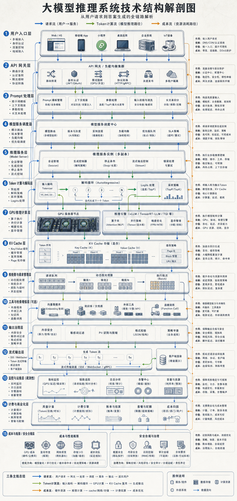

# Token 不是免费流出来的：一张图拆开大模型推理系统

很多人以为，大模型推理就是把问题丢给模型，然后等它生成答案。

真正进入生产环境后，这件事远比“模型会不会回答”复杂。

一次普通的 API 调用背后，是一套高并发、高成本、高风险的在线工程系统：它要接住请求、重组上下文、调度 GPU、管理缓存、输出 token、过滤风险，还要能计费、监控和审计。

如果把大模型能力看成一座算力工厂，那么用户看到的答案，只是最后流出来的一小段成品。

真正决定体验、成本和稳定性的，是工厂里面每一层系统如何配合。

## 01 请求进来后，第一站不是模型

用户从 App、网页、企业系统、插件入口或 API 发起请求后，第一站通常不是模型本体，而是接入与网关层。

这一层要先回答几个非常现实的问题：

- 这个用户是谁？
- 是否有调用权限？
- 当前是否超过限额？
- 应该走哪个模型、哪个集群、哪个版本？
- 这次调用如何计费？
- 是否进入灰度链路？

所以，企业级大模型服务首先不是“让模型开口”，而是保证服务可控。

API 网关、身份认证、限流、计费、路由、灰度发布，构成了推理系统的入口秩序。没有这一层，模型能力很难变成稳定可运营的在线服务。

## 02 Prompt 不是原样送进模型

请求通过网关之后，会进入 Prompt 处理层。

用户输入往往只是其中一部分。真正送进模型之前，系统还会把多种信息重新组装在一起：

- 系统指令
- 用户问题
- 多轮对话上下文
- Prompt 模板
- 输出格式要求
- 安全规则
- 检索结果或工具返回结果

如果上下文太长，还要做截断、压缩、摘要或关键信息选择。

这一层看似不显眼，但它直接影响模型最终看到什么、忽略什么、按什么规则回答。

很多回答质量问题，并不一定发生在模型参数里，也可能发生在 Prompt 拼接、上下文选择和输入治理里。

## 03 真正昂贵的部分，在推理计算层

当请求进入模型服务层，推理引擎会调度模型权重、批处理队列、流式输出和模型路由。

再往下，就是最昂贵的推理计算层。

模型权重加载在 GPU 或 AI 加速卡的显存中，请求进入推理引擎后，系统开始一个 token 一个 token 地生成答案。

这里的关键资源包括：

- GPU 计算时间
- 显存容量
- KV Cache
- 注意力计算
- 并发调度
- 网络与存储开销

其中 KV Cache 对长上下文成本尤其敏感。

上下文越长，系统需要保留和访问的中间状态越多。用户看到的是“继续回答”，系统消耗的是显存、带宽和调度能力。

这就是为什么长上下文、多轮对话和高并发请求，会迅速放大推理系统的成本压力。

## 04 推理系统的核心矛盾：稳定地回答很多人

单个请求能回答，不代表系统能商用。

推理系统真正要解决的是：

> 能不能在可接受成本下，稳定回答很多人。

这句话里包含三个约束。

第一，延迟要可接受。用户不能等太久，企业系统也不能被慢请求拖垮。

第二，吞吐要足够高。同一时间有大量请求进入时，系统要通过批处理、队列和调度机制提高资源利用率。

第三，成本要算得过来。每一次生成都在消耗 GPU 时间、显存、网络、存储和运维资源。

所以推理系统不是单纯追求“更聪明”，而是在质量、速度、成本和稳定性之间做工程权衡。

## 05 为什么要做量化、缓存和推理加速

为了降本提速，系统会引入一系列优化手段：

- 量化：降低模型计算和显存开销，但可能带来质量损失。
- 蒸馏与剪枝：用更小模型承接部分任务，减少推理成本。
- 批处理：把多个请求合并调度，提高吞吐，但会影响实时性。
- Speculative Decoding：用小模型预生成候选 token，再由大模型验证，提高生成速度。
- Paged Attention：更高效地管理注意力和 KV Cache，改善长上下文与并发场景。
- 算子优化：把底层计算做得更快、更省资源。

这些优化没有一种是免费的。

更快、更便宜，常常意味着质量、稳定性、系统复杂度或调试成本上的新取舍。

这也是大模型基础设施的难点：很多优化看起来是算法问题，落到生产环境里，都会变成工程系统问题。

## 06 工具调用和 RAG，让推理系统变成工作流

今天的大模型服务，往往不只是生成自然语言。

它还可能连接外部工具、数据库、企业知识库和 API。

这就引出了工具与检索层：

- RAG 检索
- 函数调用
- 工具调用
- 外部 API
- 数据库连接
- 引用校验

当用户问一个需要外部知识的问题时，系统可能先检索资料，再把结果组织进上下文，然后让模型生成答案。

当用户要求执行操作时，系统可能要判断是否调用工具、传入哪些参数、如何处理返回结果，以及如何避免越权调用。

这时，推理系统已经不只是“模型接口”，而是一个围绕模型组织起来的任务执行链路。

## 07 答案生成之后，还不能直接交出去

模型生成结果后，输出治理层还要继续工作。

常见环节包括：

- 内容安全检查
- 幻觉检测
- 格式校验
- 敏感信息过滤
- 引用校验
- 日志审计

在个人使用场景里，一次回答不准确可能只是体验问题。

但在企业场景里，错误输出、敏感数据泄露、违规内容、越权调用和不可追踪的决策链路，都可能变成真实风险。

所以，大模型进入生产环境前，绕不开安全、合规和审计。

一个成熟的推理系统，不只要能生成答案，还要能解释请求从哪里来、走了哪条链路、消耗了多少资源、是否触发了风险规则，以及最终输出是否可追踪。

## 08 监控和计费，决定它能不能成为生意

如果推理系统要成为一门可持续的生意，还需要监控运维层和商业化层。

监控层要持续观察：

- 延迟
- 吞吐
- 错误率
- GPU 利用率
- 单次请求成本
- 日志链路
- 告警状态

商业化层则要把这些资源消耗映射到价格模型里：

- API 计费
- 订阅制
- 企业私有化部署
- 行业解决方案
- 模型市场

每一次请求都消耗 GPU 时间、显存、网络、存储和运维资源。

这些资源最终会转化为 API 成本、订阅收入或企业部署价值。

这就是“成本流”：token 并不是免费流出来的，它背后有清晰的资源账本。

## 09 用三条流理解大模型推理系统

如果只用一张图理解大模型推理系统，可以抓住三条流。

第一条是请求流。

用户请求进入 API 网关，经过认证、限流、路由、Prompt 处理，再进入模型服务。

第二条是计算流。

模型权重、KV Cache、显存和 GPU 算力共同完成 token 生成，再通过流式输出返回给用户。

第三条是成本流。

每一次调用都在消耗计算、显存、网络、存储和运维资源，最终进入计费、订阅或企业交付模型。

理解这三条流，就能看懂为什么推理系统既是技术系统，也是商业系统。

## 结语

大模型推理系统，本质上是把“模型能力”包装成“可调用、可监控、可计费、可治理”的在线服务。

用户以为自己在等一句回答。

其实背后是一整座实时运转的算力工厂：入口在控制请求，Prompt 层在重组上下文，GPU 在生成 token，缓存和加速系统在压低成本，治理层在控制风险，监控和计费系统在维持这门生意的可持续性。

下一次看到大模型流式输出时，可以换一个角度理解它：

那不是一句话慢慢出现，而是一套工程系统正在把算力、规则、数据和商业模型压缩成一个个 token。

下一个想拆的主题，可以是 RAG 系统、AI Agent，或者向量数据库。

<!--
Guocc WeChat source files:
- 小红书文案.txt
- 提示词.txt

Candidate images:
- 图片.png
-->
