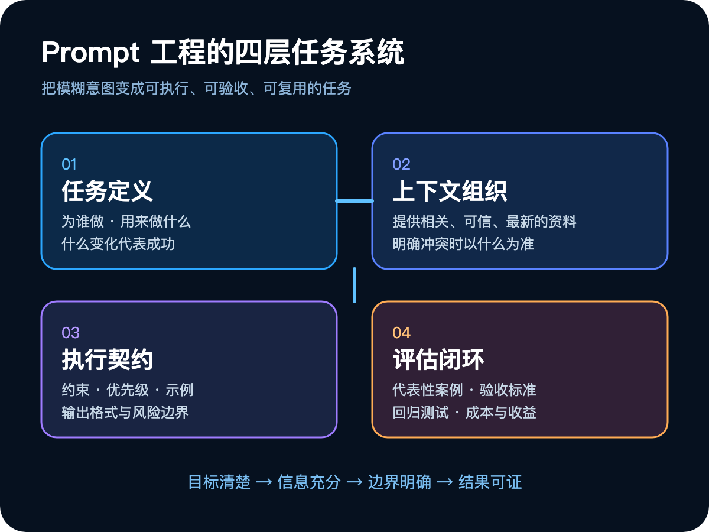
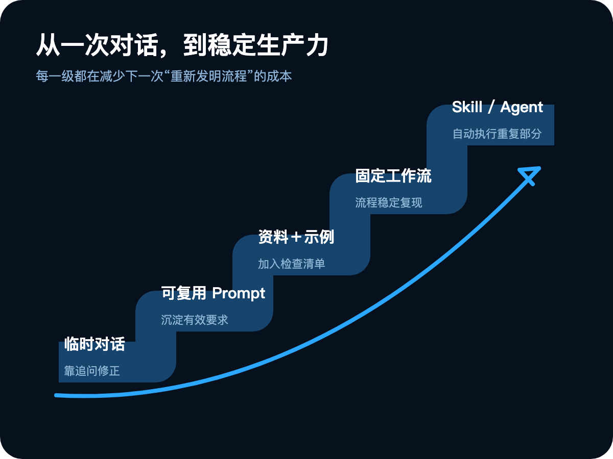

# 模型越来越强，为什么你的生产力没有变？

你订阅了更强的模型，收藏了更多提示词，安装了各种 Agent 工具。

每天都在读 AI 新闻、测试新产品、研究新的工作流。一个月后回头看，真正被 AI 稳定接管的工作，可能一项都没有。

文章还是要自己重写，报告依然需要从头核对，生成的代码不敢直接使用。AI 确实给了你很多答案，却没有真正改变你的工作方式。

这是 AI 时代最常见、也最容易被忽略的矛盾：**模型越来越强，很多人的生产力却没有同步提高。**

原因可能并不复杂：绝大多数人不是已经学会了 Prompt 工程，而是只学会了向 AI 提问。会提问，可以得到一次不错的回答；真正的 Prompt 工程，要解决的是另一件事——怎样让 AI 在一类真实任务中持续创造价值。

## 一、你痴迷的可能不是生产力，而是 AI 本身

我们很容易把“了解 AI”误认为“会使用 AI”。

知道模型排行榜，能谈论 Agent、RAG、MCP，收藏了几百条提示词，这些只能说明你关注 AI，不能证明 AI 已经改善了你的结果。

判断 AI 是否成为生产力，可以问五个更朴素的问题：

1. AI 是否稳定接管了某个重复任务？
2. 完成同一件事，时间是否减少了？
3. 错误率和返工是否下降了？
4. 过去因为成本太高而做不了的事，现在是否可以完成？
5. 一次成功经验，能否被下一次直接复用？

如果这些问题没有答案，我们可能一直在“玩 AI”，却没有把 AI 变成生产力。

问题通常不在模型不够强，而在于我们仍把 AI 当作一个聊天对象。聊天依赖临场反应：结果不满意，就追问一句；方向偏了，再补充背景；漏掉要求，就临时纠正。这适合探索，却很难稳定复用。

生产任务需要另一套能力：提前定义目标，提供必要资料，说明边界与优先级，并判断结果是否合格。从聊天到生产，中间缺少的这一层，就是 Prompt 工程。

## 二、Prompt 工程不是“咒语”，而是任务设计

很多人对 Prompt 工程的印象，仍停留在一些表面技巧：给模型指定一个夸张的专家角色，加上“一步一步思考”，套用十几个模块的万能模板，或者收藏一句据说能显著提高质量的神奇指令。

这些方法偶尔有效，但它们不是核心。

**真正的 Prompt 工程，是把脑中模糊的意图，变成模型可以执行、结果可以验收的任务。**

当你说“帮我写一篇有深度的文章”，模型面对的并不是一个明确任务，而是一团没有展开的期待：写给谁？准备改变读者的什么认知？核心判断是什么？需要哪些事实和案例？“有深度”如何判断？哪些表达应该避免？

如果这些问题没有答案，模型只能猜。

“帮我分析这个产品”也一样。你关心的是用户需求、商业模式、竞争壁垒，还是技术可行性？分析是用于快速了解，还是支持投资决策？资料不足时应该继续推断，还是明确标出未知？

很多 Prompt 写不清楚，不是因为表达技巧不够，而是任务本身还没有被想清楚。

Prompt 工程表面上训练的是与 AI 沟通，底层训练的其实是四种能力：任务定义、上下文组织、执行契约和评估闭环。

这四层不是写作模板，而是一套任务系统：目标清楚，信息充分，边界明确，结果可证。

## 三、四层框架：把模糊期待变成可执行任务

### 1. 任务定义：不要只说动作，要说明价值

很多 Prompt 只有动作，没有目标。“总结这篇文章”“分析这组数据”“写一份营销文案”，都只告诉 AI 做什么，没有说明为什么做、为谁做，以及结果将如何使用。

把“总结这篇文章”改成：

> 为没有技术背景的产品经理总结这篇文章，帮助他判断这项技术是否值得在团队内试用。优先解释应用条件、实施成本和主要风险。

任务立刻变得不同。同一份材料，面向不同读者、服务不同决策，本来就应该产生不同答案。受众、用途和成功标准不是附加信息，而是任务本身的一部分。

一个清楚的任务定义，至少回答三个问题：谁会使用这个结果？他准备用它完成什么？什么变化代表任务成功？

如果人类没有完成这一步，更强的模型只会更流畅地执行一个模糊任务。

### 2. 上下文组织：不是给得越多，而是给得越对

AI 无法使用你没有提供的信息。项目背景、用户特征、已有结论、参考材料、历史决策和业务规则，都可能直接改变输出。很多所谓的“模型能力不足”，其实只是模型没有拿到完成任务需要的上下文。

但上下文也不是越多越好。把几十份文档全部扔给模型，和什么都不给一样，都是在逃避选择。真正的能力是判断：哪些信息与任务直接相关；哪些资料可信，哪些只是参考；哪些结论已经过时；哪些背景必须保留，哪些只是噪声；信息冲突时以什么为准。

这也是为什么 Prompt 工程会自然通向 Context Engineering。Prompt 关注“我要模型做什么”，Context 关注“完成这一步时，模型应该看到什么”。后者不是取代前者，而是把上下文从临时粘贴变成系统管理。

### 3. 执行契约：把期待变成边界

目标和资料清楚之后，还要规定模型如何完成任务。一份合格的“执行契约”通常包括四类内容：

- **约束**：哪些内容必须包含，哪些行为不能发生；
- **优先级**：多个要求冲突时，先满足哪一个；
- **示例**：什么样的结果符合标准；
- **输出格式**：结果将怎样被人或程序继续使用。

很多人只写字数、语气和格式，却忽略了更重要的事实边界与风险边界。例如：信息不足时必须明确说明，不能虚构案例和来源；无法确认时列出待核验项；涉及外部操作时先请求确认；准确性与表达流畅冲突时，优先保证准确。

示例也比堆叠形容词更有效。“写得简洁”“要有洞察”“不要有 AI 味”，每个人的理解都不同。与其继续解释，不如提供一两个真正符合标准的例子。示例同时传递格式、内容密度、判断尺度和表达风格。

输出格式则决定结果能否进入下一步。给人阅读的报告需要结论、证据和不确定性；交给程序的结果需要稳定结构；需要继续执行的任务应该包含行动项和完成条件。**格式不是装饰，而是工作流接口。**

### 4. 评估闭环：先定义怎样算好

这是 Prompt 工程中最容易被忽略、也最重要的一层。

很多人的优化方式是：生成一次，感觉不好，加一句要求；再生成一次，看起来不错，于是保存。这种方法完全依赖感觉。

真正的工程方法，应该先准备一组有代表性的任务，再定义判断标准。每次修改 Prompt 后重新测试：哪些问题被修复了？哪些原本正确的结果退化了？改进只对一个案例有效，还是能稳定复现？质量提升是否值得额外增加的时间和成本？

不同任务需要不同的评估方式。文章可检查观点是否明确、论证是否完整、事实是否可核验；代码可运行测试、类型检查和安全扫描；研究报告可检查引用是否真实、结论是否超出证据；业务任务最终要看它是否节省时间、减少错误或改善结果。

如果连“好结果是什么”都无法定义，就不可能真正优化 Prompt，只是在不断调整自己的感觉。

## 四、模型越强，Prompt 工程反而越重要

模型能力提升，确实会淘汰一部分机械技巧。我们不必再迷信标点、关键词顺序或只对某个模型有效的暗号。更强的模型更能理解自然语言，也更能主动补全缺失细节。

但它不能替你决定目标。你没有提供的业务背景，它不会自动拥有；你没说清楚的取舍，它只能猜；你自己无法验收的结果，它也无法替你证明正确。

更重要的是，AI 的执行能力正在变强。过去，一个模糊 Prompt 最多生成一段没用的文字。现在，一个 Agent 可以在模糊目标下连续工作，调用工具、修改文件，甚至影响真实系统。

执行能力越强，方向错误的代价越大。

模型进步淘汰的是“咒语式 Prompt”，而不是任务定义、上下文组织、边界设计和结果评估。AI 越能执行，人就越需要知道自己究竟要它执行什么。

## 五、从一条 Prompt 到真正的生产力

Prompt 工程的价值，不在于保存了一段漂亮文字，而在于能否把偶然成功沉淀成稳定能力。

一个重复任务的成熟路径通常是：

第一次完成任务时，你可能需要不断追问和修正。第二次，把有效要求整理成 Prompt。第三次，补充标准资料、正确示例和验收清单。当流程足够稳定，再封装成 Skill、脚本或 Agent，让系统自动执行重复部分。

真正的效率提升，不是“这次少写了十分钟”，而是下一次遇到同类任务时，不必重新发明整个过程。

真正的 AI 价值，也不是生成了多少内容，而是有多少工作能够被稳定完成，多少错误能够提前发现，多少人的判断能够被系统复用。

## 六、Prompt 是起点，但不是全部

重新重视 Prompt 工程，不意味着所有问题都能靠 Prompt 解决。

模型缺少关键知识，需要补充上下文或接入检索；任务需要操作外部系统，就要提供工具；流程跨越多个步骤，需要状态管理；结果影响很大，就必须加入测试、权限、审批和人工监督。

如果同一种错误反复出现，最好的办法通常也不是给 Prompt 再加一句警告，而是把规则写进代码，把检查变成测试，把流程封装成工具。

Prompt 工程的更高阶段，不是写出越来越长的 Prompt，而是能判断问题发生在哪一层：

- 任务不清楚 → 修改 Prompt
- 信息不完整 → 改进 Context
- 执行不稳定 → 完善 Workflow / Harness
- 结果不可控 → 加入 Eval / Verification

Prompt 是所有 AI 工作流的最小起点，却不是终点。

## 七、别再收藏模板：从一个真实任务开始

如果你每天使用 AI，却没有感受到明显的效率提升，不需要再收藏一百条模板。

选择一个每周都会重复、结果可以判断的真实任务，然后依次回答：

1. 这项任务最终要创造什么价值？
2. AI 必须看到哪些资料？
3. 哪些边界和优先级不能被忽略？
4. 有没有一个能代表理想结果的示例？
5. 输出将被怎样继续使用？
6. 我准备用什么标准验收？

用这六个问题写出第一版 Prompt，拿真实案例测试，记录失败，再逐步沉淀为工作流。

## 结语

人与人使用 AI 的差距，不只来自谁拥有更强的模型，更来自谁能把自己的意图变成清楚、可执行、可验证的任务。

模型越来越强，并不会自动提高你的生产力。

只有当一次对话变成可复用的流程，当模糊期待变成明确任务，当结果能够被验证，AI 才真正开始为你创造价值。
