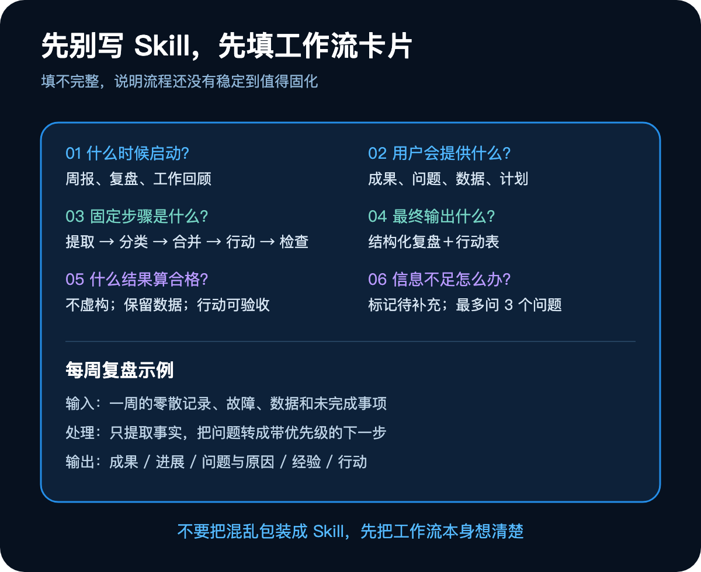
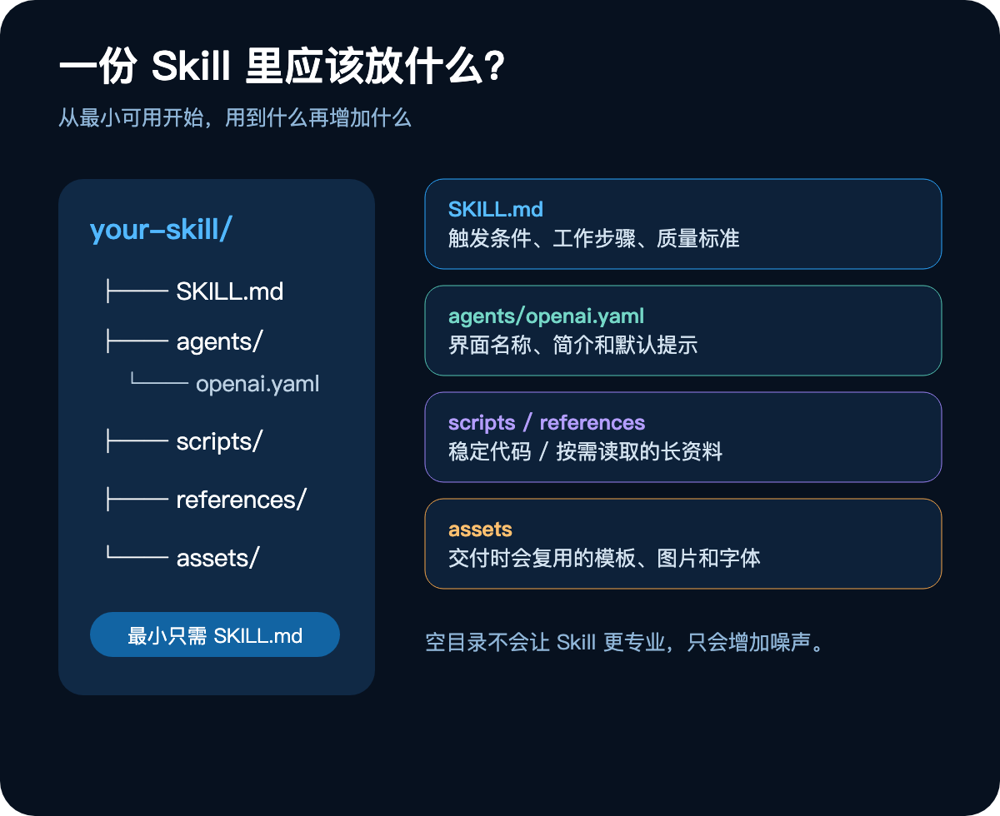
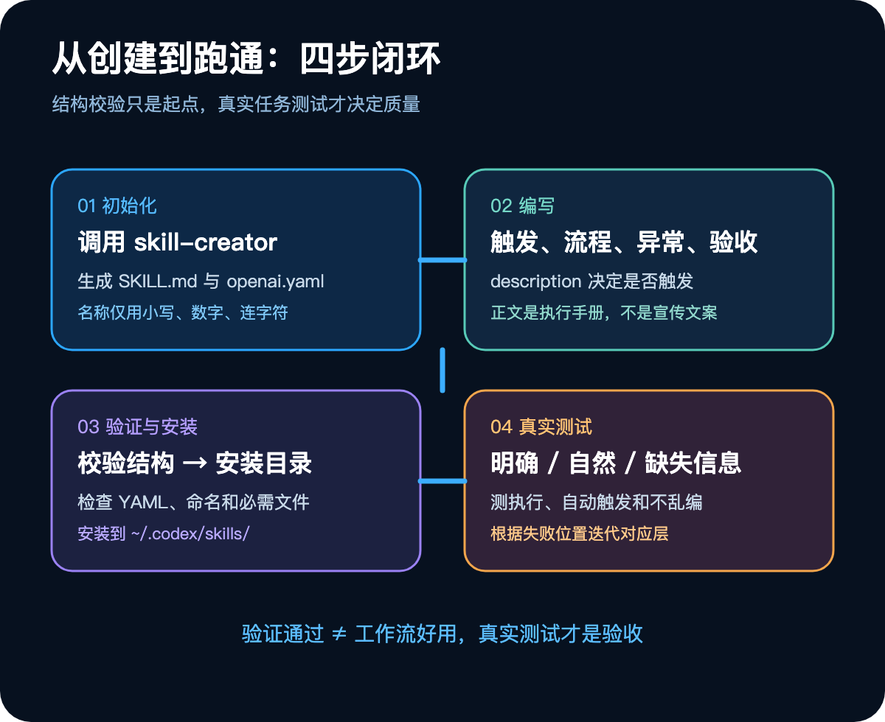
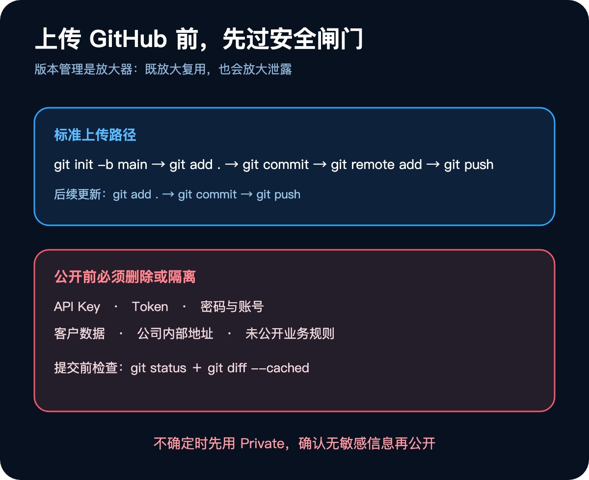

很多人使用 AI 一段时间后，都会积累一个越来越长的提示词收藏夹。

写周报有一段，审核合同有一段，整理访谈又有一段。问题是，每次开始工作，你仍要找到旧提示词、补充背景、解释规则，再检查 AI 有没有漏掉关键要求。提示词收藏得越多，管理成本反而越高。

这不是“提示词写得不够好”，而是工作方式还停留在对话层。只要一项任务反复出现，你真正需要保存的就不再是一段话，而是整套做事机制：何时启动、需要哪些材料、如何判断、遇到缺失信息怎么办，以及怎样才算交付合格。

Codex Skill 的价值正在这里。它不是一条更长的提示词，而是把个人经验变成可安装、可测试、可迭代的工作模块。

本文不按“建文件—写配置—上传仓库”的工具顺序讲，而从一个更实用的问题出发：**怎样判断一项工作已经成熟到可以交给系统，以及怎样避免把混乱自动化。**

## 一、先识别一种隐形成本：重复解释

假设每到周五，你都会把一周的零散记录交给 Codex，并附上一串要求：区分成果和进展，提取问题与经验，把未完成事项转成下周行动，不要虚构数据，每个行动都要写清完成标准。

第一次这么做，是沟通。连续几周都这么做，就出现了“重复解释税”。

这项成本不只体现在复制粘贴。你还要反复提醒边界、纠正格式、核对事实。更麻烦的是，同一件事在不同对话里可能得到不同结果：有时漏掉数据，有时把推测写成事实，有时下周计划只剩“持续优化”。

Skill 解决的不是“让 AI 记住一段文字”，而是让一类任务拥有稳定的执行环境。可以把它理解为四层协议：

1. **触发协议**：哪些请求出现时应该接管任务；
2. **执行协议**：信息按照什么顺序被处理；
3. **资源协议**：允许调用哪些脚本、资料和模板；
4. **验收协议**：什么结果可以交付，什么结果必须返工。

普通提示词更像一次口头交代，Skill 更像岗位制度。前者追求当下回答，后者追求下次仍然稳定。

## 二、不是所有重复任务都值得自动化

“经常做”只是第一个条件。决定一项工作能否做成 Skill，我更建议看三个边界。

### 输入边界：材料是否大致可预期

周复盘的输入通常是事实、数据、问题和计划；会议整理通常会收到转写稿、参会人和待办。输入不必每次完全一致，但应该知道系统在处理什么。

### 决策边界：中间是否存在可描述的规则

例如先提取事实，再分类，再合并重复项，最后生成行动。如果任务完全依赖灵感、品味或临场判断，就很难靠固定流程保证质量。

### 输出边界：合格结果能否被检查

“写得更好”无法验收；“包含五个固定栏目，事实与推断分开，每个行动都有优先级和完成标准”则可以。

当输入、决策和输出三个边界都相对清楚时，Skill 才有稳定基础。把零散记录整理成周复盘、按固定风险项审核合同、发布前跑检查清单、把会议记录转成任务表、按品牌规范回复客服、批量处理同类 PDF 或表格，都属于合适场景。

相反，一次性的临时任务、一句话就能完成的简单操作、完全开放的创意探索，以及“帮我运营所有内容”这样的无限目标，不适合直接封装。

这里有一个反直觉判断：**Skill 的范围越小，长期价值往往越大。** “把访谈整理成固定结构的长文”比“全能内容助手”更容易触发、更容易测试，也更容易持续改好。

## 三、先写工作流卡片，再碰文件

不少人创建 Skill 的第一步是新建目录。更稳妥的做法，是先把脑中的隐性经验摊开。



一张工作流卡片只需要回答六件事：

- 什么情况下启动；
- 用户会提供什么；
- 系统依次做什么；
- 最终交付什么；
- 哪些条件代表合格；
- 信息不足或发生异常时怎么办。

以每周复盘为例，真正有价值的不是“帮我写周报”，而是下面这套约束：从记录中抽取事实和数据；把内容归入成果、进展、问题与经验；合并重复描述；将未完成事项转成下周行动；保留原始数字；禁止补写不存在的成绩；缺失项标记“待补充”；最多提出三个必要问题。

如果这六项写不完整，先不要自动化。那通常意味着工作方法本身还没有定型。Skill 不会替你消除流程中的混乱，只会让混乱更快、更频繁地发生。

在动手实现前，再准备三种真实请求：

```text
请使用 $weekly-review 整理这周的记录。
```

```text
帮我把这些流水账整理成周报，并排出下周优先级。
```

```text
这周主要在做支付功能，帮我复盘一下。
```

它们分别检验三个不同能力：点名调用是否执行正确；自然语言能否触发；材料不足时是否守住事实边界。把这三句话提前写好，后面才有真正可用的测试集。

## 四、Skill 不是一个文件，而是一套分层信息

最小的 Skill 确实只需要 `SKILL.md`，但成熟后可能还会出现界面配置、脚本、参考资料和交付素材。



这些目录不是装饰，而是在解决不同的信息寿命问题：

- `SKILL.md` 保存每次执行都必须知道的触发条件、步骤、异常处理和质量标准；
- `agents/openai.yaml` 提供界面名称、简介和默认提示等展示信息；
- `scripts/` 保存必须稳定复现的代码，例如转换、校验或批处理；
- `references/` 保存较长、只在特定任务中才需要读取的规则和文档；
- `assets/` 保存交付时会复用的模板、图片或字体。

分层的目的，是避免把所有东西都塞进 `SKILL.md`。内容过长会增加上下文负担，也让关键规则淹没在资料里。判断方法很简单：每次都必须遵守的放主文件；反复生成且要求确定性的放脚本；偶尔查阅的长资料放 references；直接用于成品的放 assets。

不要提前创建空目录。先让最小版本解决一个问题，再根据真实失败逐步增加资源。

## 五、真正决定效果的，是触发描述和验收标准

Skill 名称只能使用小写字母、数字和连字符，例如 `weekly-review`、`check-release`。新手可以直接让 Codex 调用 `skill-creator` 完成初始化：

```text
请使用 skill-creator，把下面的工作流做成一个 Skill。

Skill 名称：weekly-review
工作流：[粘贴工作流卡片]

要求：
1. 先创建在当前项目；
2. 只生成真正需要的文件；
3. 完成后执行验证；
4. 告诉我如何测试与安装。
```

最小结构通常类似：

```text
weekly-review/
├── SKILL.md
└── agents/
    └── openai.yaml
```

`SKILL.md` 的 YAML 头部负责触发，正文负责执行。一个有效的头部可以这样写：

```yaml
---
name: weekly-review
description: 将一周的零散记录整理成结构化复盘和下周行动计划。用户提到周报、每周复盘、一周总结、工作回顾，或要求从流水账中提炼成果、问题、经验和下一步行动时使用。
---
```

description 不能只写功能名称，还要写出用户可能采用的表达。Codex 会先依据 name 和 description 判断是否加载 Skill；触发条件藏在正文里，等于入口处看不到招牌。

正文则要像执行手册，而不是产品介绍。至少包含流程、异常处理、输出格式和质量标准。规则应该能被检查，例如“区分事实与推断”“缺少负责人时标记待补充”“每个行动使用明确动词并给出完成条件”。“专业一些”“写得有深度”这类要求无法指导稳定执行。

我的经验是：越容易出错的地方，越需要低自由度；其余部分保持简洁。能用三十行说清的流程，不要扩写成三百行。

## 六、把测试当成产品迭代，而不是毕业考试

完成结构验证后，可以把 Skill 安装到 Codex 的技能目录：

```bash
cp -R ./weekly-review ~/.codex/skills/
```

如果没有立即出现，可以新建一个 Codex 任务，必要时重启应用。但必须明确：验证工具只能证明 YAML、命名和目录结构合法，不能证明 Skill 好用。



接下来用前面准备的三类请求测试：显式点名看流程是否完整；自然表达看自动触发是否准确；缺失信息看系统会不会编造日期、数据或负责人。

失败后不要笼统地说“这个 Skill 不行”，而要找到故障层：

- 没有自动触发，修改 description；
- 步骤经常换序，收紧工作流程；
- 输出充满空话，补充具体质量标准；
- 信息不足时乱编，强化异常处理；
- 同一段代码反复生成，把它移入 scripts；
- 主文件越来越臃肿，把长资料移入 references。

这个诊断模型比反复重写整份提示词有效得多。Skill 的第一版不是终点，而是一个可以观察、定位和修复的工作系统。

## 七、GitHub 的意义不是展示，而是让方法可维护

Skill 在真实任务中跑通后，再考虑上传 GitHub。版本库带来的核心收益，是记录每次修改、在设备之间同步、与团队共享，并在新版本退化时回到旧版本。



创建空仓库后，可以在本地目录执行：

```bash
git init -b main
git add .
git commit -m "feat: add my first Codex skill"
git remote add origin <你的仓库地址>
git push -u origin main
```

后续更新就是正常的版本迭代：

```bash
git add .
git commit -m "docs: improve skill workflow"
git push
```

每次上传前，至少检查：

```bash
git status
git diff --cached
```

如果内容包含公司流程、客户案例、内部规范或业务数据，优先使用 Private。任何公开仓库都不应出现 API Key、Token、密码、账号、客户信息、内部地址和未公开规则。

## 八、从“会用 AI”到“拥有自己的操作系统”

做 Skill 最常见的五个误区，其实都来自同一个错觉：以为把文字装进文件夹，就完成了自动化。

聊天记录不是流程，需要先提炼；大而全的目标没有边界，需要缩小；只有步骤而没有验收标准，无法判断好坏；结构验证通过不等于真实任务可用；上传 GitHub 也不等于可以忽略敏感信息。

真正成熟的 Skill，应同时具备三个特征：它知道何时介入，知道遇到不确定信息时如何停下来，也知道什么结果不能交付。

今天就可以做一个小实验：翻看最近一个月的对话，找到你重复解释过两次以上的任务。先别写代码，只写完那张六项工作流卡片，再交给 `skill-creator` 生成最小版本。随后用明确请求、自然请求和缺失信息请求各测试一次。

当你开始积累这些经过验证的小模块，变化不只是节省几次复制粘贴。你会逐渐把散落在脑中的经验变成一套可维护的个人操作系统：每次工作留下的不只是结果，还会留下下一次可以直接复用的方法。
