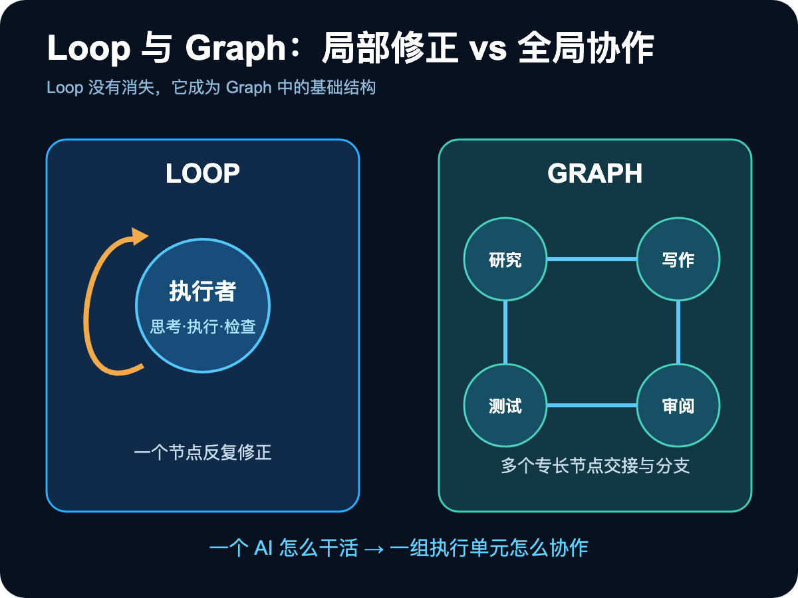
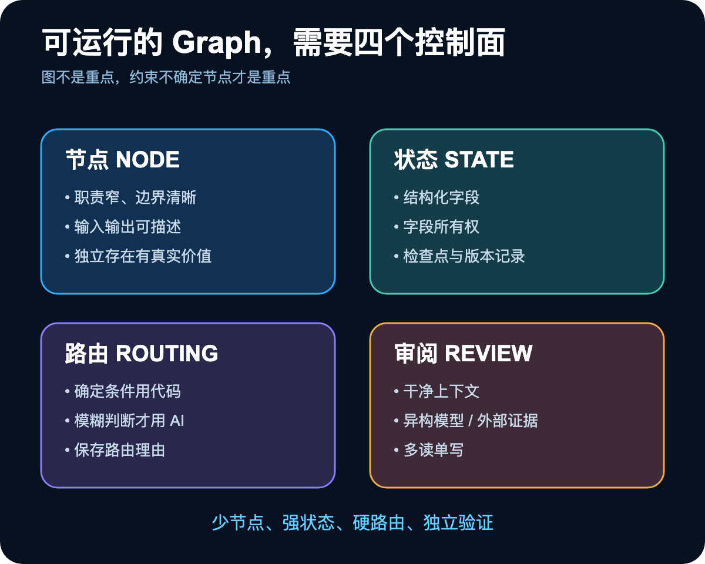
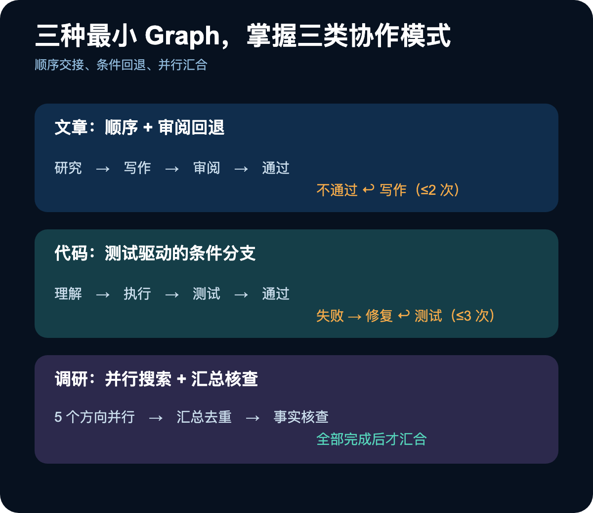
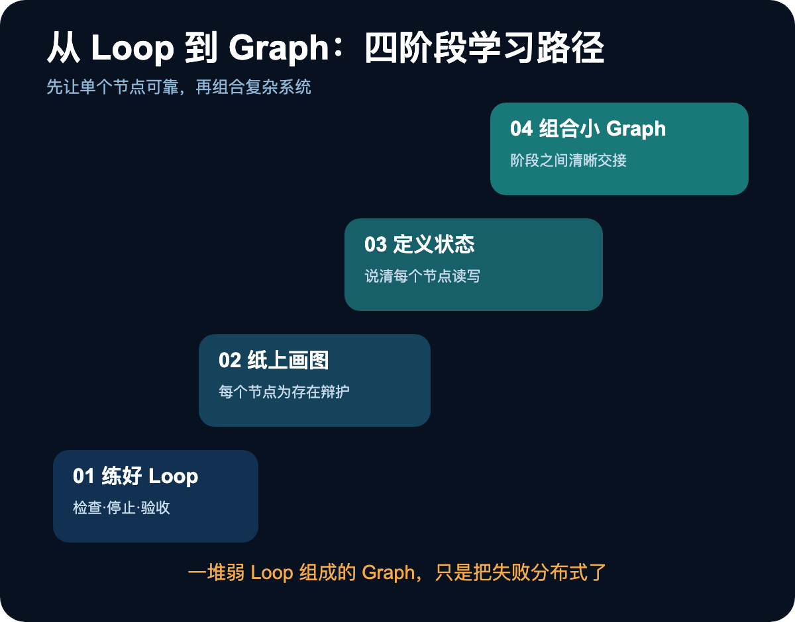
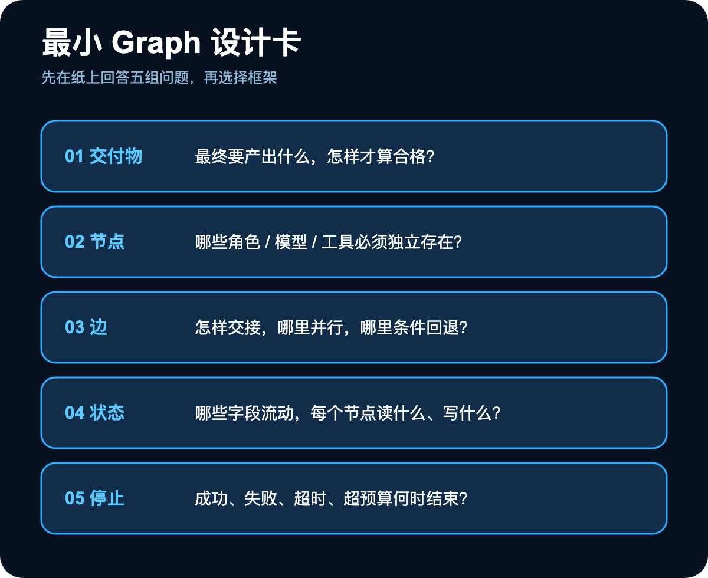

让一个 AI 持续思考、执行、检查、修正，已经能解决很多任务。这个过程通常被称为 Loop：结果不合格，就带着反馈再跑一轮，直到通过或触发停止条件。

但当任务从“写一段文案”升级为“完成一项产品工作”，问题会发生质变。研究、写作、测试、审阅、视觉和发布需要不同能力；有些环节可以并行，有些必须等待；某一步失败要返回修复，某些操作则必须由人确认。

这时，给一个 AI 写更长的提示词，往往只会让它频繁切换角色、累积上下文并逐渐失去重点。更合理的做法，是把复杂任务拆成多个有明确职责的节点，再规定它们如何传递状态、选择路径、验证结果和停止运行。

这就是 Graph Engineering。

不过，多智能体系统最大的误解恰恰是“多”。节点越多，并不自动意味着结果越好。它也可能更贵、更难复现，并把一个小错误扩散到整条链路。Graph Engineering 的重点不是组建一支看起来豪华的 AI 团队，而是建立一套能够约束协作的工程系统。

## 一、Loop 没有消失，它只是成为图中的一个结构

2026 年 7 月 18 日，Peter Steinberger 在 X 上问了一句：“我们还在谈 Loop，还是已经转向 Graph？”这条短帖获得了超过 300 万次浏览。大约四个半小时后，Hamel Husain 发布长文《Loop Engineering Is Dead. Enter Graph Engineering》。从 Loop Engineering 被集中讨论，到“Graph 接棒”的叙事出现，中间只有约 41 天。

这很像 AI 圈熟悉的造词速度，但背后确实对应一个真实问题：一个循环擅长管理单个执行者，一张图则负责协调多个执行单元。

Loop 可以被画成一个节点和一条指回自身的边：

```text
思考 → 执行 → 检查
 ↑             ↓
 └── 不合格 ───┘
```

Graph 并没有替代它，而是把许多这样的执行循环连接起来。研究节点可以有自己的搜索与复查 Loop，写作节点可以反复修改，测试节点可以失败后回到修复节点。Loop 是局部自我修正，Graph 是全局分工与协调。

一个简单判断是：翻译一句话、生成十个标题、解释一个概念，一个 Loop 足够；当任务需要明显不同的角色、条件分支或并行执行时，才值得画 Graph。若同一个 Loop 到第三轮仍无法稳定完成，也说明问题可能不只是“再试一次”，而是任务结构需要重组。



## 二、一张 Graph 只有三个基本元素，却能制造很多麻烦

所有 Graph 都能还原成三个对象：

- **节点 Node**：一个执行单元，可以是 AI、工具调用、确定性脚本，甚至是一次人工确认；
- **边 Edge**：规定下一步去哪里，可以顺序执行、并行汇合，也可以根据结果走不同分支；
- **状态 State**：节点之间共同读取和写入的信息，例如研究摘要、代码变更、审阅结论和重试次数。

以深度文章为例，最小结构只有“研究—写作—审阅”三个节点。研究节点输出资料与要点，写作节点生成初稿，审阅节点判断是否合格；不合格就携带问题返回写作，合格才结束。

后厨团队是一个容易理解的类比：Loop 像一位厨师自己切配、炒制、调味和装盘，每一步都可以回头调整；Graph 则像切配、炒锅、打荷和出菜组成的流水线，每个岗位专注一段，通过订单和菜品状态完成交接。

可现实中的 AI 节点并不像传统机器。Airflow、状态机和任务调度图早已存在，Anthropic 也在 2024 年总结过常见 Agent 模式。今天重新讨论 Graph，并不是流程图本身有了革命性变化，而是图里的节点开始自行理解、判断和行动。

传统节点输入确定，输出规则明确；AI 节点面对同一输入，可能得到不同理解。于是三个新问题出现：状态可能被错误信息污染，路由可能在多次运行中漂移，审阅节点还可能和执行节点一起自信地赞成错误答案。

换句话说，Graph Engineering 研究的不是怎样画更多方框，而是怎样管理一群不完全确定的执行者。

## 三、先问节点为什么存在，而不是它叫什么名字

新手最容易把流程拆得过细。例如“总结一份 PDF”被拆成抓取、切块、总结、审阅和排版五个 AI 节点，看起来专业，实际可能只增加 token、延迟和故障点。

一个节点值得独立存在，至少要带来一种不可替代的差异：

1. 使用了不同模型或能力，例如研究和独立审阅采用不同模型；
2. 拥有不同工具集，例如一个能检索网页，一个能执行代码；
3. 承担真实不同的角色与权限，例如审阅者只读，执行者才允许修改。

检验方式非常直接：把两个相邻节点合并，如果质量、权限隔离、并行速度和可观测性都没有损失，它们原本就不该分开。

这也是 Graph 设计的第一条反直觉原则：**节点数量不是能力指标，而是系统成本。** 每增加一个节点，就增加一次模型调用、一次状态交接、一个潜在错误源和一笔预算。

## 四、Graph 的四个控制面：节点、状态、路由、审阅

真正可运行的图，需要同时管住四个控制面。



### 节点：职责必须窄，输入输出必须清楚

节点应该知道自己读什么、做什么、写什么，也要知道哪些字段和动作不属于自己。研究节点负责证据，写作节点负责表达，审阅节点负责找问题；不要让所有节点都能随意重写全局结果。

### 状态：先设计数据结构，再启动协作

Loop 中的上下文腐烂，到了 Graph 中会变成共享状态污染。第二个节点写错的一条信息，可能成为第五个节点的可靠输入，并沿着边继续传播。

状态应有明确结构，不能今天是列表、明天变成一段字符串。每个节点只写自己负责的字段；关键节点之间建立检查点，保存输入、输出、路由理由和版本。这样系统出错时才能重放运行，找到第一处偏差，而不是只看到最终结果不对。

没有状态治理的 Graph，就像没有账本的团队：每个人都在改数据，却没人知道谁改了什么。

### 路由：确定性留给代码，模糊判断才交给 AI

每条边都是一次决策。如果所有路径都由 AI 自由选择，同一输入可能两次走出不同路线，问题就难以复现。

更稳妥的原则是：条件清楚的地方用 `if/else`、测试结果或字段值决定；真正需要语义理解和权衡时，才调用 AI 做路由。测试通过进入交付、重试次数超过上限立即停止，这些都不需要模型判断。

### 审阅：独立性比“多一个 AI”更重要

同源模型读取同一段有问题的上下文，可能非常一致地互相认可。结构漂亮不等于事实正确，AI 审 AI 很容易退化为集体点头。

提升独立性的三个办法是：审阅使用不同模型或不同验证机制；提供干净上下文，只给任务、标准和待审对象，不继承完整对话；将结论锚定到外部证据，例如真实测试、编译结果、原始数据和可访问来源。

Cognition 长期运行多智能体系统后形成了一条很有价值的原则：多个 AI 可以同时读取和提出意见，但同一时刻只允许一个执行者修改关键对象。读可以并行，写必须收口。糟糕意见在没有被执行前成本很低，冲突写入才是事故起点。

## 五、三种最小 Graph，足以覆盖大多数入门任务

不需要先学复杂框架。文章、代码和调研三种图，已经覆盖了最典型的顺序、回退和并行模式。



### 写文章：研究、写作、独立审阅

```text
研究 → 写作 → 审阅
         ↑      │
         └ 不通过（最多 2 次）
```

研究节点搜索资料并整理五个关键要点；写作节点只依据研究摘要生成正文；审阅节点检查开头是否具体、是否存在空话和过长段落、读者能否知道下一步。审阅失败时必须返回明确问题，而不是一句“继续优化”。

### 写代码：理解、执行、测试、修复

```text
理解 → 执行 → 测试 → 通过 → 结束
               │
               └ 失败 → 修复 → 测试
```

理解节点先读项目结构并输出修改方案；执行节点按方案改代码；测试节点运行真实检查；失败才进入修复，并限制最多三次。超过预算后不再死循环，而是输出错误、已尝试方案和卡点。

### 做调研：并行搜索、汇总、事实核查

```text
市场规模 ─┐
主要玩家 ─┤
用户痛点 ─┼→ 汇总去重 → 事实核查 → 结束
技术趋势 ─┤
机会缺口 ─┘
```

五个搜索节点同时运行，全部完成后才汇总；最后检查关键数据是否有来源，并把存疑信息单独标记。这类图的核心收益不是角色扮演，而是并行缩短等待时间。

## 六、Graph 的三种隐形故障，比单个 AI 出错更危险

单个 AI 说错一句话，通常还能在当前回答中发现；Graph 的错误会跨节点传播，因此更容易被漂亮流程掩盖。

### 状态腐烂：错误被包装成正式输入

治理方式是结构化状态、字段所有权、版本记录和检查点。关键事实不要只保存摘要，还要保留来源或可验证引用。

### 路由漂移：同一任务无法复现

治理方式是最大化确定性路由，并记录每次 AI 路由的输入、输出和理由。没有轨迹，就没有调试。

### 验证共谋：审阅者继承了执行者的偏见

治理方式是隔离上下文、使用异构模型、加入确定性验证，并坚持单写入者。审阅节点的目标不是让格式更漂亮，而是尽力证明结果不该被接受。

这三类问题揭示了 Graph Engineering 的真正门槛：不是会不会调用多个模型，而是有没有状态账本、可复现路径和独立证据。

## 七、从 Loop 到 Graph，按四个阶段学习

第一阶段用 1—3 天练好一个 Loop。它必须有检查动作、停止条件和验收标准。不会稳定自我修正的节点，被接入 Graph 后只会把失败分布式传播。

第二阶段用 3—7 天在纸上画真实流程。每个节点都要为独立存在辩护；画完后主动合并无意义节点。一个入门 Graph 应该能放在一张餐巾纸上。

第三阶段用 7—14 天定义共享状态。例如文章 Graph 可以包含主题、研究摘要列表、文章初稿、审阅状态和修改次数。要求在不运行的情况下，也能说清每个节点读取和写入哪些字段。

第四阶段用 14—30 天组合多个小 Graph。制作一门课程，不必建立一个超级图，可以拆成选题调研、课程大纲、单节脚本和营销文案四个子图，通过清晰状态交接。复杂任务的秘密不是一个无所不能的 Graph，而是一组边界清楚的小 Graph。



## 八、新手最容易踩的五个坑

第一，为了图而画图。一个 Loop 能完成的任务，不要制造多个节点。

第二，不定义状态。节点靠默契传递信息，类型和字段迟早发生冲突。先定数据结构，再运行。

第三，把所有路由交给 AI。条件清楚的分支用代码写死，模型只负责真正模糊的判断。

第四，执行和审阅使用同一种模型、同一份上下文。审阅必须建立独立性，否则只是重复确认。

第五，没有预算上限。Graph 会让多个节点并行消耗 token，一个弱节点反复重试足以拖垮成本。每个节点都应设置最大重试次数、token 或时间预算；超过后停止，并报告卡点。

Graph 可以协调复杂任务，但成本、风险和最终判断仍由人承担。

## 九、今天就能做的最小练习

选择一件真实任务：深度文章、竞品调研、一个小功能或一期内容策划。不要先选框架，先在纸上回答五组问题：

1. 任务最终交付什么；
2. 哪些角色或工具必须成为独立节点；
3. 节点之间如何连接，哪些可以并行，哪些需要条件回退；
4. 状态包含哪些字段，每个节点读什么、写什么；
5. 成功、失败、超时和超预算分别何时停止。



如果这张图可以被别人读懂，也能说清每个节点为何存在，你就已经完成了 Graph Engineering 最重要的一步。

真正的转变不是从“一个 AI”升级到“很多 AI”，而是从“希望系统自己搞定”，变成明确设计角色、交接、决策、证据和收尾。协作不是节点越多越好，而是每一步都知道谁负责、改了什么、为什么走这条路，以及什么时候必须停。
