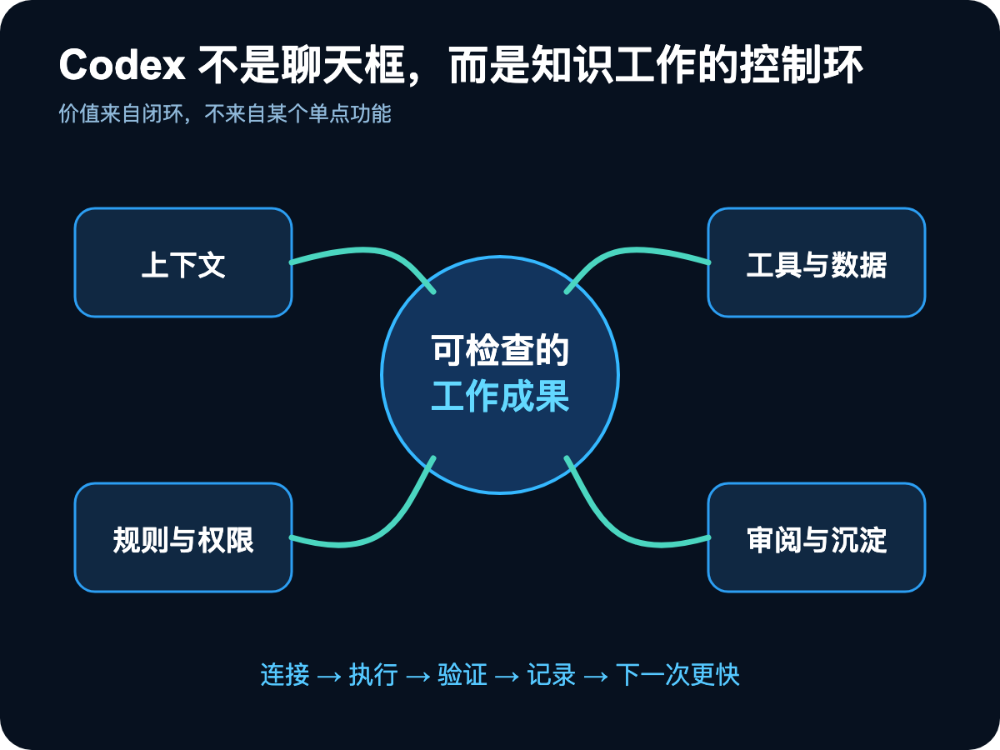
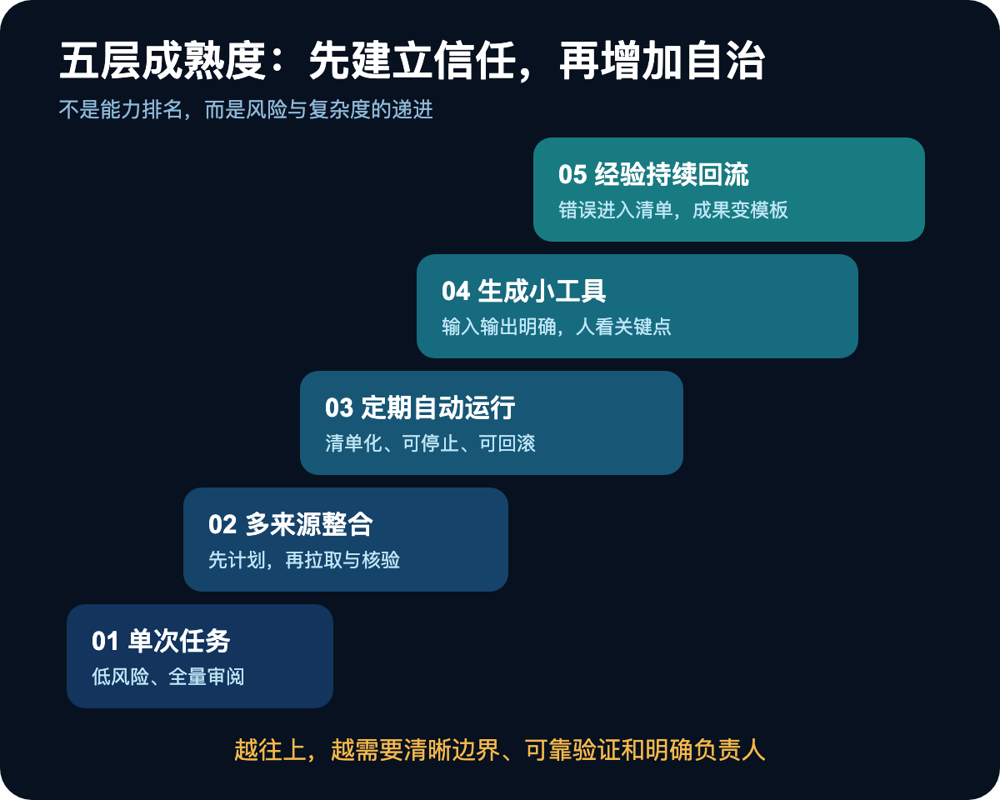
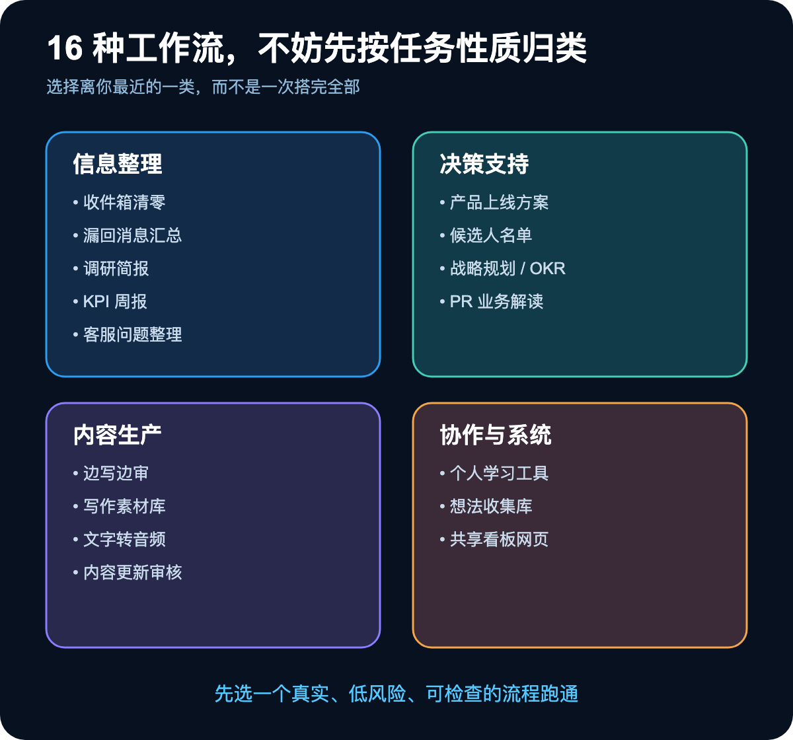
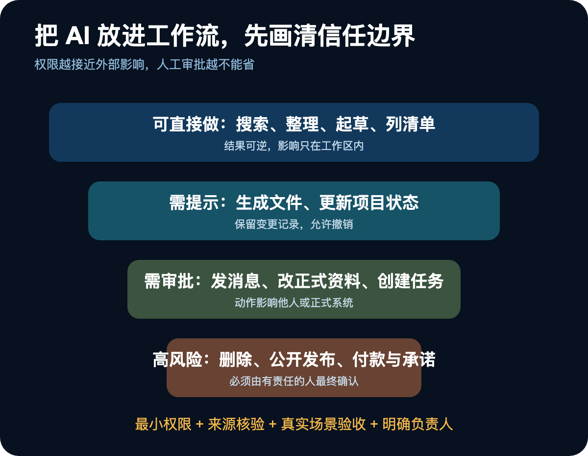
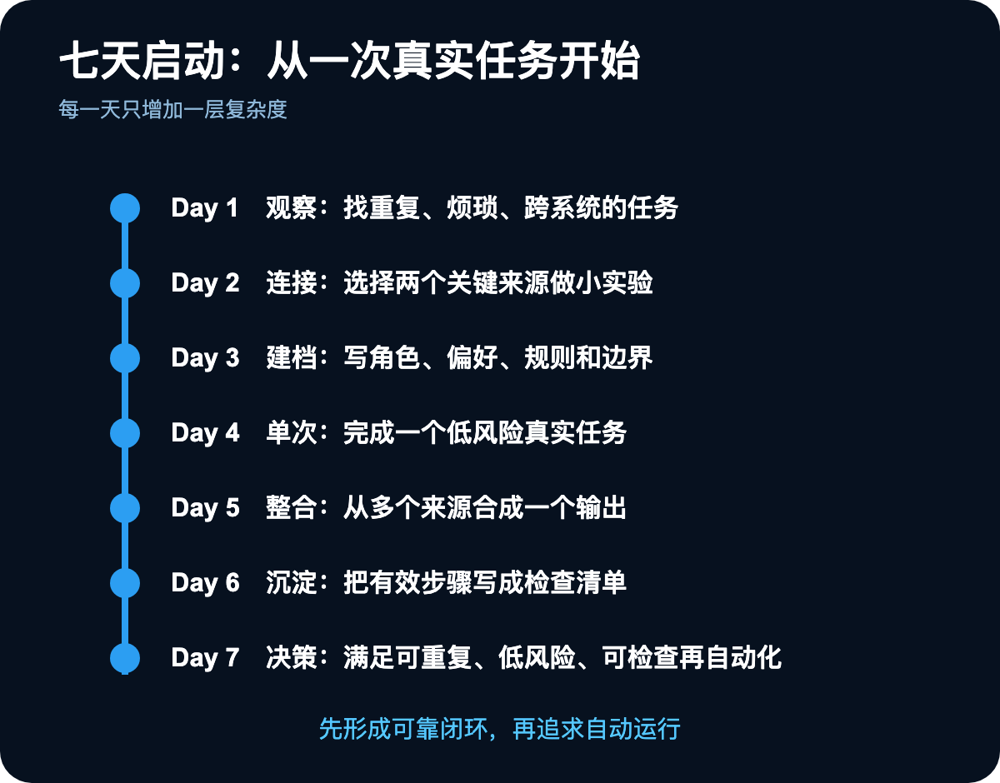

很多人第一次看到 Codex，会下意识把它归入“程序员工具”。毕竟它最擅长读项目、改文件、调用终端、验证结果，这些能力听起来都很像软件开发。

但换一个角度看，这恰好也是复杂办公任务最缺的能力：从多个地方找齐资料，理解长期背景，按规则推进多步工作，必要时调用工具，最后把结果落成文档、表格、演示稿、网页或可复用流程。

真正值得讨论的，不是“Codex 还能帮我写什么”，而是一个更大的变化：**知识工作正在从聊天问答，转向可运行、可检查、可积累的工作系统。**

一个周一早晨的产品上线方案，可能同时需要客户访谈、群聊决策、历史数据、竞品材料和时间表。传统做法是人在五六个系统之间搬运信息；新的做法，是让 Codex 负责拉取、整理和起草，人保留关键判断、审批与责任。

这篇文章给出一套不依赖编程背景的使用框架：怎样判断任务是否适合交给 Codex，怎样搭工作空间，怎样逐步增加自动化，以及怎样避免 AI 在真实业务里“看起来很能干，实际上悄悄出错”。

## 一、先换一个模型：从 AI 助手到控制系统

把 Codex 当聊天机器人，你会不断问问题；把它当工作系统，你会开始设计上下文、工具、规则、执行、审阅和经验回流。

这个闭环包含五种能力：

- 读写项目文件，把背景和结果沉淀下来；
- 连接邮件、聊天、文档、云盘、日历等外部系统；
- 将复杂任务拆成多个步骤持续执行；
- 在需要时生成脚本或小工具，处理重复和确定性工作；
- 输出文档、表格、PPT、PDF、网页等实际成果，并允许多个任务并行推进。

如果电脑保持在线，你还可以从手机启动或查看任务。经常重复的工作，则可以进一步做成 Skill、自动化流程或插件。需要共享和交互的成果，还能变成站点，而不只是一个静态文件。

不过，“能做”不代表“应该独立做”。Codex 无法替你承担判断、事实核验和最终责任。数据源不可访问、质量完全依赖主观品味、错误后果严重的任务，都不适合无人看管。

一个实用筛选法是看四个问题：这项工作是否要汇总多个来源？是否包含重复步骤？是否有明确的检查标准？是否最终要产出一个具体成果？满足两项以上，通常值得尝试。若它还让你反复拖延，优先级就更高。

再决定自治程度：一张清单就能描述清楚、风险低、结果容易核验的任务，可以让 Codex 做完再验收；目标模糊、需要品味或不断权衡的任务，则更适合人机协作、边做边调。

## 二、六个对象，构成一套可维护的工作环境

要让 Codex 稳定工作，需要先理解六个对象各自解决什么问题。

### 项目：工作的容器

产品上线、季度复盘、内容运营最好各自拥有独立项目。一个项目里的任务共享同一批文件和规则。重要决定、当前状态和关键链接应写进项目文件，而不是寄希望于聊天记录永久记住。

### 对话：一次具体执行

一个对话处理一件明确的事。方向改变、上下文变乱或任务已经结束，就新开对话。不同对话不会天然共享聊天内容，但可以通过文件协作：A 对话把调研结果写进文件，B 对话读取它继续生成方案。

### 目标：需要持续推进的终点

当你知道最终结果，却无法一次走完中间过程，可以设定 Goal，并说明什么算完成。系统会持续推进，完成或真正卡住时再通知你。

### 插件与 Skill：复用成熟能力

它们把工具、规则和工作流包装成可重复调用的模块。准备从零搭建前，先检查是否已有现成能力；真正具有个人或组织差异的部分，再沉淀为自己的 Skill。

### 站点：让成果可查看、可互动

当路线图、审核队列或项目看板需要多人持续查看和操作时，站点比文档更合适。如果读者只需阅读，普通文档通常已经足够。

### 工作空间文件：系统的长期记忆

工作空间是一个文件夹，里面放角色背景、偏好、红线、流程、来源和检查清单。它相当于给 Codex 的入职资料，却比一次性提示词更容易维护。

不要急着自己设计复杂目录。可以让 Codex 一次只问一个问题，了解你的职责、项目、工具、合作对象、交付物、工作习惯和绝不能越过的边界，再给出文件结构，确认后才落地。

最关键的三份资料通常是：

- `context.md`：你是谁、负责什么、当前项目、常用工具和协作关系；
- `preferences.md`：语气、格式、写作风格，以及哪些成果必须经过你审阅；
- `rules.md`：发布、发送、删除、修改正式资料、付款等红线，以及可以直接执行的低风险动作。

根目录的 `AGENTS.md` 应保持简短，只写这个空间的用途、最重要的文件和全局规则。具体项目的详细要求放进对应子目录，避免所有任务都背着一大包无关背景。

## 三、最可靠的工作法，是让每次执行形成闭环

无论做周报、调研还是内容审核，都可以使用同一个循环：**接工具、写规则、执行、检查、沉淀。**

第一步是接入日常系统，例如飞书、Slack、Gmail、Notion、Google Drive、日历或数据分析工具。Word、Excel、PPT 等文件本身可以直接处理。工具没有接入时，Codex 只能看到项目文件和你手工提供的内容。

连接工具不等于开放无限权限。默认使用最小必要权限；任何发送、删除、正式修改都应经过确认。接入后，可以让 Codex 观察你的工作习惯，推荐三个值得优先搭建的流程，并说明数据从哪里来、产出什么、多久运行、哪些动作需要审批。

第二步把目标、偏好、项目状态、关键链接和验收标准写入文件。这样做过一次的背景不会在每个新对话里重新解释。

第三步执行前先说清三件事：使用哪些材料、最终需要什么格式、怎样算合格。复杂或跨系统任务，让 Codex 先给计划，列出要查什么、可能缺什么、如何核验，再开始工作。

第四步必须在成果真正使用的地方检查。邮件草稿要去邮件客户端看，飞书消息要放到飞书语境里看，文档要在最终排版里看。编辑器内部“看起来正确”，不代表真实场景里可用。

第五步把有效提示词、流程、模板和踩坑记录留下来。每次出错都应变成新的检查项，每次成功都应留下下一次可直接复用的资产。

## 四、五层成熟度：自治不是开关，而是阶梯

很多自动化失败，不是工具不够强，而是团队从“第一次试用”直接跳到了“无人值守”。更稳妥的方式，是逐层建立信任。

### 第一层：单次、低风险、全量审阅

从整理会议纪要、重组散乱笔记、汇总链接、按风格改稿、生成检查清单开始。要求准确优先，事实附来源，不确定之处明确标出，并列出需要你确认的问题。

审阅前先问三个问题：做这件事时最难决定的是什么？考虑过但没采用哪些方案？最没有把握的地方在哪里？这些问题比逐字挑错更快暴露方向性风险。

### 第二层：跨系统整合

让 Codex 同时读取聊天、文档、邮件和本地文件，生成上线方案、周报或研究摘要。开始前要求它给出检索计划、预期输出、缺失信息和核验办法。

此时最大的风险是“数字看起来一致”。不同系统的指标定义、更新时间和关联方式可能完全不同。任何用于决策的数据，都要回到原始来源核对。

### 第三层：周期性运行

当一个流程每次都差不多，才考虑定时或自动触发，例如每日未回复消息扫描、每周指标简报、会后自动整理待办、将写作草稿打包成审阅格式。

自动化前写清：运行频率、数据来源、输出、可自主动作、必须审批的动作、验证方式、保存位置，以及何时停用或更新。没有退出机制的自动化，迟早会变成无人负责的遗留系统。

### 第四层：让 Codex 造小工具

当提示词难以保证稳定结果，可以把确定性步骤变成脚本、看板或小程序。先手工跑通，再询问哪些环节适合工具化；用真实数据对比手工结果，好用的保留，不好用的丢弃。

你不必理解每一行代码，但必须说清输入、输出和哪一步需要人看一眼。三件事说不清，就还不适合上线。

### 第五层：让经验持续回流

每次完成重要任务，保存高质量提示词和材料组合；把数字错误、语气偏差和错误假设加入检查清单；项目结束后更新背景文件；再问一次：哪些内容值得变成模板、自动流程或小工具？

这一层真正实现的不是“AI 越用越聪明”，而是你的工作系统越来越了解什么是好结果、什么是不可接受的错误。

## 五、16 个办公场景，应该从哪一个开始

不要把所有模板都搭一遍。先按任务性质找到离自己最近的一类。

### 信息整理类：先替你完成搜索、归类与去重

1. **收件箱清零**：将邮件分成待回复、待处理、可归档和已处理；只起草回复，不直接发送。跑几次后，再固化联系人优先级和自动归档规则。
2. **每日漏回消息汇总**：扫描过去 24 小时未回复的消息，标出紧急项和需要认真思考的回复，仍由人审核发送。
3. **调研简报**：综合内部资料和公开信息，整理背景、关键数据、观点分歧、待回答问题和延伸资源；事实附出处，不确定内容单独标记。
4. **KPI 周报**：从分析、收入、客服和社交指标生成周期报告。每个指标必须带定义、来源、时间范围和异常说明。
5. **客服问题整理**：识别工单核心问题，与已有 Issue 查重；高频问题提高优先级，新 Issue 先起草、后审核。

### 决策支持类：让 AI 准备材料，人做最终选择

6. **产品上线方案**：汇总客户反馈、销售记录、定位、竞品和历史经验，形成目标用户、信息架构、渠道、时间表、风险和待确认事项。
7. **候选人名单**：依据岗位说明、简历、面试记录和评分标准，解释推荐理由、风险、缺口与下一轮重点。招聘决定仍由人承担。
8. **战略规划与 OKR**：从历史规划、会议和数据生成草案，区分材料事实、系统推断、关键假设、反对观点和必须由管理者判断的问题。
9. **代码变更的业务解读**：让非工程角色也能理解 PR 的意图、用户影响、风险和待确认事项，但不能替代工程审查。

### 内容生产类：先诊断，再修改

10. **边写边审**：把草稿、受众和风格指南交给 Codex，先指出结构、事实和语气问题，再分阶段修改，而不是一上来就润色。
11. **写作素材库**：围绕主题整理支持论据、最强反方意见、应对思路、证据缺口和冲突来源，让写作建立在证据结构上。
12. **文字转音频**：把报告、简报或会议纪要转换为通勤可听的音频。若环境本身没有语音合成能力，需要额外接入 TTS 服务或本地模型。
13. **内容更新审核**：对比现有页面与最新信息，形成带理由和证据的修改建议队列，不自动编辑或发布。

### 协作与系统类：把一次成果变成长期资产

14. **个人学习工具**：根据学习目标和当前水平，生成本地练习工具，并依据每次反馈持续调整。
15. **想法收集库**：记录想法来源、现有方案、价值判断和下一步；新增内容先查重，被否决的想法也保留理由。
16. **共享看板网页**：当路线图、审核队列或项目状态已经不适合文档管理时，做成可持续查看的站点；静态阅读需求则继续使用文档。

这些场景的共同点不是“AI 能写”，而是都有数据入口、处理规则、交付形式和审阅位置。

## 六、可靠性来自边界设计，而不是盯着 AI

使用 Codex 很像带一位能力强、但刚入职的新同事：给方向、给资源、设边界、检查结果。告诉它要达到什么结果，比手把手规定每一次点击更有效；复杂任务先看计划，方向确认后让它跑完一轮。

真正需要防范的有五类事故：

1. **自信地说错**：关键事实必须回到来源核实，不能直接转发。
2. **数字拼接错误**：多系统的定义和时间范围不一致，业务数字要逐项核对。
3. **修改超出范围**：特别是代码和正式资料，应查看实际变更，而不是只看最终说明。
4. **自动化悄悄失效**：接口更新、登录过期、规则陈旧都会让流程退化，每个自动化都需要定期检查。
5. **被外部内容带偏**：邮件、网页和文档可能含有针对 AI 的恶意指令。发送、删除、修改等动作必须放在审批之后，并坚持最小权限。

高质量管理还有三个习惯：开工前问“还缺什么信息”；重要事实要求来源；验收时追问最难决定、被放弃的方案和最不确定之处。

## 七、团队采用的关键，不是培训，而是责任归属

个人用顺手后，团队协作会放大收益，也会放大风险。

每个自动化流程必须有明确负责人；生成的文档放到团队真正使用的共享工具里审阅，而不是只留在 Codex；资料既要方便人阅读，也要便于系统检索。

推广时不要一次推给所有人。选择一个人、一个具体痛点，展示真实成果、完整流程和节省的时间。组织通常不是被“AI 很强”说服，而是被一个可靠的小案例说服。

## 八、七天启动计划：每天只增加一层复杂度

第一天，观察一周中最重复、最烦、最需要跨系统整合的任务；先找摩擦，不急着自动化。

第二天，选择两个关键来源，例如飞书和本地表格，让 Codex 完成一个小任务。

第三天，建立 `AGENTS.md`、`context.md`、`preferences.md` 和 `rules.md`，让 Codex 复述它理解的角色、项目和红线。

第四天，完成一个低风险、真实、可检查的单次任务，例如会议纪要或调研简报。

第五天，从多个系统合成一份输出，要求先给计划，再执行和核验。

第六天，把有效步骤写成工作流和检查清单，记录来源、格式、审阅标准与常见错误。

第七天，判断是否值得自动化：只有会重复、风险可控、验收清楚的流程才周期化；其余任务继续采用手动触发的人机协作。

## 结语：真正要自动化的，是搬运与重复，不是责任

Codex 的意义并不是替知识工作者思考，而是把散落在文件、聊天、邮件和脑海里的上下文组织起来，把重复步骤交给系统，把结果放回真实场景审阅，再把有效经验留下。

这也是知识工作的新分工：机器承担检索、整理、转换、执行和初步校验；人保留判断、品味、策略、关系和最终责任。

不必从高级自动化开始。打开一个项目文件夹，选择一件你原本就会做、风险不高、结果可检查的事情，告诉 Codex 有哪些素材、想要什么结果、你会怎样验收。先可靠地做好一次，再让第二次更快。系统就是这样长出来的。
