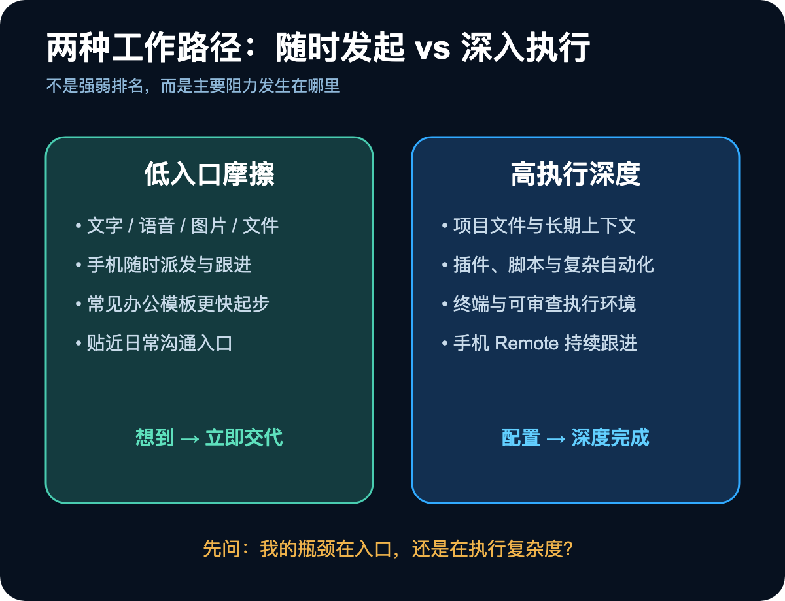
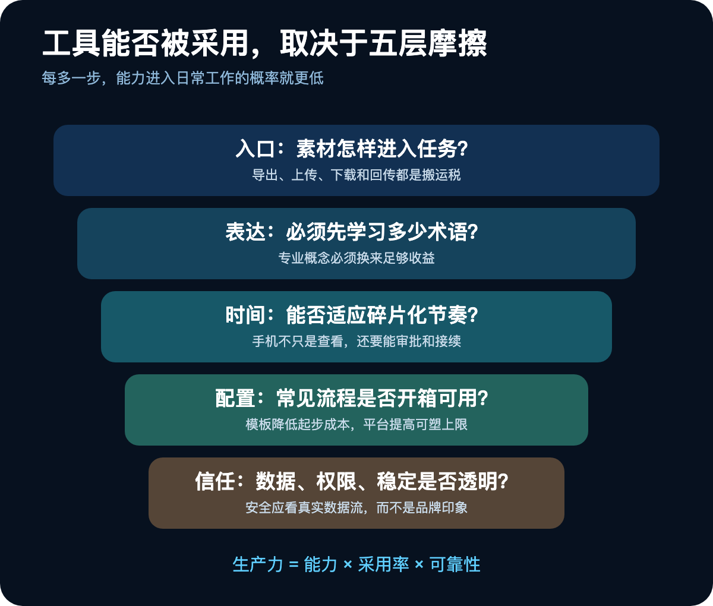
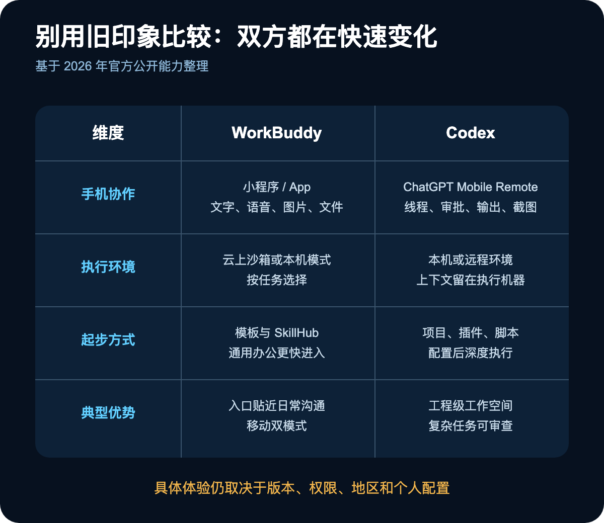
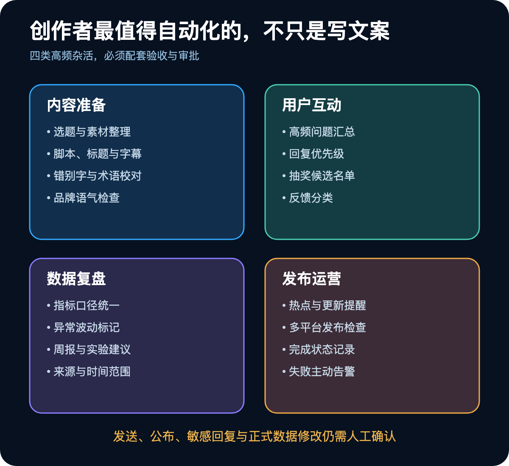
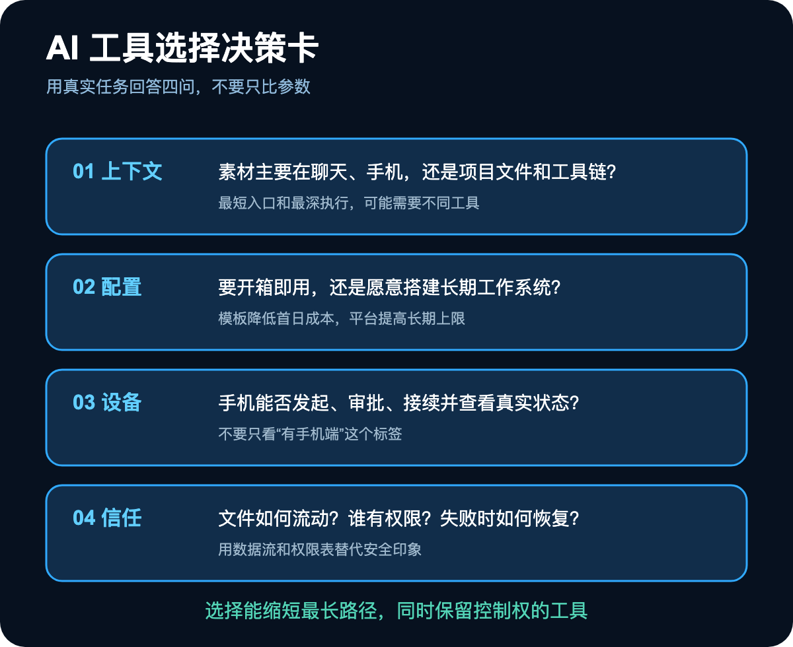

比较 AI 工具时，人们很容易陷入一场参数竞赛：谁能写代码、谁能操作桌面、谁能连接更多工具、谁的模型更强。

可真实用户做选择时，答案经常让技术爱好者意外。一个功能更全面的工具，未必是某类人每天最愿意打开的工具；一个看起来没那么“极客”的产品，反而可能更快进入日常工作。

视频号创作者选择 WorkBuddy 而不是 Codex，就是一个典型案例。但这并不意味着前者全面胜出，也不意味着后者只适合程序员。真正值得研究的是：**为什么工作流里的几步摩擦，足以压过模型能力上的巨大差异。**

截至 2026 年，两款产品都已经具备移动协作能力。WorkBuddy 官方小程序支持文字、语音、图片和文件输入，可选择云端沙箱或远程连接本机；Codex 也可以通过 ChatGPT 手机端的 Remote 访问受支持的桌面任务，查看输出、批准命令、改变方向并继续工作。

因此，今天的区别早已不是简单的“一个能用手机、一个只能坐在电脑前”，而是入口离用户有多近、上下文怎样进入系统、需要多少配置、能否承接高频杂活，以及用户是否理解它的数据路径和权限边界。

## 一、用户选择的不是最强工具，而是最短路径

创作者的一天很少从“打开 AI 工作台”开始。选题可能来自群聊，甲方要求在对话框里，图片存在手机相册，语音灵感刚刚录下，参考视频躺在收藏夹，数据则散落在表格和各个平台后台。

一个工具即使能力很强，只要使用前必须反复另存文件、切换设备、补充背景，完成后再把结果搬回原来的协作渠道，它就在每次任务前后征收“搬运税”。

WorkBuddy 对微信用户的吸引力，首先来自入口。手机端可以用自然语言、语音、图片或文件下达任务；本机模式能远程调度电脑，云上模式则不依赖个人电脑。对长期在微信里沟通和收集素材的人来说，任务更容易从“想到”直接进入“执行”。

Codex 的优势则更偏向深度工作空间：项目文件、插件、终端、脚本、代码和复杂自动化可以形成可审查的执行环境。它同样支持手机远程跟进，但典型价值不是把一条聊天转给“助理”，而是让一个已经配置好上下文和权限的工作任务持续运行。

这两种路径没有绝对高下。一个优化“随时发起”，一个擅长“深入执行”。选择时应问：我的主要阻力发生在任务入口，还是发生在执行深度？

## 二、创作者真正付不起的，是五种摩擦

视频号博主觉得某个工具“贴脸”，通常不是一个功能造成的，而是五层摩擦同时降低。

### 第一层：入口摩擦

素材已经在手机和微信里，就希望直接用文字、语音、图片或文件交代任务。每多一次导出、上传、下载和回传，工具被闲置的概率都会增加。

### 第二层：表达摩擦

很多创作者不想先学习 Prompt、项目、Skill、自动化和脚本。他们习惯用助理听得懂的方式说：“整理这几条爆款文案，按我的账号语气给三个选题”“汇总评论里问得最多的问题”“明早提醒发布，并整理上周数据”。

这不是用户拒绝专业能力，而是专业概念必须证明自己能换来明显收益。若一个简单任务需要先理解工具体系，学习成本就会成为第二份工作。

### 第三层：时间摩擦

创作者的工作被热点、通勤、家庭和评论回复切成碎片。手机上想到选题，语音交代后让电脑继续工作；等待孩子入睡、开会间隙或路上查看任务进度，都比要求整块桌面时间更符合真实节奏。

但要注意，这已不再是 WorkBuddy 独有能力。Codex 的移动 Remote 同样可以连接运行中的机器、查看线程、批准操作和接续任务。真正差异转向：移动入口是否处在用户最常用的应用里，以及它和既有素材流之间还有几步。

### 第四层：配置摩擦

评论抽奖、字幕校对、播放数据周报、热点提醒、多账号分发检查，这些工作并不“智能”，却最消耗时间。

Codex 可以通过项目规则、脚本、Skill 和自动化完成，但通常需要用户先搭建、测试和维护。WorkBuddy 的官方定位更偏全场景办公工作台，并提供模板与 SkillHub，降低常见办公流程的起步成本。

这意味着两种不同产品哲学：一种提供高度可塑的工作台，让用户构建自己的系统；另一种努力把常见场景预装成更快可用的助理。前者上限高，后者首日价值更容易感知。

### 第五层：信任摩擦

网络稳定、账号可用性、价格、数据位置和权限都会影响选择。但“国内产品一定安全、海外产品一定不安全”不是可靠判断。

WorkBuddy 有云端和本机两种执行环境；Codex 桌面环境中的本地文件和凭证也留在运行机器上，手机端通过安全中继访问活动状态。真正需要核对的是：本次任务用了云端还是本机、哪些文件会上传、模型和插件能访问什么、日志保存多久、谁能批准外部动作。

安全不是品牌印象，而是一张数据流和权限表。

## 三、别再用旧结论比较：两款产品都在快速变化

原先常见的比较是：Codex 强但只能桌面使用，WorkBuddy 更适合微信和手机。这一说法已经过时。

目前更准确的描述是：

- 两者都能从手机继续或发起部分工作；
- 两者都能连接本机环境，并处理文件和多步骤任务；
- WorkBuddy 的移动入口与微信、QQ 等腾讯系身份和使用习惯更接近，官方还提供小程序的云上与本机模式；
- Codex 的核心优势仍是项目化上下文、复杂执行、插件和工程级工作流，Remote 让这种深度环境可以从手机跟进；
- 最终体验取决于具体版本、账号权限、所在地区、工具连接和用户自己的配置，不能只看一篇测评下结论。

同样需要谨慎的是“中文网感”。它既不是单一模型参数，也不是永久属性。账号语气是否自然，取决于模型、上下文、样例、规则和审阅。与其相信“某产品天然懂宝子”，不如拿同一份素材、同一套品牌样例做盲测。

## 四、视频号运营最值得自动化的，不是写文案

真正做过内容账号的人都知道，文案只占工作的一部分。最容易被忽视的时间黑洞，反而是细碎、重复、必须完成的运营动作。

可以将任务分成四组：

### 内容准备

- 从聊天和素材中提炼选题；
- 整理爆款结构，但避免机械洗稿；
- 根据账号样例起草脚本、标题和字幕；
- 批量检查字幕错别字与专有名词。

### 用户互动

- 汇总评论区高频问题；
- 识别需要人工认真回复的留言；
- 按公开规则生成抽奖候选名单；
- 将反馈归类为内容需求、产品问题和情绪表达。

### 数据复盘

- 汇总播放、完播、点赞、转发和关注变化；
- 统一指标口径与时间范围；
- 标记异常波动；
- 生成周报与下一轮实验建议。

### 发布运营

- 热点与更新提醒；
- 多平台发布前检查；
- 记录每个平台是否完成；
- 失败时提醒，而不是静默跳过。

这些任务适合自动化，是因为输入、步骤和验收都相对明确。但发送内容、公布抽奖、回复敏感评论和修改正式数据，应继续保留人工确认。

所谓“专属内容总监”不是一天调教出来的。它需要账号规则、语气样例、指标口径、发布时间、禁用表达和审批边界。真正可复用的资产不是一句“你是我的内容总监”，而是持续更新的工作手册。

## 五、选择工具时，用四个问题代替参数表

第一，我的上下文主要在哪里？如果素材和沟通高度集中于微信，入口贴近会显著降低摩擦；如果工作依赖项目文件、代码、脚本和复杂工具链，深度工作空间更重要。

第二，我愿意投入多少配置？想马上完成通用办公任务，应重视模板和现成 Skills；愿意搭建长期系统，可以选择可塑性更高的平台，并接受前期设计与调试。

第三，我的任务在哪台设备上发生？不要只问有没有手机端，要问手机端能否看到真实状态、审批关键动作、继续上下文，以及本机离线后还能做什么。

第四，我怎样验证安全与可靠性？画出文件、账号、云端模型、本机工具和外部平台之间的数据路径；测试网络中断、登录过期和权限拒绝时的表现；对关键流程保留人工检查和替代方案。

## 六、最好的答案，往往不是二选一

同一位创作者完全可以把两类工具放在不同环节。

微信入口适合捕捉灵感、提交素材、派发常见任务和查看提醒；深度工作空间适合批量处理文件、建立可审查流程、编写脚本、做复杂研究和维护长期自动化。前端负责低摩擦，后端负责高复杂度。

关键不是同时订阅多少工具，而是避免上下文重复搬运、规则分散和数据口径不一致。若两个系统都使用，应规定谁是事实来源、输出保存在哪里、哪些自动化只由一个系统负责。

选择 AI 工具的终极标准，从来不是发布会上展示了多少能力，而是它能否在你的真实工作中稳定减少步骤，同时不牺牲可验证性和控制权。

对视频号创作者来说，“贴脸”确实重要；对所有知识工作者来说，适配工作流都比参数崇拜更重要。先画出自己一天的素材流、任务流和审批点，再选择能缩短最长路径的工具。真正的生产力，不是让 AI 看起来更强，而是让人少搬运、少等待、少返工，同时清楚知道系统做了什么。
