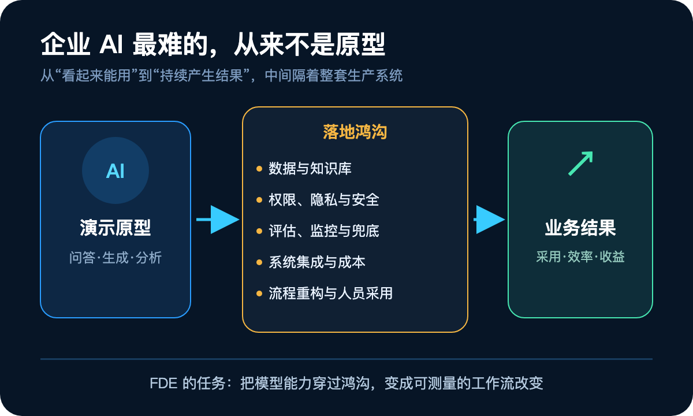
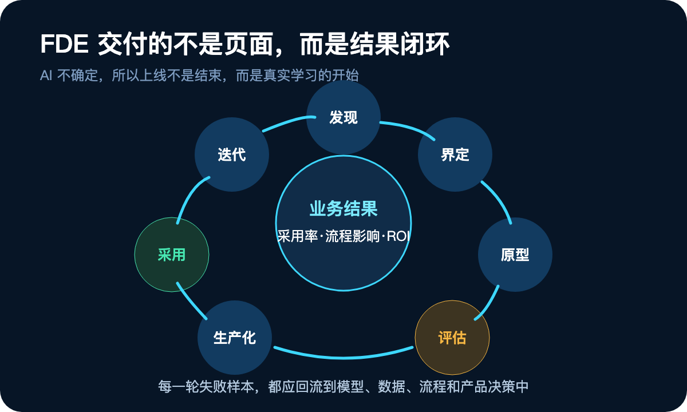
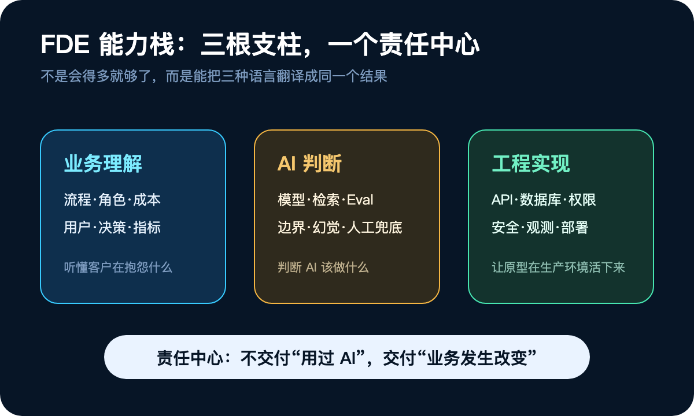
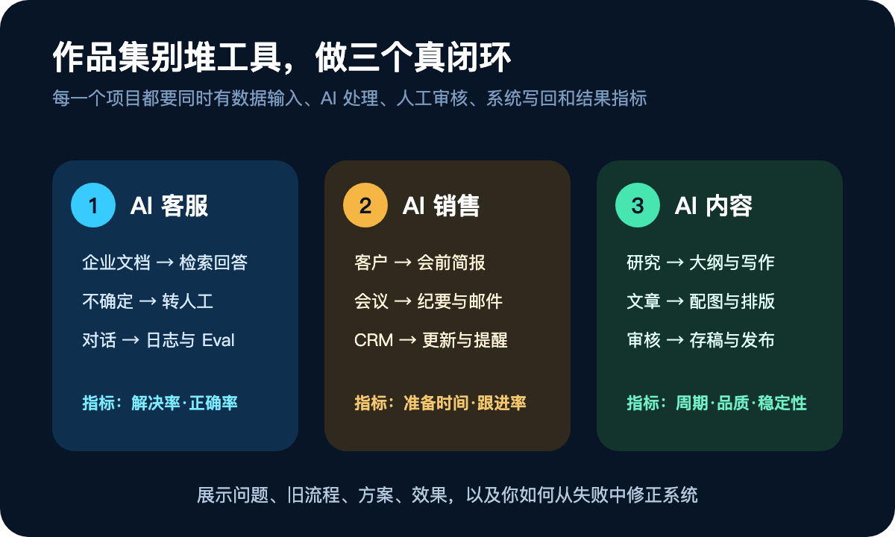
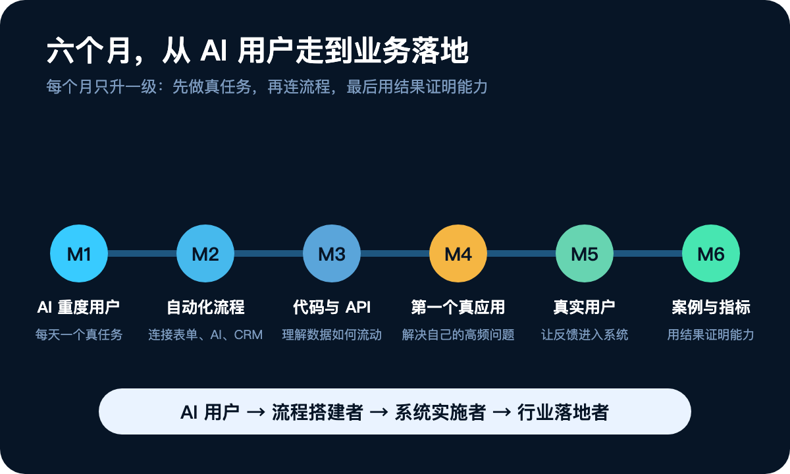

# AI 时代最值钱的，不是会用工具：而是把结果送进业务的人

AI 工具的使用门槛越来越低，但企业里的一个奇怪现象却越来越明显：演示一个 AI 原型很容易，让它真正进入日常工作、被员工使用、稳定产生结果，却异常困难。

这道鸿沟催生了一类新角色：FDE，全称 Forward Deployed Engineer，通常译作“前线部署工程师”。

但这个中文名字容易把人带偏。FDE 既不只是赶到客户现场写代码，也不是换了名字的售前、客服或产品经理。他们最核心的任务，是把模型能力装进真实业务，并对生产环境里的采用率、工作流效率和可测量的业务结果负责。

OpenAI 对这一角色的描述也很直接：从需求发现、技术范围界定、系统设计、开发，一直负责到生产上线；成功不是看软件是否交付，而是看是否被真正采用、是否改变了工作流。

这个职位值得关注，不是因为又多了一个高薪名词，而是它揭示了 AI 时代的一个更大趋势：**企业开始少为“懂 AI”买单，转而为“用 AI 重做业务并拿到结果”买单。**

## 一、AI 落地的难点，从来不在聊天框里

想象一家有 3000 名员工的企业要建 AI 客服。在演示环境里，无非是用户提问、模型回答。但进入真实业务后，问题会迅速扩张：

- 它怎么连接 CRM、ERP、工单和企业知识库？
- 哪些人可以查订单、改资料、发起退款？
- 客户隐私和内部数据怎么隔离？
- 模型答错了怎么检测，什么时候必须转人工？
- 响应速度、调用成本、峰值并发如何控制？
- 员工为什么要改变原来的工作习惯？
- 上线之后，怎么证明它真的节省了时间或提升了解决率？

所以，企业 AI 不是“接一个模型 API”，而是一次工作流重构。模型只是发动机，数据、权限、系统集成、评估、人工兜底和组织采用，才是让这台车开起来的其余部件。

## 二、普通工程师交付功能，FDE 交付结果

传统软件项目通常从一个较为明确的需求开始：加一个页面、写一个接口、完成一个模块。工程师可以在既定边界里把功能做对。

FDE 面对的却往往是一句模糊的业务抱怨：“我们的销售效率太低。”

他不能立刻开始写代码，而要先跟着销售走完真实流程：会前怎么搜客户信息，会中怎么记录，会后怎么写邮件、更新 CRM、设置提醒。最后的解决方案，可能是一套跨越 CRM、邮箱、合同、会议纪要和公开数据的销售助手：

- 会前自动生成客户简报；
- 会后整理要点和待办；
- 撰写跟进邮件，但保留人工确认；
- 更新 CRM 字段并触发下一次提醒。

这里的差别，可以叫做两种不同的“交付合同”：普通工程师的合同是功能合同，FDE 的合同是结果合同。他必须反复追问：问题到底是什么？AI 应该插在哪个环节？什么指标能证明问题被解决了？

## 三、AI 把“交付”变成了一个持续闭环

传统软件大部分是确定性的：输入一样，逻辑不变，输出就可预期。AI 系统则不同：模型版本、提示、上下文、检索数据和用户输入的微小变化，都可能改变结果。

因此，FDE 不是“上线即结项”。他们需要跑一个结果闭环：

1. **发现**：访谈用户，跟踪当前流程，找到真正的阻塞点。
2. **界定**：把“效率低”拆成可执行的工作流和成功指标。
3. **原型**：用 API、Python、数据库、前端、Agent 和企业接口快速验证。
4. **评估**：建立 Eval，用代表性样本和数据而不是凭感觉判断。
5. **生产化**：处理并发、安全、权限、成本、日志、告警和可观测性。
6. **采用**：让工具进入既有工作流，而不是额外制造一个无人打开的页面。
7. **迭代**：通过真实反馈调整模型、检索、提示和业务范围。

评估是这个闭环中最容易被低估的一环。假设人工客服的正确率是 95%，AI 只有 82%，“再换一个更大模型”不一定是答案。问题可能在知识库不完整、召回错误、提示不清楚、工作流缺少人工审核，也可能是本就不该自动化的范围被硬塞给了 AI。

真正成熟的落地者，不会只问“模型强不强”，而会问“整个系统为什么在这里失败”。

## 四、FDE 的本质：三种能力，一个责任中心

FDE 看上去像工程师、产品经理、AI 工程师、解决方案架构师和咨询顾问的合体。但与其记住五个头衔，不如记住三种能力：

- **业务理解**：能听懂客户的语言，看到流程、角色、决策点和成本。
- **AI 判断**：知道模型擅长什么、会在哪里幻觉、什么任务应该保留人工。
- **工程实现**：能把原型变成安全、稳定、可观测的小型产品。

三种能力围绕同一个中心：对最终结果负责。这也是为什么 FDE 可以被理解为“离客户最近的工程师，也是离工程最近的业务问题解决者”。

一家房产公司的案例能说明“结果责任”意味着什么。中介每天在微信上面对上千名客户，真正的瓶颈不一定是“不会打字”，而是忘了跟进、记不住长期需求、反复搜房源、新人缺少成熟话术。

有价值的系统不是一个另外打开的聊天机器人，而是嵌入原流程：读取对话→提取需求→建立客户画像→匹配房源→生成跟进建议→销售审核后发送→记录反应→更新意向。关键不是“能不能生成回复”，而是“在哪个环节插入 AI，才能改变业务结果”。

## 五、普通人不必先抢头衔，先抢下“落地能力”

学两个月提示词，就直接拿到顶级 AI 公司的 FDE 职位，这并不现实。高阶岗位确实要求强工程能力、系统设计、AI 理解以及在模糊客户环境中沟通和交付的能力。

但职位标签和市场需求不是一回事。数量庞大的中小企业，未必会招聘一个叫 FDE 的人，却会需要人解决这些问题：

- 30 人的外贸公司，如何自动分类询盘、调用知识库、生成回复、记录表格并提醒销售？
- 内容团队，如何把选题、研究、写作、配图、排版和存稿组成稳定流程？
- 电商团队，如何从评论和客服对话中提取商品问题？
- 培训机构，如何用现有课程资料构建可追溯的问答与 FAQ？

做这些工作的人，实际职位可能叫 AI 落地顾问、自动化工程师、解决方案工程师、Agent 工程师、AI 产品实施或企业转型顾问。名称可以不同，能力内核是一致的。

我更建议把普通人的路线看成四级阶梯：

1. **AI 重度用户**：能把原本 2 小时的工作稳定压缩到 20 分钟。
2. **工作流搭建者**：把单次对话连成“输入—处理—审核—写回—通知”。
3. **小型系统实施者**：能处理 API、数据库、用户、日志和部署。
4. **行业落地者**：能用行业指标证明系统创造了价值。

不要跳级追求头衔。先让自己在一个真问题上完成一次闭环，就已经比“什么都学了一点”更有职业价值。

## 六、学习顺序要反过来：从问题出发，再补知识

如果目标不是做模型研究，一开始就被 Transformer、Attention、Embedding、向量数据库、微调、参数和 CUDA 包围，很可能学到一大堆名词，却仍然不会解决一个业务问题。

更高效的顺序是：

### 先熟练一到两个 AI 工具

ChatGPT、Claude 或 Gemini 选一到两个就够。重点是学会给上下文、拆任务、处理文件和数据、让模型使用工具，并把多步操作沉淀成稳定方法。

### 再把对话升级为自动化

学习 n8n、Make、Zapier、Dify、Coze 或 Agent 工具中的一种。工具不是重点，重点是把流程连起来。例如：收到客户询盘→自动分类→查知识库→生成回复→人工确认→写入表格→通知销售。

### 然后补足最小工程能力

学会 Python 基础、API、JSON、HTTP、数据库、Git 和基础前端。不必先把自己变成资深程序员，但必须看得懂数据如何流动、接口怎么调用、错误在哪一层、系统如何部署。AI 编程已经降低了产品化门槛，但它不会替你承担理解系统的责任。

## 七、作品集不要堆截图，要做三类真项目

如果想证明自己有 AI 落地能力，至少做三个小而完整的项目：

### 1. AI 客服系统

它要能读企业资料、回答问题、不确定时转人工、记录对话，并有一套可回放的评估样本。

### 2. AI 销售助手

它要能分析客户、生成跟进建议、整理会议纪要、撰写后续邮件、更新 CRM，并把人放在关键确认点上。

### 3. AI 内容流水线

它要连接研究、整理、大纲、写作、配图、排版和存稿，必要时再增加发布步骤。每一步都要有清晰输入、输出和人工审核规则。

项目完成后，不要只展示 UI 截图。一份有说服力的案例应该回答七个问题：业务问题是什么？旧方法如何运作？方案怎么设计？使用了哪些模型和系统？时间节省了多少？最终效果如何？中间失败过什么，又怎么修正？

最后一个问题尤其重要。FDE 的价值不是显得从不犯错，而是能把失败转化为可重复的系统改进。

## 八、最有价值的竞争力，是“行业×AI×工程”

学完工具之后，应该尽快选择一个行业。横向能力包括 AI、Agent、自动化、API、数据库、产品和业务分析；纵向则是一个你真正理解的行业，例如制造、跨境电商、金融、医疗、房产、内容、销售、客服或供应链。

过去的经验不是包袱，反而是进入 AI 落地的捷径：

- 做过房产，就比别人更懂客户意向、房源匹配和长周期跟进；
- 做过外贸，就更懂询盘、报价、邮件、跟进和客户分层；
- 做过电商，就更懂选品、客服、评论分析、广告和运营；
- 做过 HR，就更懂招聘、简历筛选、面试、培训和知识库。

产品经理也很适合转向这类工作。他们已经会做需求分析、PRD、原型、研发协同和上线推进；补上 AI、Agent、自动化、API、基础代码、Eval 和系统设计后，可以走向 AI-native PM、AI 解决方案构建者或 FDE 型角色。产品经理的稀缺优势，是能把业务语言翻译成技术问题；AI 编程则在快速缩短他们与实现之间的距离。

## 九、一条可执行的六个月路线

### 第 1 个月：先成为 AI 重度用户

每天用 AI 完成一个真实工作任务：总结、调研、写作、分析、文件处理或数据整理。目标是找到一个可重复的时间压缩比。

### 第 2 个月：学会一个自动化工具

用 n8n、Make 或 Dify 完成三个连接：表单→AI→表格，邮件→AI→CRM，文档→AI→知识库。

### 第 3 个月：补 Python 和 API 基础

掌握变量、函数、API、JSON、数据库和模型调用，让 AI 做结对编程搭档，但要能解释每个部分在做什么。

### 第 4 个月：做第一个真实 AI 应用

不复制教程里的玩具案例，解决自己工作中一个高频、重复、可测量的小问题。

### 第 5 个月：为一个真实用户解决问题

去问朋友、公司或小商家：你每天最浪费时间的重复工作是什么？把真实反馈带回系统里。

### 第 6 个月：写出一份可信的案例

用“问题—旧流程—方案—模型与系统—时间与效果—失败与修正”的结构，把一个小项目写成能被雇主或客户判断的证据。

## 十、判断一个 AI 项目是否真落地，看四件事

无论你的职位是不是 FDE，都可以用下面四个问题检查一个 AI 项目：

1. **问题是否真实**：它是用户每天都会遇到的阻塞，还是为了展示 AI 而创造的伪需求？
2. **流程是否闭环**：数据从哪里来，AI 完成后写回哪里，谁在什么时候审核？
3. **质量是否可测**：是否有 Eval、业务指标、日志和失败样本？
4. **结果是否被采用**：真正的用户是否持续使用，时间、成本、收入或质量是否发生了变化？

企业愿意支付的，不是一个人会写多少花哨的提示词，而是客服成本能否降低 30%，销售准备时间能否从 40 分钟缩短到 5 分钟，原来 10 个人的流程能否由 3 个人稳定完成。这些数字不是对任何项目的效果承诺，而是提醒我们：AI 项目必须用业务指标定义成功。

## 结语：从使用 AI，到对 AI 的结果负责

AI 正在像 Excel 一样成为通用工具。当“会用”逐渐普及，稀缺价值就会从工具操作转移到业务重设计。懂行业的人开始拥有软件能力，懂软件的人开始对业务结果负责，两条路正在向同一个位置汇合。

“Engineer”不必成为门槛焦虑。顶级 FDE 岗位很难，但未来数年的 AI 转型会持续需要一组可迁移的能力：理解问题、设计方案、使用 AI、连接系统、做出产品、拿到结果。

真正值得完成的身份升级，不是给简历换一个英文缩写，而是从 **AI 用户**，变成 **AI 问题解决者**，再变成 **能把 AI 稳定部署进业务的人**。

每一个行业，都将需要自己的这类人。
