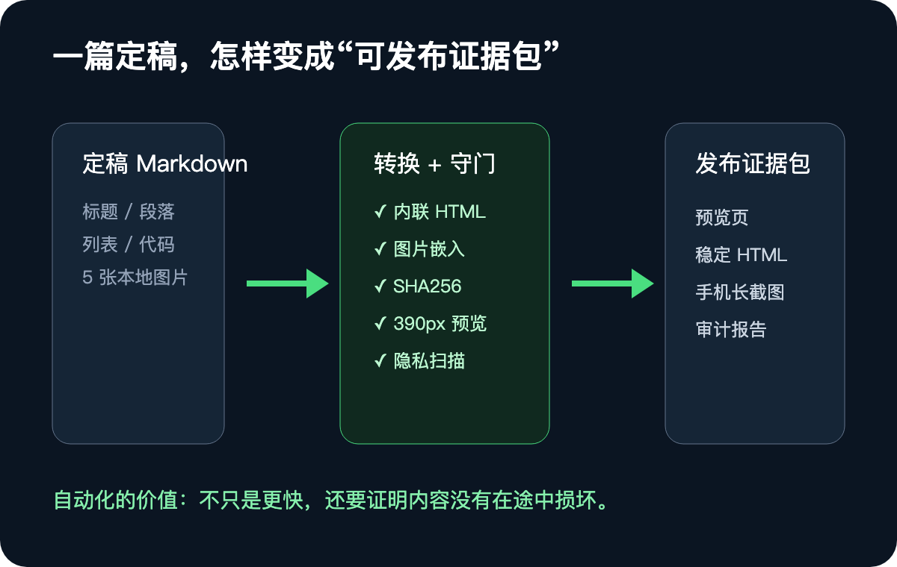
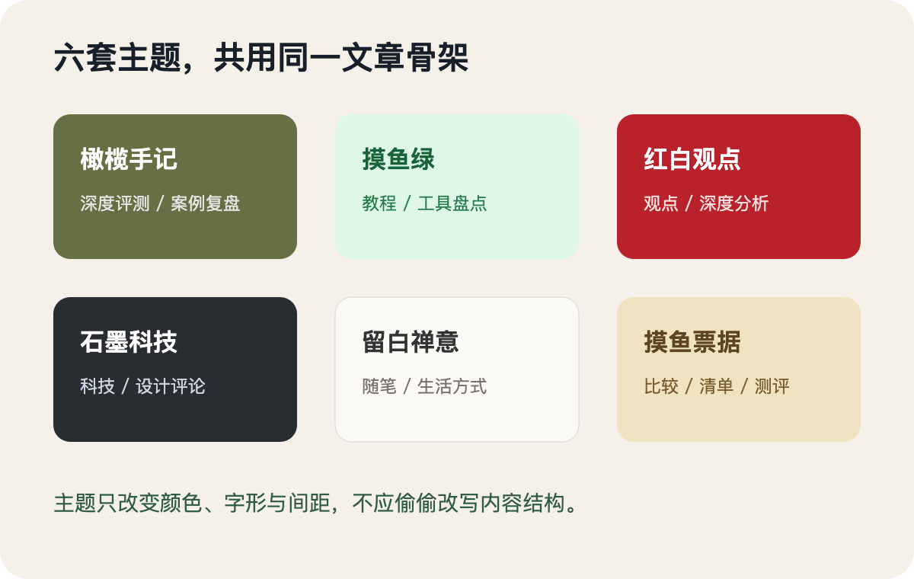
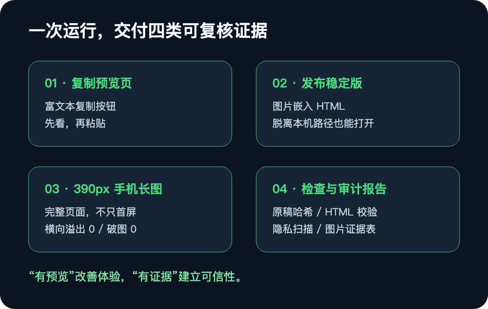
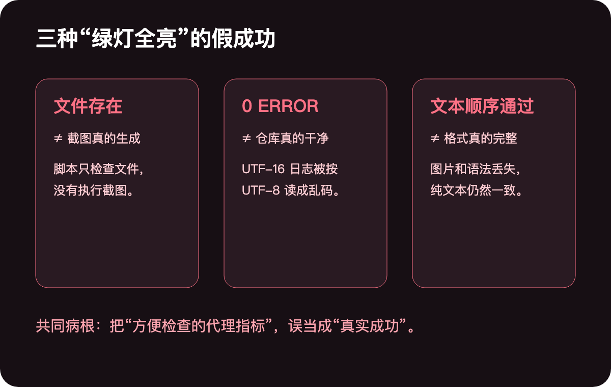
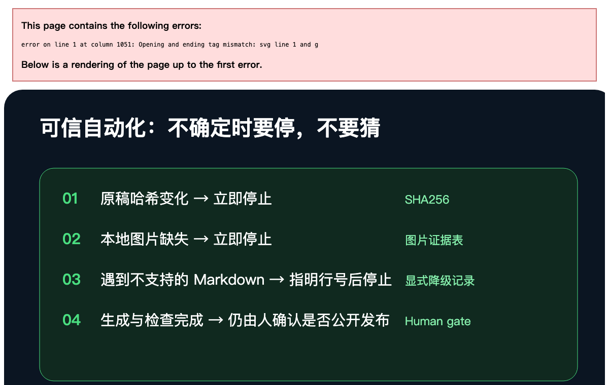

写完一篇公众号文章，最折磨人的往往不是写，而是最后那段看似简单的发布工作。

Markdown 在编辑器里层级清楚，复制进公众号后，标题前剩下井号，粗体星号直接露出来，图片不见了，代码块挤成一团。于是只能重新调标题、图宽、行距和留白，修完后一段，上一段又被挤歪。

这些工作不难，却频繁、繁琐，而且每篇都要重复。这也是为什么有人买几十到几百元的排版软件，有人长期订阅在线工具，还有人干脆每篇花钱代排。

但如果你每周都在发文，更值得解决的不是“去哪里找一套好看的主题”，而是“如何把定稿稳定地变成可粘贴、可复核、可归档的发布包”。

一次具体实测中，3864 个字、5 张图，从输入命令到全部产物生成，用了 25 秒。这个数字不应被当作所有电脑和稿件的性能承诺，它真正说明的是：**原来需要人手工反复调整的半小时，可以被改造成一条确定性流程。**



## 一、排版自动化有三个层次，大多数工具只做了第一层

一条真正可用的公众号流水线，至少要处理三个层次。

### 第一层：视觉转换

把 Markdown 的标题、段落、列表、引用、代码和图片，转换成公众号能保留格式的内联 HTML。

微信编辑器不是标准浏览器环境。`style` 标签、CSS 类名和不少布局属性会被过滤，在本地好看的页面，粘贴进后台可能完全变样。因此关键样式必须内联，并且要按公众号真实编辑器的约束生成。

### 第二层：发布稳定性

普通 HTML 里的图片，可能仍然指向类似 `C:\Users\...\assets\01.png` 的本机路径。当时打开没问题，换一台电脑、把文件发给同事，或过几个月再翻出来，图片就可能全部失效。

发布稳定版会把图片嵌入 HTML，使产物不依赖原电脑路径，可以传递和长期归档。

### 第三层：可验证性

真正关键的不是脚本有没有打印“成功”，而是你能不能回答：

- 原稿是不是被改了？
- 图片是不是全部在，顺序有没有变？
- 手机窄屏上有没有横向溢出？
- Markdown 语法是全部支持，还是悄悄降级？
- 生成的报告里有没有本机路径、Token、私钥或邮箱？

如果没有证据，自动化只是把人工错误变成了更快的自动错误。

## 二、一条可复现的公众号流水线，实际上跑了八步

这套开源项目名为 `wechat-article-pipeline`，自有代码采用 MIT License。它面向 Windows 和 AI Agent，输入是一份定稿 Markdown 和本地配图，输出是公众号兼容 HTML、发布稳定版、手机预览和一组审计报告。

最简单的使用方式，是把定稿和配图放入同一文件夹，执行：

```powershell
.\tools\公众号排版.ps1 -ArticleDir .\我的文章 -OpenPreview
```

如果不想输命令，也可以直接把文章文件夹拖到 `公众号排版.bat` 上。完成后浏览器会打开一个带复制按钮的预览页，点击按钮，再到公众号后台粘贴即可。

但按下命令后，底层不是只做了一次格式转换，而是依次完成八步：


1. 检查 Markdown 中引用的本地图片是否全部存在。
2. 生成适合公众号编辑器的内联 HTML。
3. 把图片嵌入，生成不依赖本场路径的稳定版。
4. 校验主题组件和最终 HTML 是否合规。
5. 生成带“复制到公众号”按钮的浏览器预览。
6. 以 390px 视口渲染手机页，生成完整长截图。
7. 再次计算原始 Markdown 的 SHA256，确认运行前后没有被修改。
8. 清理报告中的本机路径，扫描常见敏感信息。

这八步中，真正让工具从“格式转换器”升级为“发布流水线”的，是后四步。它们不改变文章外观，却在回答一个更重要的问题：这份产物真的能发吗？

## 三、六套主题只是外衣，不应改变文章结构

流水线预设了六套主题：

| 主题 | 更适合的内容 |
|---|---|
| 橄榄手记 | 深度评测、案例复盘、内刊手记 |
| 摸鱼绿 | 教程、测评、工具盘点 |
| 红白色系 | 观点、深度分析、强调型内容 |
| 石墨极简 | 科技、设计和专业评论 |
| 留白禅意 | 随笔、生活方式、低密度内容 |
| 摸鱼票据 | 工具对比、清单和评测 |

换主题只需要改参数重跑：

```powershell
.\tools\公众号排版.ps1 -ArticleDir .\我的文章 -Theme red-white
```



这里有一个重要边界：六套主题改变的是颜色、字体、间距和排印参数，共用同一套文章结构。如果需要每套主题都拥有不同的复杂组件，应直接使用底层的 `gzh-design`。

这也是自动排版的一条好原则：**主题是表达策略，不应成为内容结构的隐形编辑。**

## 四、跑完以后，你拿到的不是一个 HTML，而是一份证据包

一次完整运行至少会产出四类结果。



### 复制预览页

它包含一个复制按钮，用来把已经排好的富文本复制到剪贴板，再粘贴进公众号编辑器。

### 发布稳定版

图片已经嵌入 HTML，可以跨电脑打开和长期归档，不会因原图路径变化而破图。

### 390px 手机长截图

发布前直接查看读者手机上的长页效果。如果文章太长，浏览器一次无法完整截取，流水线会分段截图再拼接。某篇实际文章最终产生了高 11188 像素的完整长图，并确认横向溢出为 0、破图为 0。

### 检查与审计报告

包括原稿哈希、HTML 合规校验、隐私扫描和图片证据表。图片证据表会记录每张图的顺序、路径、所属章节和用途。图片一多，人脑很容漏检；机器既然已经知道稿件引用了哪些图，就应顺手留下可复核证据。

对这条流水线来说，“有预览”只是体验，“有证据”才是可信性。

## 五、三个“绿灯全亮，但事情根本没做对”的故障

这套流水线最值得借鉴的，不是它有多少功能，而是它曾经暴露过三种典型的“假成功”。



### 故障一：检查了截图文件“在不在”，却从没生成截图

README 很早就写了“一键生成 390px 长截图”。但复核代码时发现，脚本根本没有截图，它只是检查长截图文件是否存在。文件在，就报成功；至于文件是谁、什么时候生成的，系统并不关心。

后来才真正接入 Playwright，让浏览器以 390px 视口打开预览页，超长文章自动分段截取并拼接。

这个故障更新了一条规则：**文档里写“支持”，必须有一次真实执行证据；代码里有一个同名函数，不算实现。**

### 故障二：隐私报告是 0 ERROR，Git 里却真的有本机路径

为了公开仓库，流水线会扫描绝对路径、用户名、Token、私钥、邮箱和 IP。某次 `privacy-audit.json` 给出了漂亮的 `0 ERROR`，但 Git 仓库里已经提交了真实的本机绝对路径。

根因来自一个典型 Windows 细节：PowerShell 5.1 的 `Tee-Object` 默认把日志写成 UTF-16LE，脱敏脚本却按 UTF-8 读取。日志并非没有扫描，而是读进去就变成了乱码，正则当然什么都匹配不到。

后来日志被改为显式 UTF-8，脱敏脚本也会根据 BOM 识别编码。继续追查后还发现，泄露路径的日志不是一个，而是三个。

这个故障更新的规则是：**生成的结果，不能把你的电脑一起发出去。**

### 故障三：渲染器不支持某种 Markdown，却默默改样式并报成功

外部代码审核指出，早期渲染器遇到不支持的 Markdown 语法时并不会停止。用一份专门的探测稿运行后，问题全部暴露：

- 引用块的大于号留在正文里；
- 斜体和删除线符号原样显示；
- 列表中的粗体和行内代码被剥掉；
- 夹在句子中的图片直接消失。

更糟糕的是，完整性校验对比的是“剥掉格式后的纯文本”，所以它仍然会告诉你“正文顺序通过”。

修复后，引用、斜体、删除线和列表格式得到支持；真正不支持的语法，命中时会直接停止，给出行号、语法类型和停止原因。

这三个故障看起来完全不同，病根却只有一个：系统检查了一个方便的代理指标，然后把代理指标当成了真实成功。

## 六、自动化的高级原则：不确定时要停，不要猜

现在这条流水线明确有三件事不会做：

1. **不改原稿**：运行前后分别计算 SHA256，对不上就中止。
2. **不替用户发布**：生成和检查是可逆的，公开发布不是，必须留给人确认。
3. **图片少一张就停**：不猜它是不是不重要，也不用占位符悄悄继续。

项目 README 还对 Markdown 支持范围做了显式说明。它支持一到三级标题、段落、单层有序与无序列表、代码块、行内代码、粗体、斜体、删除线、链接、引用块、表格、分隔线和独占一行的图片。

嵌套列表、四级及以下标题、行内图片和直接写在 Markdown 里的 HTML 标签，默认不支持；命中时应直接报错停止。如果使用者明确愿意接受降级，才可以用 `--allow-unsupported` 继续，并在结果里记录哪些行发生了降级。



这类“不会做什么”的规则，比功能列表更能定义一个自动化工具是否可信。

## 七、这不是一个人重写所有轮子，而是三类能力的组装

这条流水线的项目边界必须说清楚。最难的底层能力来自已有开源项目，流水线做的是编排、补齐和守门。

### gzh-design：解决公众号 HTML 兼容性

`gzh-design` 负责公众号内联 HTML、一键复制预览、HTML 检查和主题基础。项目由甲木和摸鱼小李共建，使用 AGPL-3.0 许可证。

这条流水线没有复制或重新分发 `gzh-design` 源码，只在运行时以独立进程调用，使用者需要自行安装。

### xiaowan-wechat-layout：提供手机端结构检查思路

它贡献了手机端结构检查、图片证据和排版 QA 的整体思路，作者是小晚。

### md2wechat：处理素材上传和草稿创建

`md2wechat` 聚焦公众号素材上传和草稿创建，作者是极客杰尼。它含有商业授权条款，用于商业场景前应阅读 LICENSE，而不是默认当成无限制免费组件。

在这些基础上，`wechat-article-pipeline` 增加了 Windows 一键入口、原稿哈希、图片检查、稳定版 HTML、390px 长截图、隐私扫描和 Agent 执行规则。

这类工作的价值，不在于宣布自己“重新发明了轮子”，而在于把不同轮子装成一辆愿意每天开的车，并且加上刹车、仪表盘和保险带。

## 八、如果你要搭自己的内容流水线，先定义验收证据

这套项目的经验不只适用于公众号排版。任何由 AI 和脚本参与的内容生产流水线，都应在开始写功能前回答五个问题：

1. **什么东西绝不能被修改？** 用哈希、只读输入和差异比对保护它。
2. **什么叫做完成？** 是文件存在，还是文件由当次任务生成且通过内容检查？
3. **最容易悄悄丢掉什么？** 是图片、格式、表格、链接还是段落顺序？
4. **产物会离开本机吗？** 如果会，路径、凭证和个人信息必须在出口处再扫一次。
5. **遇到不支持的情况怎么做？** 默认应该停止并指出位置，而不是静默降级。

把这五个问题定义清楚，你才是在建一条生产线；否则只是把几个脚本用管道连在了一起。

## 结语：一个讲排版的工具，应该先能证明自己没把这篇排坏

公众号排版的手工成本当然值得省。定稿后的繁琐工作从半小时压缩到几十秒，对周更或日更创作者会产生很实在的累积价值。

但“快”不能成为唯一指标。如果一个工具悄悄丢掉图片、改了格式、漏了隐私，却把所有检查灯都点成绿色，它越快，之后的损失只会越大。

一条成熟的发布流水线，应该同时交付三样东西：好看的版面、可迁移的产物、可复核的证据。

它不会在不确定时猜测，不会用文件存在代替真实生成，不会用纯文本一致代替格式完整，也不会在未经人确认时越过发布边界。

自动化最值钱的不是一键，而是这一键之后，你仍然知道发生了什么。
